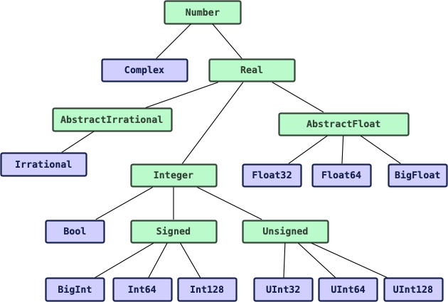

# Introducción al lenguaje de programación Julia

El propósito de estas notas es tener una guía de estudio y referencia para el interesado en aprender en español el lenguaje de programación Julia. No es un curso formal, ni pretende serlo. La mayoría de la información proviene de la documentación oficial de [Julia](https://docs.julialang.org/en/v1/).
***

## Índice

* [Instalación](#instalación)
  * [Windows](#windows)
  * [Linux](#linux)
* [Ejecutando Hola Mundo](#ejecutando-hola-mundo)
* [Julia Esencial](#julia-esencial)
  * [Variables](#variables)
  * [Tipos de datos](#tipos-de-datos)
    * [Números enteros y de punto flotante](#números-enteros-y-de-punto-flotante)
    * [Literales numéricos como coeficientes](#literales-numéricos-como-coeficientes)
    * [Números racionales](#números-racionales)
    * [Números complejos](#números-complejos)
    * [Strings](#strings)
  * [Estructura de datos](#estructura-de-datos)
    * [Vectores y arreglos](#vectores-y-arreglos)
    * [Tuplas](#tuplas)
    * [Diccionarios](#diccionarios)
  * [Operadores matemáticos y funciones elementales](#operadores-matemáticos-y-funciones-elementales)
    * [Operadores aritméticos](#operadores-aritméticos)
    * [Operadores booleanos](#operadores-booleanos)
    * [Operadores de actualización](#operadores-de-actualización)
    * [Operadores de comparación](#operadores-de-comparación)
    * [Funciones matemáticas básicas](#funciones-matemáticas-básicas)
    * [Funciones vectorizadas](#funciones-vectorizadas)
  * [Funciones](#funciones)
    * [Bloque `function`](#bloque-function)
    * [Funciones por asignación](#funciones-por-asignación)
    * [Funciones anónimas](#funciones-anónimas)
    * [Desestructurando argumentos](#desestructurando-argumentos)
    * [Funciones con número variable de argumentos](#funciones-con-número-variable-de-argumentos)
    * [Argumentos opcionales](#argumentos-opcionales)
    * [Argumentos de palabra clave](#argumentos-de-palabra-clave)
    * [Declaración de tipo de argumentos](#declaración-de-tipo-de-argumentos)
    * [Return nothing](#return-nothing)
    * [Vectorización de funciones](#vectorización-de-funciones)
    * [Composición de funciones](#composición-de-funciones)
  * [Bloques de control de flujo](#bloques-de-control-de-flujo-condicionales-ciclos-y-otros)
    * [Condicionales](#condicionales)
    * [Evaluación short-circuit](#evaluación-short-circuit)
    * [Ciclos while y for](#ciclos-while-y-for)
    * [Bloque de expresiones compuestas](#bloque-de-expresiones-compuestas)
    * [Bloque do](#bloque-do)
* [Julia Intermedio](#julia-intermedio)
  * [Arreglos multidimensionales](#arreglos-multidimensionales)
    * [Funciones básicas para arreglos](#funciones-básicas-para-arreglos)
    * [Construcción de arreglos e inicialización](#construcción-de-arreglos-e-inicialización)
    * [Arreglos literales](#arreglos-literales)
    * [Concatenación](#concatenación)
    * [Array comprehension](#array-comprehension)
    * [Vistazo a los generadores](#vistazo-a-los-generadores)
    * [Indexación](#indexación)
    * [Broadcasting](#broadcasting)
  * [Leer y escribir archivos](#leer-y-escribir-archivos)
  * [Gestor de paquetes Pkg](#gestor-de-paquetes-pkg)
    * [Uso básico](#uso-básico)
    * [Ambientes virtuales en Julia](#ambientes-virtuales-en-julia)
    * [Modo no interactivo de Pkg](#modo-no-interactivo-de-pkg)
  * [Usar paquetes dentro de Julia](#usar-paquetes-dentro-de-julia)
    * [Diferencia entre `using` e `import`](#diferencia-entre-using-e-import)
    * [Importando elementos especificos y el uso de alias](#importando-elementos-especificos-y-el-uso-de-alias)
  * [Manejo de excepciones](#manejo-de-excepciones)
    * [Excepciones integradas](#excepciones-integradas)
    * [Función `throw`](#función-throw)
    * [Bloque `try`/`catch`/`finally`](#bloque-trycatchfinally)
  * [Comandos shell en Julia](#comandos-shell-en-julia)
    * [Ejecutar instrucciones shell](#ejecutar-instrucciones-shell)
* [Julia Avanzado](#julia-avanzado)
  * [Tipos](#tipos)
    * [Declaración de Tipos](#declaración-de-tipos)
    * [Tipos abstractos](#tipos-abstractos)
    * [Tipos primitivos](#tipos-primitivos)
    * [Tipos compuestos: `Struct`](#tipos-compuestos-struct)
    * [Tipos compuestos mutables](#tipos-compuestos-mutables)
    * [Tipos declarados](#tipos-declarados)
    * [Tipos `Union`](#tipos-union)
    * [Tipos paramétricos](#tipos-paramétricos)
      * [Tipos compuestos paramétricos](#tipos-compuestos-paramétricos)
      * [Tipos abstractos paramétricos](#tipos-abstractos-paramétricos)
      * [Tipos tupla](#tipos-tupla)
      * [Tipos tupla de argumentos variables](#tipos-tupla-de-argumentos-variables)
      * [Tipos tupla con nombre](#tipos-tupla-con-nombre)
      * [Tipos primitivos paramétricos](#tipos-primitivos-paramétricos)
    * [Tipos `UnionAll`](#tipos-unionall)
    * [Tipos singleton](#tipos-singleton)
    * [Operaciones sobre tipos](#operaciones-sobre-tipos)
    * [Impresion bonita personalizada](#impresión-bonita-personalizada)
    * [Tipos *valores*](#tipos-valores)
  * [Métodos de funciones: Despacho multiple](#métodos-de-funciones-despacho-múltiple)
    * [Definiendo métodos](#definiendo-métodos)
    * [Ambigüedades en métodos](#ambigüedades-en-métodos)
    * [Métodos paramétricos](#métodos-paramétricos)
    * [Patrones de diseño con métodos paramétricos](#patrones-de-diseño-con-métodos-paramétricos)
      * [Despacho iterado](#despacho-iterado)
      * [Separar la lógica de conversión y la del núcleo](#separar-la-lógica-de-conversión-y-la-del-núcleo)
    * [Métodos de argumentos variables restringidos paramétricamente](#métodos-de-argumentos-variables-restringidos-paramétricamente)
    * [Argumentos opcionales y de palabra clave](#argumentos-opcionales-y-de-palabra-clave)
    * [Objetos similares a funciones](#objetos-similares-a-funciones)
    * [Diseño de métodos y prevención de ambigüedades](#diseño-de-métodos-y-prevención-de-ambigüedades)
      * [Argumentos Tuple y NTuple](#argumentos-tuple-y-ntuple) 
      * [Ortogonalización del diseño](#ortogonalización-del-diseño) 
      * [Despachar sobre un argumento a la vez](#despachar-sobre-un-argumento-a-la-vez)
      * [Contenedores abstractos y tipos de elementos](#contenedores-abstractos-y-tipos-de-elementos)
      * [Métodos en cascada con argumentos por defecto](#métodos-en-cascada-con-argumentos-por-defecto) 
  * [Constructores](#constructores)
    * [Métodos constructores externos](#métodos-constructores-externos)
    * [Métodos constructores internos](#métodos-constructores-internos)
    * [Inicialización incompleta](#inicialización-incompleta)
    * [Constructores paramétricos](#constructores-paramétricos)  
  * [Módulos](#módulos) 
    * [Gestión del namespace](#gestión-del-namespace) 
    * [Listas de exportación](#listas-de-exportación) 
    * [Manejo de conflictos de nombres](#manejo-de-conflictos-de-nombres) 
    * [Definiciones de primer nivel por default y módulos `baremodule`](#definiciones-de-primer-nivel-por-default-y-módulos-baremodule) 
    * [Submódulos y rutas relativas](#submódulos-y-rutas-relativas)
  * [Documentar código](#documentar-código)
    * [Convenciones simples](#convenciones-simples) 
    * [Acceso a la documentación](#acceso-a-la-documentación)
    * [Documentando funciones y métodos](#documentando-funciones-y-métodos) 
    * [Uso avanzado](#uso-avanzado) 
    * [Documentación dinámica](#documentación-dinámica)
* [Referencias](#referencias)

***

## Instalación

Para instalar el intérprete de Julia en nuestra computadora, debemos descargarlo directamente de los [repositorios](https://julialang.org/downloads/) oficiales. Elegimos la versión deseada, dependiendo del sistema operativo y arquitectura de la máquina donde vayamos a trabajar. Para este tutorial, se usará la versión Julia-1.7.3.

### Windows

1. Descarga el instalador, dependiendo la versión de Windows. El más común la versión a 64 bits. 

2. Una vez descargado, ejecuta el archivo **.exe** y sigue los pasos del asistente para concretar la instalación.

3. Para finalizar, abre el *símbolo del sistema* o una terminal de *Powershell*, y ejecuta:
```console
$ julia
```
para abrir y verificar que Julia se haya instalado correctamente.

### Linux

1. Para el sistema operativo Linux x86 a 64-bits. Se descargará un archivo con extensión **.tar.gz**.

2. Extrae el contenido, esto se hace abriendo una terminal y ejecutaremos el siguiente comando:

    ```console
    $ tar -xvzf julia-1.7.3-linux-x86_64.tar.gz
    ```

    donde ustedes deben sustituir por el nombre del archivo que descargaron. El comando les habrá generado una carpeta con el `julia-1.7.3` que contiene los binarios del interprete.

3. Copiamos todo el contenido de dicha carpeta al directorio `/opt/` de nuestro sistema de la siguiente manera:

    ```console
    $ sudo cp -r julia-1.7.3 /opt/
    ```

4. Finalmente, crearemos un enlace simbólico (*symbolic link*) del ejecutable **Julia** dentro del directorio `/usr/local/bin/` para que sea visible para todo el sistema:

    ```console
    $ sudo ln -s /opt/julia-1.7.3/bin/julia /usr/local/bin/julia
    ```

Listo, tenemos Julia instalado. Podemos verificar la instalación, reabriendo la terminal y ejecutando el comando

```console
$ julia
```

el cual, nos permitirá abrir el interprete de Julia.
***

## Ejecutando Hola Mundo

Para ejecutar código en Julia, se pueden utilizar varias opciones. La más fácil es usando el intérprete de Julia, también conocido como **REPL**. Lo abrímos en una terminal ejecutando `$ julia`. Una vez dentro del REPL, ejecutaremos el *hola mundo*, con esta sencilla instrucción para imprimir en pantalla:

```julia
julia> println("Hola Mundo")
Hola Mundo  
```

Listo, tenemos nuestro 'Hola Mundo'. 😄

Otra forma para ejecutar código, es escribiendo el código dentro archivos con extensión `.jl`. Por ejemplo, en un archivo `script.jl` como sigue:

```julia
println("Hola Mundo")
```

y ejecutar el script en la terminal:

```console
$ julia script.jl
Hola Mundo
```

Podemos personalizar nuestro 'Hola, mundo', preguntando el nombre del usuario, con la siguiente línea:

```julia
println("¿Cuál es tu nombre?")
nombre = readline()                   # Con esta instrucción podemos introducir datos desde la terminal.

println("Hola, ", nombre)
```

Listo, hemos ejecutado un nuevo 'Hola Mundo'. 😄
***

## Julia Esencial

## Variables

En Julia, una variable es un nombre asociado a un valor, y es útil para almacenar ese valor en la memoria ram para su uso posterior. Para declarar variables en Julia, se usa mediante asignación directa:

```julia
variable = 1 + 2
nombre = "Juan"
mensaje = "Hola Mundo"
```

El nombre de las variables son sensibles a mayúsculas y minúsculas. Pero estas diferencias no tienen significado semántico, es decir, no tienen propiedades especiales si se escriben en una forma u otra (como en otros lenguajes).

El nombre de las variables pueden usar cualquier carácter Unicode UTF-8, por ejemplo:

```julia
δ = 0.001
```

En el REPL de Julia u otros editores, se pueden escribir carácteres especiales de **LaTeX** presionando el backslash `\ ` y el nombre del carácter, seguido de un `TAB`. Por ejemplo, `\alpha + TAB = α`.

Los nombres de las variables en Julia por convención deben iniciar por una letra (A-Z ó a-z), guiones bajos o carácteres especiales Unicode, ya sea letras, simbolos matemáticos o inclusive *emojis*. Se debe tener precaución, ya que algunos símbolos se podría confundir con los operadores matemáticos que usa Julia.

Los nombres para variables no validos son aquellas dentro de la lista de *palabras reservadas* del lenguaje. Por ejemplo: *begin, break, function, do, if*, etc.

Julia impone pocas restricciones al asignar nombre a las variables, pero se recomiendan las siguientes **convenciones de estilo**:

1. El nombre de las variables deben ser escritas en minúsculas.
2. La separación de palabras puede ser indicada por el guión bajo `_`, pero se desaconseja a menos de que el nombre sea díficil de leer en otro caso.
3. El nombre de **Tipos** y **Módulos** deben empezar por una letra mayúscula y se debe utilizar *CamelCase* entre palabras de nombres compuestos, en lugar de guiones bajos.
4. El nombre de **funciones** y **macros** deben escribirse siempre en minúsculas y sin guiones bajos.
5. Las funciones que modifican sus argumentos, en lugar de devolver un resultado, por convención, sus nombres siempre finalizan con **!**. Este tipo de funciones se les conoce como "mutantes" (*mutating*) o (*in-place*).

Para más ver más recomendaciones, por favor revise la [guía de estilo](https://docs.julialang.org/en/v1/manual/style-guide/) de Julia.

## Tipos de Datos

Una de las fortalezas de Julia es su amplia variedad de ***tipo de datos***. Además, cada tipo de dato es muy especifico a las necesidades que requiere la tarea.

A diferencia de otros lenguajes de programación como Javascript, el cuál tienen solo unos cuantos tipos de datos genéricos (por ejemplo, ***number*** para cualquier dato númerico), en Julia se tiene tipo muy especifico, es especial si se quiere un buen desempeño del código. Esto, aunque a primera vista podría parecer engorroso, nos dará ventajas que veremos más adelante.

Empecemos a ver los diferentes tipos de datos que nos ofrece Julia nativamente.

### Números Enteros y de Punto Flotante

Julia proporciona una amplia gama de ***tipos numéricos primitivos***, y sobre ellos se define un conjunto completo de ***operadores aritméticos*** y ***bit a bit***, así como funciones matemáticas estándar.

En la parte de ***números enteros***, Julia nos proporciona los siguientes tipos numéricos primitivos:

|Tipo|Signo|Número de bits|Valor mínimo|Valor máximo|
|--|--|--|--|--|
|Int8|✓|8|-2^7|2^7 - 1|
|UInt8| |8|0|2^8 - 1|
|Int16|✓|16|-2^15|2^15 - 1|
|UInt16| |16|0|2^16 - 1|
|Int32|✓|32|-2^31|2^31 - 1|
|UInt32| |32|0|2^32 - 1|
|Int64|✓|64|-2^63|2^63 - 1|
|UInt64| |64|0|2^64 - 1|
|Int128|✓|128|-2^127|2^127 - 1|
|UInt128| |128|0|2^128 - 1|
|Bool|N/A|8|false (0)|true (1)

Y para datos de números de ***punto flotante***, tiene los siguiente tipos primitivos:

|Tipo|Precisión|Número de bits|
|--|--|--|
|Float16|half|16|
|Float32|single|32|
|Float64|double|64|

Por defecto, el tipo de dato que usa Julia depende de la arquitectura del sistema donde se ejecuta, si se trata de 32-bits o de 64-bits.

Para saber el tipo de dato con el que se está trabajando algún literal númerico, podemos usar la instrucción:

```julia
julia> typeof(25)
Int64

julia> typeof(3.1416)
Float64
```

Existe un truco de síntaxis muy útil para trabajar con números muy grandes: se pueden agrupar las cifras con guiones bajos, y Julia los omitira internamente, esto es:

```julia
julia> a = 1_234_567
1234567

julia> b = 0.000_000_000_5
5.0e-10
```

Los números `UInt` se representan el prefijo `0x` seguido de un número en hexadecimal (digitos 0-9a-f). El tamaño de un número `UInt` es determinado por el número hexadecimal.

```julia
julia> x = 0x1
0x01

julia> typeof(x)
UInt8

julia> x = 0x12f
0x012f

julia> typeof(x)
UInt16
```

Por otra parte, también es soportada la ***representación binaria y octal*** de los literales númericos, usando los prefijos *0b* y *0o* respectivamente.

```julia
julia> x = 0b101
0x05

julia> typeof(x)
UInt8

julia> x = 0o217
0x8f

julia> typeof(x)
UInt8
```

Para revisar los ***valores mínimos y máximos*** que pueden representar los diferentes tipos de datos númericos, se debe ejecutar las siguientes instrucciones:

```julia
julia> typemin(Int32)
-2147483648

julia> typemax(Int32)
2147483647
```

Se pueden convertir los tipos de datos simplemente indicando el nuevo tipo de dato:

```julia
julia> Float64(2)
2.0
julia> Int64(3.0)
3
```

Los números de ***punto flotante*** se pueden declarar usando las representaciones estándares, incluyendo la notación exponencial:

```julia
julia> 2.
2.0

julia> 2.5e-4
0.00025

julia> 3.5f-4
0.00035f0
```

El literal númerico `3.5`, Julia lo interpretará como de tipo `Float64`, se puede declarar como de tipo `Float32` agregandole al final el sufijo `f0`

```julia
julia> typeof(3.5)
Float64

julia> typeof(3.5f0)
Float32
```

En los tipos de ***punto flotante***, existen **dos ceros**: el cero positivo y el cero negativo. Aunque son iguales el uno del otro, pero tienen diferente representación binaria.

```julia
julia> 0.0 == -0.0
true
```

Existe tres valores de números de ***punto flotante***, los cuales no representan a ningún punto en la recta real:

|Nombre|Float16|Float32|Float64|Descripción|
|--|--|--|--|--|
|Infinito positivo|Inf16|Inf32|Inf|Un valor más grande que cualquier número de punto flotante finito|
|Infinito negativo|-Inf16|-Inf32|-Inf|Un valor menor que cualquier número de punto flotante finito|
|No es un número|NaN16|NaN32|NaN|Un valor que no es igual (==) a ningún número de punto flotante, incluyendo a el mismo|

Existe un ***tipo númerico***, tanto entero como flotante, que sirve para trabajar con **números de precisión arbitraria**. Estos son `BigInt` y `BigFloat`.

### Literales numéricos como coeficientes

La síntaxis de Julia nos permite tener ***literales numéricos*** como ***coeficientes*** de expresiones o fórmulas. De está forma, podemos tener expresiones matemáticas claras, ya que un literal númerico que precede a una variable es interpretado como una multiplicación:

```julia
julia> x = 3
3

julia> 2x^2 - 3x + 1
10

julia> 1.5x^2 - 0.5x + 1
13.0
```

Aunque hay que tener cierto cuidado al interpretar esta síntaxis, ya que Julia entenderá, por ejemplo que `2^3x` como `2^(3x)` y `2x^3` será interpretado como `2*(x^3)`.

También los ***coeficiente númericos*** funciona con expresiones entre paréntesis:

```julia
julia> 2(x-1)^2 - 3(x-1) + 1
3
```

Por otra parte, Julia proporciona funciones para retornar el ***cero*** o el ***uno*** correspondiente al ***tipo especifico del argumento***. Por ejemplo:

```julia
julia> zero(Float32)
0.0f0

julia> zero(1.0)
0.0

julia> one(Int32)
1

julia> one(BigFloat)
1.0
```

### Números racionales

Julia incluye nativamente los tipos de datos de ***números racionales*** (aquellos que se pueden escribir como una fracción de enteros) y ***números complejos*** (aquellos con parte real y parte imaginaria).

Los **números racionales** son construidos usando el operador `//` como sigue:

```julia
julia> typeof(2//3)
Rational{Int64}
```

Si el numerador y el denominador tienen factores comúnes, la fracción será reducida a su mínima expresión:

```julia
julia> 5//10
1//2
```

Dicha normalización es única y por lo tanto, ambos números son iguales. Se pueden comparar directamente con cualquier operador de comparación valido:

```julia
julia> 1//2 == 5//10
true

julia> 3//4 < 2//3
false
```

Sin mayor dificultad, un ***número racional*** se puede convertir en ***tipo de punto flotante*** como sigue:

```julia
julia> float(3//4)
0.75
```

La ***promoción y conversión de tipos*** nos ayuda a que un número de ***tipo racional*** pueda operar con cualquier otro tipo de dato númerico directamente.

### Números complejos

Para el tipo **numéricos complejos**, Julia implementa la constante global `im` ligada a la unidad imaginaria matemática ($i $) que representa $\sqrt{-1}$ . Además, dado que Julia acepta la yuxtaposición de literales númericos como coeficientes para las variables, la notación utilizada para la definición de números complejos es similiar a la forma tradicional matemática:

```julia
julia> typeof(1 + 2im)
Complex{Int64}
```

Y pueden realizarse cualquier tipo de operación matemática entre números complejos, e inclusive, por promoción de tipo, puede operar con otros ***tipos de datos númericos*** sin problema:

```julia
julia> (1 + 2im) * (2 + 3.im)
-4 + 7im

julia> 3(1 + 2im)^2.0
-9.0 + 12.0im
```

Tenga cuidado cuando los coeficientes de la parte imaginaria son fracciones, ya que puede presentarse confusiones en expresiones de este estilo: `3/4im == 3/(4*im) == -(3/4)*im`.

Julia provee de funciones estandar básicas para la manipulación de ***números complejos***:

```julia
julia> z = 1 + 2im
1 + 2im

julia> real(z)              # Parte real de z
1

julia> imag(z)              # Parte imaginaria de z
2

julia> conj(z)              # Complejo conjugado z
1 - 2im

julia> abs(z)               # Norma o valor absoluto de z
2.23606797749979

julia> abs2(z)              # Norma cuadrada o valor absoluto cuadrado de z
5

julia> angle(z)             # Ángulo o fase de z
1.1071487177940904
```

Si bien es posible construir complejos a partir de ***variables númericas*** que representen sus coeficientes, esto es:

```julia
julia> a = 1; b = 2;

julia> a + b*im
1 + 2im
```

es recomendable y más eficiente construirlo a partir de la función `complex`, la cuál construye el número complejo pasando la parte real e imaginaria:

```julia
julia> complex(a, b)
1 + 2im
```

### Strings

Los literales ***tipo String*** son cadenas finitas de carácteres. Cada carácter es un elemento de ***tipo Char***. Julia puede aceptar, en términos sencillos, cualquier carácter Unicode UTF-8.

Se puede definir los ***strings*** entre comillas dobles o entre dos pares de comillas triples, como el siguiente ejemplo:

```julia
julia> str1 = "Hola \
mundo"
"Hola mundo"
julia> str2 = """Hola, estoy escribiendo en un párrafo.
Ahora estoy escribiendo en la segunda línea,
pero finalizaré aquí."""
"Hola, estoy escribiendo en un párrafo. \nAhora estoy escribiendo en la segunda línea, \npero finalizaré aquí."
```

donde se puede posponer la escritura del ***string*** mediante `\`. Además, dentro del ***string*** se puede agregar los carácteres especiales de salto de línea `\n` y tabulador `\t`.

Los ***strings*** son objetos iterables y se pueden recorrer para obtener los carácteres que lo integran de la siguiente forma:

```julia
julia> str1[1]
'H': ASCII/Unicode U+0048 (category Lu: Letter, uppercase)

julia> str1[4]
'a': ASCII/Unicode U+0061 (category Ll: Letter, lowercase)
```

**Nota**: aúnque esto es cierto en la mayoria de casos, Julia indexa los ***string*** realmente por la cantidad de bytes que ocupa el carácter *para ser codificado*. **UTF-8** incluye carácteres de longitud en byte variable. El índice arriba indicado, se refiere a la posición de byte que observa Julia para decodificar el carácter, en lugar de referirse a la posición relativa del carácter dentro del ***string***. Esto es algo para tener en cuenta y cuidado a la hora de trabajar con ***strings***. Para revisar más detalles al respecto, [aquí](https://docs.julialang.org/en/v1/manual/strings/#Unicode-and-UTF-8).

Para usar símbolos o carácteres Unicode, sólo se tienen que declarar como:

```julia
julia> s = "\u2200 x \u2203 y"
"∀ x ∃ y"
```

Para realizar la **concatenación** de dos o más strings, se puede realizar de manera sencilla de dos formas, la primera es usando la función `string`, la cual toma dos o más ***strings***, y crea uno nuevo:

```julia
julia> str1 = "Hola "; str2 = "Mundo";

julia> string(str1, str2)
"Hola Mundo"
```

Las segunda forma es utilizando el operador `*` (*multiplicación*).

```julia
julia> str1 * str2
"Hola Mundo"
```

Si bien, otros lenguajes utilizan el operador `+` para realizar la acción de concatenación de ***strings***, sintacticamente es incorrecto, ya que la operación de concatenación **es una operación no-conmutativa**. De hecho, matemáticamente, el conjunto de todos los ***strings*** de longitud finita **S** junto con el operador de concatenación `*` forma un **monoide libre** $(S,*)$ no conmutativo. Como es común representar la ***operación concatenación*** con el símbolo `*`, por lo que Julia es coherente con esa notación.

Para utilizar el valor de variables con ***literales strings*** dentro de nuevos string, Julia utiliza la **interpolación** mediante el simbolo `$`, de la siguiente forma:

```julia
julia> "$str1 a todos, hoy salió el sol para todo el $str2"
"Hola a todos, hoy salió el sol para todo el Mundo"
```

De hecho se pueden evaluar expresiones y retornarlas dentro del string con el mismo simbolo como sigue:

```julia
julia> "El resultado de sumar 1 y 2 es $(1 + 2)"
"El resultado de sumar 1 y 2 es 3"
```

## Estructura de Datos

### Vectores y Arreglos

Los ***vectores*** son colecciones de elementos ordenados, los cuales pueden estar duplicados o ser de diferente tipo de dato cada uno. Los **vectores son mutables**, esto es, pueden agregarse elementos o eliminarlos. También son objetos iterables y puede accederse a sus elementos mediante indexación. Es muy similar a las listas en Python.

Hay varias formas de declarar un vector:

```julia
julia> a = [valor1, valor2, valor3, etc]

julia> b = Vector{T}([valor1, valor2, valor3, etc])

julia> c = Array{T, 1}([valor1, valor2, valor3, etc])
```

La primera forma es la forma más directa, donde Julia identifica el mejor ***tipo de vector*** que se definirá dependiendo del ***tipo de dato*** de los elementos.

La segunda forma, se instancia un objeto `Vector`, donde `T` es el tipo de dato de los elementos que contendrá la lista. En este caso, los elementos futuros no pueden tener un tipo de dato distinto al declarado, por lo que hay que tener precaución.

La tercerda forma, se define al vector como un objeto `Array` de una dimensión. De la misma forma que el caso anterios, `T` es el ***tipo de dato*** de los elementos del vector. En el fondo, `Vector` es un **alias** de un `Array` de **una dimensión**.

Como se mencionó con anterioridad, se puede acceder a los elementos que componen un vector mediante la **indexización** usando los la notación `[]`. Se puede pasar el ***índice, número natural, o un rango***, siempre y cuando tenga sentido. Julia es un lenguaje **1-indexado**, lo que significa que el índice del primer elemento es uno, a diferencia de lenguajes de programación como Python o JavaScript, que son 0-indexados, su primer elemento se indexa a partir del cero.

```julia
julia> a = ["Hola", "¿Cómo estás?", "Muy bien", "Igualmente", "Adiós"]
5-element Vector{String}:
 "Hola"
 "¿Cómo estás?"
 "Muy bien"
 "Igualmente"
 "Adiós"

 julia> a[1]                                    # Accediendo al primer elemento
 "Hola"

 julia> a[2:4]                                  # Accediendo con un rango de índices
 3-element Vector{String}:
 "¿Cómo estás?"
 "Muy bien"
 "Igualmente"

julia> a[end]                                   # Accediendo al último elemento
"Adiós"
```

Las vectores se pueden modificar sobrescribiendo sobre algun elemento con un determinado índice:

```julia
julia> a[1] = "Buenos días"                     # Se sobreescribe directamente en el primer elemento

julia> a
5-element Vector{String}:
 "Buenos días"
 "¿Cómo estás?"
 "Muy bien"
 "Igualmente"
 "Adiós"
```

También se pueden agregar o quitar elementos al final del vector, de la siguiente forma:

```julia
julia> push!(a, "Postdata")                     # Agrega un elemento al final del vector
6-element Vector{String}:
 "Buenos días"
 "¿Cómo estás?"
 "Muy bien"
 "Igualmente"
 "Adiós"
 "Postdata"

julia> pop!(a)                                  # Elimina el último elemento del vector
5-element Vector{String}:
 "Buenos días"
 "¿Cómo estás?"
 "Muy bien"
 "Igualmente"
 "Adiós"
```

O se puede agregar o quitar elementos al principio del vector como sigue:

```julia
julia> pushfirst!(a, "Antes que nada")          # Agrega un elemento al principio del vector
6-element Vector{String}:
 "Antes que nada"
 "Buenos días"
 "¿Cómo estás?"
 "Muy bien"
 "Igualmente"
 "Adiós"

julia> popfirts!(a)                             # Elimina el primer elemento del vector
5-element Vector{String}:
 "Buenos días"
 "¿Cómo estás?"
 "Muy bien"
 "Igualmente"
 "Adiós"
```

También se pueden agregar los elementos de un vector a otro ya existente con la función `append!`, como sigue:

```julia
julia> append!(a, ["Buenas tardes", "Buenas noches"])
7-element Vector{String}:
 "Buenos días"
 "¿Cómo estás?"
 "Muy bien"
 "Igualmente"
 "Adiós"
 "Buenas tardes"
 "Buenas noches"
```

Como se mencionó anteriormente, los ***vectores*** son un caso particular de `Array` de una dimensión. Los `Array` de dos dimensiones, en Julia se le llama ***matrices***, ya que representan datos ordenados en filas y columnas. 

Para definir las matrices o arreglos de dos dimensiones, los elementos que conforman una fila se separan únicamente por un espacio en blanco, mientras que para separar las filas se usa el símbolo `;` de la siguiente forma:

```julia
julia> b = [1 2 3; 4 5 6]
2×3 Matrix{Int64}:
 1  2  3
 4  5  6
```

Para acceder a los elementos de la ***matriz***, tenemos que usar dos índices, el primero para la fila, el segundo para la columna:

```julia
julia> b[1, 2]
2
julia> b[2, 1]
4
```

Para agregar nuevos datos al final de la ***matriz***, y modificando así su dimensión matricial, se realiza de las siguientes funciones:

```julia
julia> c = [b; [7 8 9]]                             # Se agrega como una nueva fila
3×3 Matrix{Int64}:
 1  2  3
 4  5  6
 7  8  9

julia> c = vcat(b, [7 8 9])                         # Se agrega como una fila al final
3×3 Matrix{Int64}:
 1  2  3
 4  5  6
 7  8  9

julia> c = hcat(b, [7; 8])                          # Se agrega como una nueva columna al final
2×4 Matrix{Int64}:
 1  2  3  7
 4  5  6  8
```

Los arreglos 3-dimensional, son ***arreglos de arreglos*** que se extienden una dimensión más. Para crearlos, se requiere usar la función ***cat*** o ***reshape*** de la siguiente forma:

```julia
julia> d = cat([1 2; 3 4], [5 6; 7 8], dims=3)
2×2×2 Array{Int64, 3}:
[:, :, 1] =
 1  2
 3  4

[:, :, 2] =
 5  6
 7  8
```

Para acceder a sus elementos, se requieren tres índices:

```julia
julia> d[1,2,2]
6

julia> d[2,1,1]
3
```
Para más detalles sobre ***matrices multidimensionales***, se discutirá en la sección [Arreglos multidimensionales](#arreglos-multidimensionales).

### Tuplas

Las **tuplas** son contenedores de **longitud fija** y cuyos valores no se pueden modificar (son **inmutables**). Pero al igual que los vectores, sus valores se pueden acceder via ***índices***. Las tuplas se definen con paréntesis y comas, como sigue:

```julia
julia> (1,)                           # Tupla de una dimensión
(1,)

julia> (1, 1 + 1)
(1, 2)

julia> a = (2, "Hola", 3.0)
(2, "Hola", 3.0)

julia> typeof(a)
Tuple{Int64, String, Float64}

julia> a[2]
"Hola"
```

La tupla unidimensional requiere definirse como `(1,)` y no como `(1)` ya que esto último significa simplemente el valor 1 entre paréntesis.

Opcionalmente, los elementos de las tuplas se pueden nombrar. En tal caso, el objeto se llamará **tupla nombrada** y cuyos valores se pueden obtener mediante **índices** o por **notación punto** (usando el nombre de su argumento). Las ***tuplas nombradas*** se construye como sigue:

```julia
julia> b = (nombre="Juan", apellido="Pérez", edad=15)
(nombre="Juan", apellido="Pérez", edad=15)

julia>  for element in b
            println(element)
        end
Juan
Pérez
15

julia> b.nombre                     # Accediendo al valor por su nombre mediante la notación punto
"Juan"

julia> b.edad
15
```

Para desestructurar una tupla, podemos asignar una serie de variables a cada valor de los elementos de la tupla, de la siguiente forma:

```julia
julia> mitupla = ("Juan", 7, 15.50);

julia> a, b, c = mitupla;

julia> a
"Juan"

julia> b
7

julia> c
15.50
```

Al igual que en Python, podemos usar el guión bajo `_` para ignorar alguna posición de la tupla y que no sea asignada a alguna variable:

```julia
julia> a, _, c = mitupla;
```

Si durante la asignación, la última variable tiene el *sufijo* `...` (conocido como *slurping* sorbedor), entonces, a esa última variable se le asignará un iterador *perezoso* (*lazy iterator*) que se ejecutará sólo cuando sea invocado, con el resto de elementos de la tupla u objeto a la derecha del signo de asignación.

```julia
julia> a, b... = 1:5;

julia> a
1

julia> b
4-element Vector{Int64}:
 2
 3
 4
 5
```

### Diccionarios

Los diccionarios en Julia, al igual que en Python, son colecciones de pares **clave-valor** (*key-value*), donde cada valor puede ser accedido por la clave, en lugar de índices. En general, los diccionarios son desordenados. Cada diccionario debe tener claves únicas, preferentemente deben ser **strings, enteros o simbolos** (:*simbolo*), mientras que no hay restricciones en el ***tipo*** de los valores .

Un diccionario se define mediante un ***constructor*** ya incluido `Dict()`, y separando la clave del valor mediante el símbolo `=>` siguiendo la siguiente estructura y síntaxis:

```julia
julia> a = Dict("nombre" => "Juan", "apellido" => "Pérez", "edad" => 15, :Δ => "Hola")
Dict{Any, Any} with 4 entries:
  "edad"     => 15
  "nombre"   => "Juan"
  "apellido" => "Pérez"
  :Δ => "Hola"

julia> a["nombre"]
Juan

julia> a["edad"]
15

julia> a[:Δ]
"Hola"
```

Julia provee una función muy útil `get(diccionario, clave, valor_default)`, que nos ayuda a traer el valor asociado a una clave, pero en caso de no existir la clave consultada, lanzar un valor o mensaje por default. Por ejemplo:

```julia
julia> get(a, "nombre", "Beto")
"Juan"

julia> get(a, "domicilio", "Domicilio no registrado")
"Domicilio no registrado"
```

Al igual que en Python, existen funciones para obtener todas las claves o valores de un diccionario en un objeto iterable, estas son `keys` y `values` con la siguiente síntaxis:

```julia
julia> claves = keys(a)
KeySet for a Dict{Any, Any} with 4 entries. Keys:
  "edad"
  "nombre"
  "apellido"
  :Δ

julia> collect(claves)
4-element Vector{Any}:
 "edad"
 "nombre"
 "apellido"
 :Δ

julia> valores = values(a)
ValueIterator for a Dict{Any, Any} with 4 entries. Values:
  15
  "Juan"
  "Pérez"
  "Hola"

julia> collect(valores)
4-element Vector{Any}:
 15
 "Juan"
 "Pérez"
 "Hola"
```

Tanto los objetos regresados por las funciones `keys` y `values` pueden ser utilizados como iterables en ciclos `for`, se puede acceder a dichos elementos clave-valor directamente (como en Python con el método `items`) con la siguiente síntaxis:

```julia
julia>  for (clave, valor) in a
            println(clave, " => ", valor)
        end
edad => 15
nombre => Juan
apellido => Pérez
Δ => Hola
```

Los diccionarios son objetos **mutables**. Las tres principales acciones para modificar un diccionario son: 
1. Agregar nuevos elementos clave-valor. 
2. Actualizar el valor de alguna clave ya existente.
3. Borrar claves-valor.

```julia
julia> a["ciudad"] = "Monterrey"                # Agregando un nuevo par clave - valor
"Monterrey"

julia> a["ciudad"] = "Guadalajara"              # Actualizamos el valor de una clave
"Guadalajara"

julia> println(a)
Dict{Any, Any}("ciudad" => "Guadalajara", "edad" => 15, "nombre" => "Juan", "apellido" => "Pérez", :Δ => "Hola")

julia> delete!(a, "ciudad")                     # Borrar un par clave - valor
Dict{Any, Any} with 4 entries:
  "edad"     => 15
  "nombre"   => "Juan"
  "apellido" => "Pérez"
  :Δ         => "Hola"
```

Se pueden unir dos o más diccionarios mediante la función `merge`. Esto crea un nuevo diccionario, o se puede modificar el primer diccionario con `merge!`, como sigue:

```julia
julia> domicilio = Dict("ciudad" => "Guadalajara", "estado" => "Jalisco", "pais" => "México")
Dict{String, String} with 3 entries:
  "ciudad" => "Guadalajara"
  "pais"   => "México"
  "estado" => "Jalisco"

julia> merge(a, domicilio)
Dict{Any, Any} with 7 entries:
  "ciudad"   => "Guadalajara"
  "edad"     => 15
  "pais"     => "México"
  "nombre"   => "Juan"
  "apellido" => "Pérez"
  "estado"   => "Jalisco"
  :Δ         => "Hola"
```

## Operadores matemáticos y funciones elementales

Julia provee con un colección completa de ***operadores aritméticos*** y ***bit a bit*** en todos los ***tipos de primitivos***. Así como una colección de funciones matemáticas estándar implementadas eficientemente.

### Operadores aritméticos

En la siguiente tabla, se muestran los **operadores aritméticos** básicos:

|Expresión|Descripción|
|---|---|
|x **+** y|Suma o adición|
|x **-** y|Resta o sustracción|
|x **\*** y|Multiplicación|
|x **/** y|División|
|x **÷** y|División truncada al entero|
|x **\\** y|División invertida equivalente a y/x|
|x **^** y|Potencia|
|x **%** y|Residuo|

### Operadores booleanos

En la siguiente tabla, se muestra los **operadores booleanos**:

|Expresión|Descripción|
|---|---|
|**!** x|Negación lógica|
|x **&&** y|Operador AND|
|x **\|\|** y|Operador OR|

### Operadores de actualización

Todos los operadores aritméticos tienen su correspondiente **operador de actualización**, esto es, toma el valor de una variable, ejecuta la operación y guarda el resultado en la misma variable. Por ejemplo, `x += 1` equivale a `x = x + 1`. Los operadores son:

```julia
+=   -=   *=   /=   \=   ÷=   ^=   %=
```

### Operadores de comparación

Los siguientes son los **operadores de comparación**:

|Expresión|Descripción|
|---|---|
|==|Igualdad|
|!=,   ≠|Desigualdad o diferente|
|<|Menor que|
|>|Mayor que|
|<=,  ≤|Menor o igual que|
|>=,  ≥|Mayor o igual que|

Al igual que Python, Julia acepta serie de comparaciones de la siguiente forma:

```julia
julia> -21 < 1 < x <= 4 < 10 
true
```

### Funciones matemáticas básicas

Las siguientes son las **funciones de redondeo**:
|Función|Descripción|
|---|---|
|round(x)|Redondea al entero más cercano|
|floor(x)|Redondea al entero más cercano en dirección a **-∞**|
|ceil(x)|Redondea al entero más cercano en dirección a **+∞**|
|trunc(x)|Redondea al entero más cercano en dirección a cero|

Algunas funciones de **valor absoluto y signo**:

|Función|Descripción|
|---|---|
|abs(x)|Valor absoluto o magnitud de un número, según corresponda|
|abs2(x)|Cuadrado del valor absoluto o de la magnitud del número|
|sign(x)|Regresa el signo del valor, ya sea -1, 0 ó 1. Para el caso de un número complejo, lo regresa normalizado|

La siguiente tabla contienen las principales **funciones potencia, raíces y logaritmos**:
|Función|Descripción|
|---|---|
|sqrt(x),   √x|Raíz cuadrada|
|cbrt(x),   ∛x|Raíz cúbica|
|hypot(x, y)|Hipotenusa de un triángulo rectángulo cuyos catetos miden x e y|
|exp(x)|Función exponencial de x|
|log(x)|Logaritmo natural de x|
|log(b, x)|Logaritmo base b de x|
|log2(x)|Logaritmo base 2 de x|
|log10(x)|Logaritmo base 10 de x|

También, Julia incluye las funciones **trigonométricas** estandar:

```julia
sin     asin     sinh   asinh
cos     acos     cosh   acosh
tan     atan     tanh   atanh
cot     acot     coth   acoth
sec     asec     sech   asech
csc     acsc     csch   acsch
```

Adicionalmente, Julia ofrece en el repertorio funciones `sinpi(x)` y `cospi(x)` que son versiones mejor implementadas y optimizadas para calcular `sin(π*x)` y  `cos(π*x)`.

De manera paralela, se incluyen funciones trigonométricas que hacen los cálculos en grados en lugar de radianes, agregandole una *d* al nombre de la función: `sind(x)`, `cosd(x)`, `tand(x)`, etc.

### Funciones vectorizadas

Todas las funciones y operadores tienen su versión **vectorizada**, eso es, que aplicadas a un arreglo o vector, las funciones actúan sobre cada uno de los elementos (*elementwise*), mediante el **operador punto (`.`)**. 

Por ejemplo, si tenemos la instrucción `[1, 2, 3]^2` la potencia de vectores no está definida en la base estándar. En cambio, utilizando el operador punto como `[1, 2, 3] .^ 2`, la operación potencia será aplicada a cada elemento del vector, esto es: `[1^2, 2^2, 3^2]`. Este operador puede ser aplicado a cualquier operador básico. Por convención y para evitar confusiones con los literales exponentes, se recomienda siempre dejar un espacio blanco en cada lado de los operadores.

Las **funciones básicas** también se pueden *vectorizar* y aplicarlas elemento a elemento agregando un punto al final del nombre de la función. Por ejemplo, `sin.(x)` aplicará la función `sin` a cada elemento del un vector `x`.

```julia
julia> vec = [1, 2, 3, 4, 5, 6];

julia> sqrt.(vec)
6-element Vector{Float64}:
 1.0
 1.4142135623730951
 1.7320508075688772
 2.0
 2.23606797749979
 2.449489742783178
```

## Funciones

Las funciones en Julia son objetos que toman una **tupla de valores-argumento** y regresan un valor. En general, las funciones no son puras en Julia, ya que pueden ser afectadas por el estado global del programa.

### Bloque `function`

La síntaxis básica para declarar funciones en Julia es la siguientes:

```julia
julia>  function f(x, y)
            x + y
        end
```

La definición de la función comienza con la palabra reservada `function`, seguida por el nombre propia de la función y sus argumentos. Siempre se debe finalizar el bloque de definición de la función con la palabra reservada `end`.

Por default, las funciones **regresan siempre el valor de la última instrucción** de su definición. Sin embargo, existe la palabra reservada `return` que explícitamente indica el valor que la función retornará. Toda expresión después de la línea del `return` será ignorada.

**Es recomendable siempre incluir explícitamente la palabra** `return` en las funciones:

```julia
julia>  function f(x, y)
            return x^2 - 2x + y
        end
```

### Funciones por asignación

Existe otra síntaxis más compacta para declarar funciones, llamada ***por asignación***. Esta es ideal cuando la definición de la función se puede hacer en una sola expresión:

```julia
julia> f(x, y) = x^2 - 2x + y
```

Se pueden usar carácteres Unicode para el nombre de las funciones:

```julia
julia> ∑(x, y) = x + y

julia> ∑(2, 7)
9
```

### Funciones anónimas

Existe una tercera síntaxis para declarar funciones, las llamadas ***funciones anónimas*** (equivalentes a las *lambda functions* de Python o las *arrow functions* de JavaScript). Principalmente, las ***funciones anónimas*** se usan como argumentos de otras funciones, que al final de su ejecución no se requieren conservar. Las dos formas equivalentes para declarar ***funciones anónimas***, como sigue:

```julia
julia> x -> x^2 - 2x + 1            # En una sola línea

julia>  function (x)                # Sin incluir algún nombre a la función
            x^2 - 2x + 1
        end
```

Las funciones anónimas pueden aceptar múltiples argumentos, con la siguiente síntaxis:

```julia
julia> (x, y) -> x^2 - 2x + y
```

Existe una tercera forma para declarar funciones anónimas, es por medio del [Bloque do](#bloque-do), que se describirá más adelante.

### Desestructurando argumentos

De la misma forma que las [tuplas](#tuplas), se puede desestructurar los argumentos de una función. Si los argumentos de una función se escriben como una tupla, es decir `(x, y)`, en lugar de un sólo elemento, entonces, las variables serán asignada siguiendo la desestructuración de tupla `(x, y) = *argumento-tupla*`. Por ejemplo:

```julia
julia>  function minimomaximo(x, y)
            if x > y
                return (y, x)
            else
                return (x, y)                                 # En cualquier caso, regresa una tupla con dos valores
            end
        end

julia>  function diferencia((minimo, maximo))                 # Cada argumento se le asignará el respectivo
            return maximo - minimo                            # valor de la tupla de entrada.
        end

julia> diferencia(minimomaximo(10, 6))
4
```

Note que en la definición de la función `diferencia`, se requiere un par extra de paréntesis, ya que sin ellos, la función tomaría dos argumentos, en lugar de un solo argumento-tupla.   

Esto también sirve para funciones anónimas, como sigue:

```julia
julia> map( ((x, y),) -> x + y , [(1, 2), (3, 4)])              # No puede ser (x, y) -> x + y
2-element Array{Int64,1}:                                       # ya que esa sería una función anónima 
 3                                                              # de dos argumentos
 7                                                        
```
Aquí, la declaración de la función anónima requiere una coma extra para funcionar.

### Funciones con número variable de argumentos

A menudo es conveniente poder escribir funciones tomando un número arbitrario de argumentos. Estas funciones se conocen tradicionalmente como ***funciones varargs***. Puede definirse una ***función varargs*** colocando en después del último argumento posicional el sufijo de puntos suspensivos `...`, como sigue:

```julia
julia>  function toarray(a, b...)
            return [a, b...]
        end

julia> toarray(1)
1-element Vector{Int64}:
 1

julia> toarray(1, 2)
2-element Vector{Int64}:
 1
 2

julia> toarray(1, 2, 3)
3-element Vector{Int64}:
 1
 2
 3
```

Es posible restringir el número de argumentos que se pasan dentro de la función de argumentos variables. Pero eso es un tema para la sección de [Métodos de funciones](#métodos-de-funciones-despacho-múltiple).

Ahora, en el caso contrario, donde tengamos una variable con un objeto iterable (no necesariamente una tupla) cuyos elementos los queremos pasar a una función de elementos fijos, puede utilizarse los `...` como desestructurador, pero no en la definición de la función, sino en la llamada, como sigue:

```julia
julia>  function sumatriple(a, b, c)
            return a + b + c
        end

julia> sumatriple(1, 2, 3)
6

julia> z = (1, 2, 3);

julia>  sumatriple(z)                             # Falla porque estamos pasando una tupla en lugar de tres números
ERROR: MethodError: no method matching sumatriple(::Tuple{Int64, Int64, Int64})
...

julia>  sumatriple(z...)
6
```

Si hay una cantidad incorrecta de elementos en el objeto a desestructurar, la llamada a la función fallará, tal como lo haría si se proporcionaran demasiados argumentos explícitamente.

### Argumentos opcionales

A menudo es posible proporcionar ***valores predeterminados*** para los argumentos de función. Esto puede evitar que los usuarios tengan que pasar todos los argumentos en cada llamada. Por ejemplo:

```julia
julia>  function saludo(nombre::String, mensaje::String = "Buenos días", numero::Int64 = 1)
            println("$mensaje, $nombre. Eres el No. $numero")
        end
saludo (generic function with 3 methods)

julia>  saludo("Juan")
Buenos días, Juan. Eres el No. 1

julia>  saludo("Juan", "Que onda")
Que onda, Juan. Eres el No. 1

julia>  saludo("Juan", "Que onda", 5)
Que onda, Juan. Eres el No. 5
```
En Julia, a diferencia de lo que sucede en Python, **los argumentos opcionales siguen siendo posicionales y no pueden ser pasados por nombre**. Por ejemplo:

```julia
julia> saludo("Juan", mensaje="Buenas noches")
ERROR: MethodError: no method matching saludo(::String; mensaje="Buenas noches")
[...]
```

Los ***argumentos opcionales*** son en realidad una sintaxis conveniente para **escribir definiciones múltiples de métodos** con diferente número de argumentos. De hecho, note que el mensaje de salida en la definición de la función `saludo` en el ejemplo anterior, nos indica que definimos tres métodos diferentes de la función. Cada método corresponde uno de los tres casos, cuando proporcionamos valores a uno, dos o tres argumentos. Esto se verá con más detalle en la sección de [Métodos de funciones](#métodos-de-funciones-despacho-múltiple).

### Argumentos de palabra clave

Cuando una función recibe un gran número de argumentos, es difícil recordar la posición precisa de cada uno de ellos y puede ser difícil su invocación. Los ***argumentos de palabra clave*** (***Keyword arguments***) , al igual que en Python, pueden facilitar el llamado de las funciones, ya que **permiten identificar cada argumento por su nombre en lugar de su posición**.

Los ***argumentos de palabra clave*** se definen en la función separándoles de los ***argumentos posicionales*** mediante *punto y coma* `;` de la siguiente manera:

```julia
julia>  function f(x, y; radio=1.0, eje=1.0)            # Los argumentos x, y son posicionales
            return x + y * radio / eje                  # pero radio y eje son argumentos de palabra clave.
        end
```

Cuando la función es invocada, el *punto y coma* entre los argumentos es opcional. Es decir, `f(x, y; radio=3.0)` es lo mismo que `f(x, y, radio=3.0)`. Los valores por defecto de argumentos de palabra clave se pasan a la función, si no se proporciona su correspondiente valor durante la invocación.

Es posible especificar explícitamente el ***tipo*** de los argumentos de palabra clave, como sigue:

```julia
julia>  function f(; x::Int=1, y::Float64=0.0)
            # código
        end
```

También, los ***argumentos de palabra clave*** pueden ser implementados en ***funciones con número de argumentos posicionales variables*** de la siguiente manera:

```julia
julia>  function f(a, b...; radio::Float64=1.0)
            # código
        end
```

Al igual que en Python, se puede recibir ***argumentos de palabra clave*** adicionales sin especificar su número, utilizando el sufijo de desestructuración `...`, como sigue:

```julia
julia>  function f(a; x=1.0, kwargs...)
            # código
        end
```

Dentro de `f`, `kwargs` será un ***iterador clave-valor inmutable*** sobre una ***tupla nombrada***. Las ***tuplas nombradas***, así como los ***diccionarios*** con **claves** del tipo `Symbol`, pueden pasarse como ***kwargs*** utilizando explícitamente el *punto y coma* `;` en la invocación de la función. Por ejemplo:

```julia
julia> function f(r; kwargs...)
           println("Argumento posicional: ", r)
           println("Argumento palabra-clave: ", kwargs)
       end
f (generic function with 1 method)

julia> tupla = (saludo="Hola", despedida="adiós");

julia> diccionario = Dict(:nombre => "Juan", :edad => "18");        # Diccionario con claves tipo Symbol

julia> f(1; tupla...)
Argumento posicional: 1
Argumento palabra-clave: Base.Pairs(:saludo => "Hola", :despedida => "adiós")

julia> f(1; diccionario...)
Argumento posicional: 1
Argumento palabra-clave: Base.Pairs(:edad => "18", :nombre => "Juan")
```

Otra diferencia con Python, es que los ***argumentos de palabra clave*** pueden o no llevar un valor por defecto. Esto es:

```julia
julia>  function g(x; y)
            println("Argumento Posicional: ", x)
            println("Argumento Palabra clave: ", y)
        end

julia>  g(1)
ERROR: UndefKeywordError: keyword argument y not assigned
[...]

julia>  g(1, y=1.0)
Argumento Posicional: 1
Argumento Palabra clave: 1.0
```
También se pueden pasar expresiones `clave => valor` después de un *punto y coma* `;`. Por ejemplo

```julia
julia>  g(1; :y => 1.5)
Argumento Posicional: 1
Argumento Palabra clave: 1.5
```

Es decir `g(1; :y => 1.5)` es equivalente a `g(1, y=1.5)`. Esto es útil en situaciones en las que el nombre de la palabra clave se calcula en tiempo de ejecución.

Otra característica curiosa, cuando aparece un identificador simple o una *expresión de punto* después de un *punto y coma* en la invocación de la función, el nombre del ***argumento de palabra clave*** está implícito en el identificador o el nombre del campo. Esto es:

```julia
julia>  y = 2.0;

julia> g(1.0; y)                                    # Esto es equivalente a g(1.0; y=y) [Un poco 
Argumento Posicional: 1.0                           # similar a alguna característica que tiene JavaScript]
Argumento Palabra clave: 2.0

julia>  tupla = (a=5, y=8)
(a = 5, y = 8)

julia>  g(1; tupla.y)                               # Esto es equivalente a g(1; y=tupla.y)
Argumento Posicional: 1
Argumento Palabra clave: 8
```

La naturaleza de los ***argumentos de palabra clave*** hace posible especificar el mismo argumento más de una vez. Por ejemplo, en la llamada `plot(x, y; opciones..., ancho=2)` es posible que la estructura del objeto `opciones` también contenga un valor `ancho`. En tal caso, la **ocurrencia más a la derecha** tiene prioridad; en el caso del ejemplo, es seguro que `ancho` tendrá el valor `2`. Sin embargo, especificar explícitamente el **mismo** ***argumento de palabra clave*** **varias veces**, por ejemplo `plot(x, y, ancho=2, ancho=3)`, no está permitido y da lugar a un error de síntaxis.

### Declaración de tipo de argumentos

Es posible indicar el tipo de dato de los argumentos (tanto de los ***argumentos posicionales*** como los ***argumentos de palabra clave***), al igual que el tipo de dato que retorna la función.

La síntaxis para declarar el tipo de dato se realiza con los cuadripuntos `::` (símbolo similar en Fortran), de la siguiente forma:

```julia
julia>  function prediccion(x::Float64; n::Int64 = 5, p::Float64 = 0.5)::Float64
            return (n * x) ^ p 
        end
```

Julia se asegurará de convertir el resultado al ***tipo de dato*** que declara como salida de la función.

Si bien, el tipado de argumentos no da ninguna ventaja en el desempeño del código, será sumamente útil para aplicaciones más avanzadas de Julia (veáse el [Despacho múltiple](#métodos-de-funciones-despacho-múltiple)).

### Return nothing

Finalmente, las funciones que no regresan algún valor y sólo realizan cambios, por convención deben retorna la expresión `nothing`, como sigue:

```julia
julia>  function imprime(nombre)
            println("Buenos días, $nombre")
            return nothing
        end
```

### Vectorización de funciones

Una de las implementaciones más interesantes en Julia incluida en sus sistema base, es la implementación ***vectorizada*** (*elemento a elemento*) de las funciones al ser aplicadas a ***arreglos, vectores o matrices***. Para conseguirlo, usamos la síntaxis punto (*dot syntax*) que ya vimos anteriormente con las funciones elementales, pero esta vez a nuestras funciones personalizadas:

```julia
julia>  function prediccion(x, n, p)
            return (n * x) ^ p 
        end

julia> A = [1.0, 1.5, 2.0, 3.0, 5.0]

julia> prediccion.(A, 5, 0.5)                       # Si se ejecuta la función sin el punto, saltará un error
5-element Vector{Float64}:
 2.23606797749979
 2.7386127875258306
 3.1622776601683795
 3.872983346207417
 5.0
```

**Nota**: La síntaxis *punto* es azúcar sintáctica de la función [broadcast](#broadcasting) que justamente realiza la operación de aplicar una función a cada uno de los elementos de los arreglos.

### Composición de funciones

Otra curiosidad de Julia, es que se puede realizar de manera sencilla **composición de funciones**, esto es, aplicar una función sobre el resultado de otra función (algo muy natural en matemáticas). 

Esto se logra con el operador de composición `∘` de la siguiente forma: `(f ∘ g)(args...)` es lo mismo que `f(g(args...))`. Dentro del REPL, el operador composición se obtiene escribiendo `\circ + TAB`.

Otra implementación de la composición de funciones es utilizando el operador ***pipe*** `|>` (algo común entre los programadores). Ambas formas realizan exactamente lo mismo, la salida de una función pasa como argumento de la siguiente, por ejemplo:

```julia
julia> x = [1, 2, 3, 4, 5]

julia> sqrt(sum(x))               # Composición de funciones normal
3.872983346207417

julia> (sqrt ∘ sum)(x)            # Al estilo matemático
3.872983346207417

julia> x |> sum |> sqrt           # Utilizando pipe al estilo programador
3.872983346207417
```

## Bloques de Control de Flujo: Condicionales, Ciclos y Otros

### Condicionales

Los bloques condicionales permiten evaluar porciones de código dependiendo si se cumple o no cierta expresión booleana. La estructura condicional sigue el siguiente patrón `if-elseif-else`:

```julia
julia>  if condición1
            # Bloque de código 1
        elseif condición2
            # Bloque de código 2
        else
            # Bloque de código 3
        end
```

El bloque condicional no introduce un ***scope local*** de las variables, lo que significa que variables definidas o modificadas dentro del bloque, pueden ser accedidas fuera de él después de la ejecución del bloque condicional.

Existe otra síntaxis para evaluar condicionales, principalmente cuando se pueden escribir en una sola expresión, el llamado ***operador ternario*** `? :` que tiene la siguiente estructura sintáctica:

```julia
julia> condición ? expresión1 : expresión2
```

La expresión condicional se pone antes del signo `?` . Si la `condición` es verdadera, se ejecuta la `expresión1`. En caso contrario, si la `condición` es falsa, se ejecuta la `expresión2`.

### Evaluación Short-Circuit

Al evaluar dos o más condiciones lógicas, Julia utiliza tanto **&&** y **||** como operadores lógicos AND y OR respectivamente. Sin embargo, estos operadores tienen una propiedad adicional, la evaluación ***short-circuit*** o de ***cortocircuito***. Esto consiste en no evaluar necesariamente el segundo argumento. En una serie de expresiones booleanas conectadas con estos operadores, para determinar el valor final sólo se evalúan el mínimo de expresiones necesarias. En otras palabras, tenemos estas dos condiciones:

1. En la expresión `A && B`, la subexpresión ***B*** es evaluada solamente si la expresión ***A*** es **verdadera**.
2. En la expresión `A || B`, la subexpresión ***B*** es evaluada solamente si la expresión ***A*** es **falsa**.

La razón de estas dos condiciones es la siguiente:

1. Si ***A*** es falsa, entonce la expresión `A && B` debe ser falsa, independientemente del valor que tenga ***B***.
2. Si ***A*** es verdadera, entonces las expresión `A || B` debe ser verdadera, independientemente del valor que tenga ***B***.

La evaluación ***short-circuit*** de los operadores `&&` y `||` se realiza de izquierda a derecha, teniendo preferencia la evaluación de `&&` sobre `||`.

Si se desea hacer la evaluación explicita de las dos subexpresiones **A** y **B**, entonces se puede usar los operadores lógicos bit a bit `&` y `|`.

La evaluación ***short-circuit*** frecuentemente es utilizado en Julia como un truco para hacer evaluaciones `if <condición> <expresión> end`. Por ejemplo, los siguiente ejemplos son equivalentes:

```julia
julia>  if condición
            # expresión
        end

julia> condición && # expresion
```

```julia
julia>  if ! condición                                      # Negación de la condición
            # expresión
        end

julia> condición || # expresion
```

### Ciclos While y For

El primer bloque para realizar ciclos de repeticiones es el `while`, el cual evalúa una expresión condicional. En el caso de que la expresión condicional sea verdadera, el ciclo se ejecutará, hasta que se deje de cumplir la expresión. La estructura sintáctica del ciclo `while` es el siguiente:

```julia
julia>  while condición
            # Bloque de código
        end
```

El otro bloque para realizar repeticiones es el ciclo `for`, el cual recorre sobre algún objeto iterable (por ejemplo, objetos `range`) repitiendo la ejecución del bloque de código, hasta que se alcance el final del objeto iterable. La estructura sintáctica del ciclo `for` es el siguiente:

```julia
julia>  for i in objeto_iterable        # Forma pythonica de pertenencia
            # Bloque de código
        end

julia>  for i ∈ objeto_iterable         # Forma matemática de pertenencia
            # Bloque de código
        end

julia>  for i = objeto_iterable         # Forma matemática o de Fortran de declarar el loop
            # Bloque de código
        end
```

Se puede utilizar la palabra clave `in`, el símbolo `∈` (`\in + TAB`) o el símbolo igual (`=`) para indicar la pertenencia del índice mudo que recorrerá al objeto iterable.

Las objetos `range` son los más utilizados para iterar sobre un rango de valores numéricos. Hay dos formas equivalente de declarar rangos en Julia:

```julia
julia> range(inicio, final, step=n)         # Declaración de rango incluyente.

julia> inicio:step:final                    # Declaración preferida en Julia.
```

Para ciclos `for` anidados, se puede hacer de la forma tradicional, escribiendo dentro de un primer ciclo el segundo ciclo `for`. Sin embargo, para muchos casos, puede ser conveniente y posible sustituir el anidamiento en un solo ciclo `for` como sigue:

```julia
julia>  for i in [1, 2], j in [3, 4]
            println((i, j))
        end
(1, 3)
(1, 4)
(2, 3)
(2, 4)
```

Hay que tener cuidado, ya que a diferencia del ciclo `for` anidado ***tradicional***, donde los indices mudos recorre uno por uno los elementos, en este último ciclo `for` primero hace el producto cartesiano de los elementos en los iterables, y después itera sobre nuevos elementos. Para la mayoría de casos, ambos ciclos son equivalentes, pero se debe tener cuidado al trabajar con ellos dependiendo que la tarea que se quiera realizar.

### Bloque de Expresiones Compuestas

Muchas veces es conveniente y útil tener un sola expresión que evalúe varias subexpresiones y que únicamente devuelva el valor de la última subexpresión. Hay dos formas equivalentes de hacer esto en Julia, la primera es con el ***bloque `begin`*** y la segunda es con cadenas de expresiones separadas por `;`, como sigue:

```julia
julia>  suma =  begin
                    x = 3
                    y = 5
                    x + y                         # Sólo regresa la evaluación de la última expresión
                end

julia>  suma = (x = 3; y = 5; x + y)
```

En ambos casos, el valor que se guarda en la variable siempre será el resultado de la última instrucción. Aunque típicamente esta son la forma de utilizar las cadenas de `;` y el bloque `begin`, nada restringe la posibilidad de tener un bloque `begin` en una línea, y una cadena `;` multilínea.

```julia
julia>  suma =  begin; x = 3; y = 5; x + y; end

julia>  suma = (x = 3;
                y = 5;
                x + y)
```

### Bloque Do

En ***funciones de orden superior*** que requieren como argumento una función, típicamente se usan [funciones anónimas](#funciones-anónimas). Pero muchas veces, dichas funciones requieren multiples líneas para su definición, lo que hace engorrosa y díficil la lectura del código. Afortunadamente, el bloque `do` solventa este problema.

El bloque `do` creará una función anónima, y en automático se la pasará como argumento a la *función de orden superior*. Para esto, **es necesario** que la *función de orden superior* **reciba como primer argumento un función**. La síntaxis del bloque `do` es la siguiente:

```julia
# Invocación sin el bloque do sería: 
julia>  función_orden_superior(función_anónima, otros_args...)

# Usando el bloque Do
julia>  función_orden_superior(otros_args...) do argumentos_función_anónima,...
            # Instrucciones de la función anónima
        end
```

Por ejemplo:

```julia
julia> numeros = [(1,2),(9,2),(5,5),(7,3),(3,4)];

# Sin bloque Do:
julia> map(x -> begin                                   # map(f::Function, array::Array)
                    if x[1] < x[2]
                        return "Es menor"
                    elseif x[1] > x[2]
                        return "Es mayor"
                    else
                        return "Son iguales"
                    end
                end, numeros)

# Con el bloque Do:
julia>  map(numeros) do x
            if x[1] < x[2]
                return "Es menor"
            elseif x[1] > x[2]
                return "Es mayor"
            else
                return "Son iguales"
            end
        end 
```

La instrucción `do x` crea una función anónima con un argumento, equivalente a `x -> ...` . Así, la instrucción `do x, y` creará una función anónima de dos argumentos, equivalente a `(x, y) -> ...` . En cambio, la expresión `do (x, y)` creará una función anónima cuyo único argumento será una tupla que será desestructurada. Finalmente, la simple instrucción `do` definirá una función anónima sin argumentos equivalente `()-> ...` .

***

## Julia Intermedio

## Arreglos multidimensionales

Julia provee de un implementación de alta calidad para el manejo de arreglos multidimensionales. Su biblioteca de arreglos está escrita enteramente en Julia y su eficiencia se debe al compilador. Es posible definir tipos personalizados de arreglos, gracias a la herencia del tipo `AbstractArray`.

En el caso general, los arreglos pueden contener objetos del tipo `Any` (cualquiera, indistinto). Pero para la mayoria de propósitos computacionales, los arreglos pueden contener objetos de tipos más especificos como `Int64` o `Float64` y para cuestiones científicas, tipos `Complex`.

A diferencia de otros lenguajes de programación, Julia no espera que los programas sean escritos de forma *vectorizada* para mejorar su eficiencia. Sin embargo, el compilador de Julia utiliza la inferencia de tipos para generar código optimizado permitiendo una escritura de código legible, sin sacrificar el desempeño y memoria.

### Funciones Básicas para Arreglos

Estas son algunas de las funciones básicas para obtener información de los arreglos:

|Función|Descripción|
|---|---|
|**eltype(A)**|El tipo de dato de los elementos contenidos en A.|
|**length(A)**|Número de elementos en A.|
|**ndims(A)**|Número de dimensiones de A, p. ej. si A es un arreglo de **n** x **m**, el número de dimensiones es 2.|
|**size(A)**|Tupla con la dimensión de A. p. ej. si A es un arreglo de **n** x **m**, su dimensión es (n, m).|
|**size(A,n)**|Longitud de A a lo largo de la dimensión n.|
|**axes(A)**|Tupla con los índices validos para cada dimensión de A.|
|**axes(A,n)**|Un rango con los índices validos a lo largo de la dimensión n.|
|**eachindex(A)**|Un iterador eficiente para obtener el elemento en cada posición de A.|

### Construcción de arreglos e inicialización

Existe muchas funciones para construir e inicializar arreglos. La siguiente lista contiene algunas de ellas, las cuales, el argumento `dims...` son las dimensiones del arreglo que pueden ser pasados ya sea como tupla o como una sucesión de argumentos númericos individuales. La mayoria de las funciones acepta como primer argumento el ***tipo de dato*** de los elementos del arreglo `T`, que si se omite, por defecto será `Float64`.

|Función|Descripción|
|---|---|
|**Array{T}(undef, dims...)**|Construye un arreglo sin inicializar.|
|**zeros(T, dims...)**|Regresa un arreglo con todas sus entradas cero.|
|**ones(T, dims...)**|Regresa un arreglo con todas sus entradas unos.|
|**trues(dims...)**|Regresa un arreglo binario con todos los valores true.|
|**falses(dims...)**|Regresa un arreglo binario con todos los valores false.|
|**reshape(A, dims..)**|Regresa un arreglo con todos los elementos de A pero de diferentes dimensiones.|
|**copy(A)**|Regresa una copia superficial del arreglo A.|
|**deepcopy(A)**|Regresa una copia profunda del arreglo A, esto es, recursiva a cada uno de sus elementos (en caso de tener ***arreglo de arreglos***).|
|**similar(A, T, dims...)**|Regresa un arreglo sin inicializado del mismo tipo de A, pero con tipo de dato de cada elemento y dimensión personalizada. Si los argumentos `T` y `dims` se omiten, se toman directamente de A.|
|**rand(T, dims...)**|Arreglo con valores aleatorios uniformemente distribuidos sobre el intervalo abierto $[0,1)$.|
|**randn(T, dims...)**|Arreglo con valores aleatorios normales y estandarmente distribuidos.|
|**Matrix{T}(I, m, n)**|Matriz identidad de dimensión **m** x **n**. Requiere usar el paquete de `LinearAlgebra` para usar `I`.|
|**range(start, stop, length=n)**|Rango de `n` elementos linealmente espaciados, empezando en `start` y finalizando en `stop`. Es similar a `numpy.linspace` de Python.|
|**fill!(A, x)**|Llena el arreglo A con el valor x.|
|**fill(x, dims...)**|Regresa un arreglo lleno con el valor x, con dimensiones `dims`.|  

### Arreglos literales

Como vimos en secciones pasadas, se pueden definir arreglos especificando directamente sus elementos mediante paréntesis cuadrados siguiendo la síntaxis `[a, b, c, ...]`, separando los elementos con comas. Esto genera un arreglo *1-dimensional* (o *vector columna*). Con esta forma de declaración, el tipo del arreglo se determinará automáticamente a partir del ***tipo de dato*** de los elementos. Si el tipo de dato de los elementos es diferente, se determinará el tipo de dato común mediante ***promoción de tipo*** (es decir, si tenemos enteros y flotantes, todos será promovidos a flotantes). En el caso de que los tipos de datos sean heterogéneos, entonces se definirá como tipo `Any`.

```julia
julia> [1, 2.3, 4//5]               # Cada elemento tiene un tipo de dato diferente 
3-element Vector{Float64}:
 1.0
 2.3
 0.8
 ```

### Concatenación

 Existen varias síntaxis para realizar la concatenación de arreglos.

* Si los arreglos dentro de los paréntesis cuadrados son separados por punto y coma (`;`) o por saltos de línea, en lugar de comas (`,`), entonces esos elementos se concatenan verticalmente, en lugar de que sean elementos en sí mismos.

 ```julia
 julia> [1:2, 3:4, 5:6]                         # Arreglos separados por coma. Cada arreglo será 
 3-element Vector{UnitRange{Int64}}:            # un elemento en sí mismo.
 1:2
 3:4
 5:6


julia> [1:2; 3:4; 5:6]                         # Arreglos separados por punto y coma. Los elementos  
6-element Vector{Int64}:                       # de los rangos se concatena verticalmente.
 1
 2
 3
 4
 5
 6

 julia> [1:2                                    # Arreglos separados por salto de línea. Los
         3:4                                    # elementos de los rangos se concatena verticalmente.
         5:6]
6-element Vector{Int64}:
 1
 2
 3
 4
 5
 6
 ```

* Si los arreglos son separados por tabuladores, espacios vacíos, o dobles punto y coma (`;;`), entonces, los elementos son concatenados horizontalmente. **Nota**: *Recordemos que los arreglos unidimensionales se representan como vectores columna*.

```julia
julia> [1:3 4:6 7:9]                            # Arreglos separados por espacios en blanco,
3×3 Matrix{Int64}:                              # sus elementos se concatenan horizontalmente
 1  4  7
 2  5  8
 3  6  9

julia> [[1, 2, 3] [4, 5, 6] [7, 8, 9]]
3×3 Matrix{Int64}:
 1  4  7
 2  5  8
 3  6  9

julia> [1 2 3]                                  # Arreglo de números concatenados horizontalmente.
1×3 Matrix{Int64}:                              # El resultado es un vector renglón.
 1  2  3

julia> [[1 2 3] [4 5 6] [7 8 9]]                # Se concatenan horizontalmente los elementos de los 
1×9 Matrix{Int64}:                              # vectores renglón para formar un vector reglón mayor.
 1  2  3  4  5  6  7  8  9

julia> [[1 2 3], [4 5 6], [7 8 9]]              # Se define un vector de vectores renglón. Realmente
3-element Vector{Matrix{Int64}}:                # no se están concatenando los elementos.
 [1 2 3]
 [4 5 6]
 [7 8 9]
```

* Los espacios en blanco, saltos de línea, los *punto y coma* individuales o doble se pueden combinar para hacer concatenaciones horizontales y verticales.

```julia
julia> [[1 2 3]; [4 5 6]; [7 8 9]]             # Se concatenan verticalmente los tres vectores renglón.
3×3 Matrix{Int64}:
 1  2  3
 4  5  6
 7  8  9

julia> [zeros(Int, 2, 2)    [1; 2]
        [3 4]               5]
3×3 Matrix{Int64}:
 0  0  1
 0  0  2
 3  4  5
```

Existe una jerarquía de orden al realizar las concatenaciones horizontales si se combinan simbolos para realizarlas:

* Los espacios y los tabuladores tienen preferencia sobre los `;`, realizando primero las concatenaciones horizontal y después las verticales.
* En cambio, si se utiliza *punto y coma* dobles `;;` para indicar la concatenación horizontal,  entonces las concatenaciones verticales tienen preferencia, y al finalizar se realizan las concatenaciones horizontales.

En otras palabras, se resuelven las concatenaciones en este orden: **tabs o espacios → `;` →  `;;`→**...

```julia
julia> [1:2; 4;; 1; 3:4]
3×2 Matrix{Int64}:
 1  1
 2  3
 4  4
```

Se puede realizar concatenaciones a **más altas dimensiones**, agregando triples, cuádruples, o más *puntos y comas*. El símbolo `;;;` significa una concatenación sobre una tercera dimensión, y así sucesivamente.

```julia
julia> [1; 2;; 3; 4;; 5; 6;;; 7; 8;; 9; 10;; 11; 12]
2×3×2 Array{Int64, 3}:
[:, :, 1] =
 1  3  5
 2  4  6

[:, :, 2] =
 7   9  11
 8  10  12
```

En general, cada uno de las formas anteriores, son *azúcar sintáctica* de la función `cat` o alguna de sus variaciones: `vcat`, `hcat`, `hvcat`, `hvncat`.

### Array Comprehension

Los **array comprehension** son muy similares a los ***list comprehension*** de Python. Son arreglos que se construyen a partir de la iteración sobre los elementos de objetos iterables. Su construcción es muy similar a la notación de la definición de conjuntos:

```julia
A = [f(x,y,...) for x in iterable1, y in iterable2,...]
```

donde $f(x,y,...)$ es un expresión que será evaluada por cada uno de los iterables y cuyo resultado se guardará en el nuevo arreglo. Al igual que en Python, los ***arrays comprehension*** pueden evaluar condicionales `if` durante su construcción.

```julia
julia> numeros = [2, 3, 4, 5, 6];

julia> cuadrados = [x^2 for x in numeros]
5-element Vector{Int64}:
  4
  9
 16
 25
 36

julia> pares = [i for i in numeros if i % 2 == 0]
3-element Vector{Int64}:
 2
 4
 6
```

### Vistazo a los Generadores

A diferencia de los ***array comprehension*** que se construyen completos a partir de las iteraciones y se guarda en memoria, los **generadores** sólo declaran la expresión de su construcción y los elementos se van *generando* conforme se van necesitando, sin ser guardados en memoria.

Los ***generadores*** se construyen casi igual que los ***array comprehension***, pero en lugar de usar paréntesis cuadrados `[]`, se usan paréntesis normales `()`. Los ***generadores*** aceptan también la evaluación de condicionales `if` en su construcción.

```julia
julia> pares = (n for n in 1:1000 if n % 2 == 0)
Base.Generator{Base.Iterators.Filter{var"#40#41", UnitRange{Int64}}, typeof(identity)}(identity, Base.Iterators.Filter{var"#40#41", UnitRange{Int64}}(var"#40#41"(), 1:1000))

julia> sum(pares)
250500
```

Los elementos de ***generador*** se pueden obtener utilizando la función `iterate`. Para mayor referencia a como recorrer un ***generador***, vea la siguiente [documentación](https://docs.julialang.org/en/v1/base/collections/).

### Indexación

Para traer los elementos de los arreglos, se usan índices con la siguiente síntaxis general:
$$A[i_1, i_2, i_3, ..., i_n]$$
donde cada $i_j$ puede ser un ***entero***, un ***arreglo de enteros*** o un ***conjunto de índices soportados***. Esto último incluye al símbolo `:` que selecciona todos los elementos indexados en la dimensión correspondiente. También incluye rangos del tipo **start:end**, **start:step:end**, o ***arreglo de booleanos*** donde se seleccionan los elementos del array original correspondientes al índice `true`.

```julia
julia> A = [ 1  2  3  4
             5  6  7  8
             9 10 11 12
            13 14 15 16 ]
4×4 Matrix{Int64}:
  1   2   3   4
  5   6   7   8
  9  10  11  12
 13  14  15  16

julia> A[2, 3]                          # Par de índices enteros. Retornan el valor de un elemento.
7

julia> A[[1, 3], [2, 4]]                # Par de vectores de índices.
2×2 Matrix{Int64}:
  2   4
 10  12

julia> A[:, 3]                          # Uso de : para traer todos los elementos en la primera dimensión.
4-element Vector{Int64}:
  3
  7
 11
 15

julia> A[3, :]                          # Uso de : para traer todos los elementos en la segunda dimensión
4-element Vector{Int64}:
  9
 10
 11
 12

julia> A[[1, 4], 1:2:4]                 # Uso de rangos para seleccionar una secuencia de elementos
2×2 Matrix{Int64}:
  1   3
 13  15
```

Dentro de los índices especiales soportados, existe la palabra `end` para indicar el último índice del arreglo, y su valor varía dependiendo de la dimensión y forma del arreglo.

```julia
julia> A[:, end]
4-element Vector{Int64}:
  4
  8
 12
 16
```

Ahora, sí se pasa un arreglo bidimensional de índices `I`, entonces elemento $i_j$ de `I` corresponde al índice individual del elemento `a_j` de A. Esto es, a cada elemento $a_j$ de A, le corresponde un índice individual:

```julia
julia> for (indice, elemento) in enumerate(A)
           println("A[$indice] = $elemento")
       end
A[1] = 1
A[2] = 5
A[3] = 9
A[4] = 13
A[5] = 2
A[6] = 6
A[7] = 10
A[8] = 14
A[9] = 3
A[10] = 7
A[11] = 11
A[12] = 15
A[13] = 4
A[14] = 8
A[15] = 12
A[16] = 16
```

Así, si creamos una matrix B cuyos elementos son los índices de los elementos de A, retornara los valores de A que le corresponden a dichos indices, por ejemplo:

```julia
julia> B = [1 5; 9 13]                      # Matriz de índices
2×2 Matrix{Int64}:
 1   5
 9  13

julia> A[B]                                 # Retorna los valores correspondientes a los índices
2×2 Matrix{Int64}:
 1  2
 3  4

julia> B = [6 2 13; 9 5 1]                  # Las dimensiones de la matriz de índices será
2×3 Matrix{Int64}:                          # la dimensión de la matriz resultado.
 6  2  13
 9  5   1

julia> A[B]
2×3 Matrix{Int64}:
 6  5  4
 3  2  1

```

Como se mencionó anteriormente, también se puede pasar un arreglo de valores booleanos, llamados *índices lógicos* o *máscara lógica*, donde solamente se seleccionan los elementos cuyo indice corresponde al valor `true`.

```julia
julia> logic = [false, true, true, false]
4-element Vector{Bool}:
 0
 1
 1
 0

julia> A[logic,:]
2×4 Matrix{Int64}:
 5   6   7   8
 9  10  11  12

julia> mascara = map(ispow2, A)
4×4 Matrix{Bool}:
 1  1  0  1
 0  0  0  1
 0  0  0  0
 0  0  0  1

julia> A[mascara]
5-element Vector{Int64}:
  1
  2
  4
  8
 16
```

### Broadcasting

Anteriormente vimos que es posible aplicar operaciones o funciones de ***elemento a elemento*** sobre vectores o arreglos. En otras ocasiones será útil realizar operaciones binarias sobre arreglos de diferentes dimensiones, como por ejemplo, **sumar un vector a cada una de las columnas de una matriz**. Una manera poco eficiente de realizarlo sería hace una matriz con multiples copias del vector, y después hacer la suma de las dos matrices. Al trabajar con matrices en altas dimensiones, esta estrategia se vuelve laboriosa, difícil de manejar y causa un desperdicio de memoria.

Es por eso que Julia provee de la función `broadcast`, que duplica un singletón para que coincidan con las dimensiones de la matriz correspondiente, creando una nueva matriz sin usar memoria adicional, y realizar la operación elemento a elemento. La función `broadcast` tiene la siguiente síntaxis `broadcast(f, args,...)`, donde `f` es la función que se quiere aplicar.

```julia
julia> a = [3, 5]
2-element Vector{Int64}:
 3
 5

julia> B = [1 2 3; 4 5 6]
2×3 Matrix{Int64}:
 1  2  3
 4  5  6

julia> broadcast(+, a, B)
2×3 Matrix{Int64}:
 4   5   6
 9  10  11
```

La ***notación punto*** para operadores o funciones es simplemente ***azúcar sintáctica*** de la función `broadcast`. Es decir, `f.(args, ...)` es equivalente a `broadcast(f, args, ...)`. Además `broadcast` no está limitado a arreglos únicamente, sino también es posible aplicarlo a otros objetos como escalares (`Numbers`, `Strings`, `Symbols`, `Types`, `Functions`), tuplas u otra colección. Los siguiente ejemplos son equivalentes:

```julia
julia> broadcast(string, 1:3, ".- ", ["Primero", "Segundo", "Tercero"])
3-element Vector{String}:
 "1.- Primero"
 "2.- Segundo"
 "3.- Tercero"

julia> string.(1:3, ".- ", ["Primero", "Segundo", "Tercero"])
3-element Vector{String}:
 "1.- Primero"
 "2.- Segundo"
 "3.- Tercero"
```

## Leer y escribir archivos

Antes de entrar al tema, revisemos un tema relacionado. Julia provee dos funciones para leer y escribir datos sobre ***flujo de datos*** `stream`, estas son: `write`, `read`. Ambas funciones toman al `stream` como primer argumento:

```julia
julia> write(stdout, "Hola mundo");                         # Standard output
Hola mundo

julia> read(stdin, Char)                                    # Standard input
a
'a': ASCII/Unicode U+0061 (category Ll: Letter, lowercase)
```

En particular, para leer una línea completa, se puede realizar con una función más especifica: `readline` como sigue:

```julia
julia> readline(stdin)
Hola a todos.
"Hola a todos."
```

Ahora bien, para el caso de datos dentro de un archivo de texto, Julia provee la función `open`, la cual toma el nombre del archivo y regresa un objeto tipo `IOStream`, que puede ser usado con `read` y `write` para leer y escribir dentro del archivo. Por ejemplo, para leer el contenido de un archivo:

```julia
julia> file = open("hola.txt")
IOStream(<file hola.txt>)

julia> readlines(file)
2-element Vector{String}:
 "¡Hola a todo el mundo!"
 "Sean felices :D"

julia> close(file)
```

Si se desea es escribir sobre el archivo, se debe pasar como argumento "***w***" a la función `open`, como sigue:

```julia
julia> file = open("hola.txt", "w")
IOStream(<file hola.txt>)

julia> write(file, "Buenos días a todo el mundo.");
```

Si se examina el contenido del archivo en este punto, estará vacío. Esto es debido a que `IOStream` debe se debe cerra antes de que los datos se escriban en el archivo.

```julia
julia> close(file)                      # Ahora sí los datos se escribirán en el archivo.
```

El patrón que se sigue al trabajar con archivos es:

1. Se abren el archivo.
2. Se trabaja con el contenido.
3. Se cierra el archivo.

Es tan recurrente este patrón, que existe otra forma de invocar a la función `open`, en la cual toma como primer argumento una función y como segundo argumento el nombre del archivo. Con esta forma, internamente abre el archivo, ejecuta la función pasada como argumento, tomando el objeto `IOStream` como argumento, y al terminar, lo cierra el archivo en automático. Por ejemplo:

```julia
julia> function leer_y_mayusculas(file::IOStream)
           return uppercase.(readlines(file))
       end

julia> open(leer_y_mayusculas, "hola.txt")
2-element Vector{String}:
 "¡HOLA A TODO EL MUNDO!"
 "SEAN FELICES :D"
```

Ahora, recordando lo mencionado en la sección del [Bloque Do](#bloque-do), es muy frecuente invocar a la función `open` de esta segunda forma, pasando como primer argumento una ***función anónima*** definida dentro de un bloque `do`, y tener una síntaxis parecida a la expresión `with` de Python, como la siguiente:

```julia
julia>  open("numeros.txt") do file
            return parse.(Int64, readlines(file))
        end
```

## Gestor de paquetes Pkg

Julia provee de un excelente gestor de paquetes, que trabaja alrededor del concepto de ***ambientes*** o ***entornos*** (*enviroments*), es decir áreas de trabajo con conjunto de paquetes independientes que pueden ser locales para proyectos individuales o compartidos, así como seleccionados por nombre. El conjunto exacto de paquetes y versiones del ambiente es declarado en un archivo *manifiesto*, el cual ayuda a la reproducibilidad del proyecto.

El enfoque del que se inspira `Pkg` de los ambientes es muy similar al usado en Python con `virtualenv`, pero que en Julia funciona de manera nativa.

### Uso básico

Existen dos formas para usar el gestor de paquetes `Pkg`, una es la forma interactiva por medio del REPL de Julia, y la otra no interactiva, por medio de la API de `Pkg` dentro del código. Aquí explicaremos las instrucciones básicas usando el REPL.

Para entrar al REPL `Pkg` y administrar los paquetes, presionamos la tecla `]` dentro de REPL de Julia, y para salir presionamos la tecla de retroceso (*backspace*) o `ctrl + c`. Veremos que el REPL cambió y se verá similar al siguiente:

```julia
(@v1.7) pkg>
```

Aquí, podemos ejecutar las instrucciones. Por ejemplo, para instalar algún paquete, debemos ejecutar la instrucción `add` seguido por el nombre del paquete(s) que queremos instalar, separados por un espacio simple.

```julia
(@v1.7) pkg> add Paquete1 Paquete2 
```

Para remover algún paquete, lo ejecutaremos con la instrucción `rm` seguido del nombre del paquete:

```julia
(@v1.7) pkg> rm Paquete1
```

Para agregar algún paquete no registrado, se debe especificar la dirección URL donde está alojado el paquete, por ejemplo:

```julia
(@v1.7) pkg> add https://github.com/JuliaLang/Ejemplo.jl
```

Y al igual que en el caso anterior, para removerlo usamos la instrucción `rm`.

Finalmente, para actualizar algún paquete usaremos la instrucción `update` como sigue:

```julia
(@v1.7) pkg> update Paquete1
```

o sin argumento, para actualizar todos los paquetes.

Si desea instalar algún paquete en una versión especifica, puede señalarla usando el símbolo `@` y el número de versión, por ejemplo:

```julia
(@v1.7) pkg> add Paquete1@1.3.2 
```

Cuando se está trabajando en el *desarrollo de un paquete*, es muy conveniente instalarlo en modo *desarrollador* `dev`, para que sean siempre recargados de una ubicación de desarrollo.

```julia
(@v1.7) pkg> dev PaqueteDev
```

El gestor de paquetes realizará un clon del paquete en la ruta de desarrollo de Julia y cuando se importe el paquete dentro de Julia, el interprete sabrá que deberá traerlo de la ruta desarrollo en lugar de los repositorios estables. Para dejar de seguir el paquete de desarrollo y utilizar el paquete estable, se puede hacer con

```julia
(@v1.7) pkg> free PaqueteDev
```

Para paquetes que no se utilicen por más de 30 días o que en ningún *manifiesto* los llame, se pueden borrar con el ***garbage collector***, usando la siguiente instrucción:

```julia
(@v1.7) pkg> gc --all
```

Con esto, borrará de disco todos los paquetes viejos y que no se utilizan.

### Ambientes virtuales en Julia

Para este punto, seguro habrá notado en el REPL de Pkg (@v1.7), esto nos indica el ambiente o entorno virtual en el cual estamos trabajando.

Para crear un nuevo ambiente virtual y comenzar a trabajar en un nuevo proyecto, usamos la instrucción `activate` como sigue

```julia
(@v1.7) pkg> activate tutorial               # nombre del ambiente virtual
  Activating new project at # dirección del directorio donde se trabajará.

(tutorial) pkg>
```

Esto creará un carpeta con el nombre del ambiente, donde creará los archivos `Project.toml` y `Manifest.toml` con la información de los paquetes y dependencias que se instalarán para el nuevo proyectos.

Si simplemente se quiere inicializar un ambiente virtual en el directorio actual, cuyo nombre lo tomará del directorio, sólo ejecute:

```julia
(@v1.7) pkg> activate .          
  Activating new project at # directorio de trabajo

(introduccion-julia) pkg>
```

Una vez activado el ambiente virtual, podemos usar las instrucciones que se vieron anteriormente para instalar, borrar o actualizar los paquetes que se requieren. Toda la información de las dependencias será actualizada en los archivos `Project.toml` y `Manifest.toml`.

Cuando se desea regresar al ambiente por defecto, simplemente ejecute `activate` sin argumentos.

```julia
(introduccion-julia) pkg> activate

(@v1.7) pkg>
```

Si se quiere recrear el ambiente virtual de algún proyecto del cual, por ejemplo, se clonó de GitHub o que se distribuye libremente, se puede replicar el entorno de manera sencilla si se tienen los archivos `Project.toml` o `Manifest.toml`. Simplemente, ejecute Julia en el directorio raíz del proyecto, ingrese al REPL de `Pkg`, active el ambiente en el directorio actual e ***instancie*** como sigue:

```julia
(@v1.7) pkg> activate .                                     # Activando el ambiente virtual
  Activating new project at # directorio de trabajo

(proyecto-clonado) pkg> instantiate                         # Se instanciará las especificaciones del ambiente virtual
```

Esto instalará todas las dependencias declaradas en los archivos *manifiestos* o las resolverá a las versiones más actuales y compatibles con el proyecto.

Ahora, si no se quiere usar `activate` desde el REPL de Julia, puede especificar el ambiente virtual usando la bandera `--project=<directorio>`. Por ejemplo, para ejecutar un script desde la línea de comando utilizando el entorno virtual en el directorio actual:

```console
$ julia --project=. miscript.jl
```

### Modo no interactivo de Pkg

Como se mencionó anteriormente, se puede gestionar la instalación de paquetes sin entrar en el modo interactivo del REPL de Julia por medio de la API funcional de `Pkg` (ideal cuando se manejar scripts de ejecución).

Aunque tiene incluye un grado de complejidad mayor para funciones avanzadas, presentamos las instrucciones básicas.

```julia
using Pkg                                       # Importamos la API del gestor de paquetes

Pkg.add("Paquete1")                             # Instalamos un paquete
Pkg.add(name="Paquete2", version="0.3")         # Instalamos un paquete en una version especifica
Pkg.add(url="https://github.com/JuliaLang/pkg.jl", 
        rev="master")                           # Instalamos paquete de un repo externo

Pkg.develop("PaquetePrueba")                    # Instalamos un paquete en modo dev
Pkg.develop(url="https://github.com/JuliaLang/Compat.jl")
Pkg.develop(path="MyJuliaPackages/Package.jl")

Pkg.activate("proyecto")                        # Activa el ambiente virtual de Julia ya sea por nombre
Pkg.activate("ruta/local")                      # o por ruta del proyecto

Pkg.rm("Paquete1")                              # Remueve el paquete del ambiente actual

Pkg.update()                                    # Actualiza todos los paquetes
Pkg.update("Paquete1")                          # o actualiza alguno en especifico

Pkg.instantiate()                               # Instala todas las dependencias declaradas en 
                                                # los archivos "manifiestos"

Pkg.gc()                                        # Limpia los paquete que no se usan en ningún ambiente

Pkg.status()                                    # Imprime el estatus de los manifiestos

Pkg.dependencies()                              # Regresa un diccionario con la información de las 
                                                # dependencias instaladas

pkg.project()                                   # Regresa la información del proyecto
```

**NOTA**: Los detalles avanzados acerca del gestor de paquetes Pkg de Julia se escapan del objetivo de este documento. Para mayor referencia, visite la [documentación oficial de Pkg](https://pkgdocs.julialang.org).

## Usar paquetes dentro de Julia

En Julia hay dos métodos para cargar los paquetes y usarlos dentro del código: la expresión `using` y la expresión `import`.

```julia
julia> using Paquete1

julia> import Paquete2
```

Ya sea usando `using` o `import`, permite cargar un paquete, es decir, una colección independiente y reutilizable de código Julia para que esté disponible con su nombre dentro del módulo de importación. Si el mismo *paquete* se importa varias veces en la misma sesión de Julia, sólo se carga la primera vez; en las importaciones posteriores, sólo se obtiene una referencia al mismo módulo.

### Diferencia entre `using` e `import`

Si bien, ambas instrucciones sirven para cargar el código de un paquete o de un módulo, tiene ligeras diferencias.

Usando `using`, se trae con ello:

1. El nombre del módulo o paquete.
2. Los elementos en la ***lista de exportación*** al espacio de nombres (*namespace*) global principal.

Técnicamente, la declaración `using Paquete1` significa que un paquete llamado *Paquete1* estará disponible para resolver los nombres según sea necesario. Cuando se encuentra una variable global que no tiene definición en el módulo actual, el sistema la buscará entre las variables *exportadas* por *Paquete1* y la utilizará si se encuentra ahí. En palabras simples, con `using` se importa tanto el nombre del *Paquete1* y todos los nombres exportables por *Paquete1* para que **sean usados directamente** por la sesión de Julia donde se importa. Los nombres que son están en la ***lista de nombres exportados***, pueden ser accedidos por medio de la síntaxis punto: `Paquete1.nombre`.

Por otra parte, usar `import` sólo se obtiene el nombre del paquete al *scope* actual. Los usuarios necesitarán usar la ***síntaxis punto*** para acceder a todos los nombres dentro del paquete, esto es: `Paquete1.nombre`. Por lo general se usa `import` para mantener limpio el *namespace* de la sesión actual y evitar cruce de nombres repetidos.

Otra diferencia relevante es que al importar con `using` no se puede crear nuevos métodos a las funciones que viven dentro del paquete importado. En cambio usando `import` es posible crear nuevos métodos a las funciones importadas, pero es necesarios invocarlos con la síntaxis punto.

### Importando elementos especificos y el uso de alias

Tanto con `using` e `import` se pueden importar multiples paquetes en la misma expresión, separando los paquetes con comas, por ejemplo:

```julia
julia> using LinearAlgebra, Statistics
```

Si se quiere importar sólo ciertos elementos especificos de un paquete, ya sea con `using` o `import`, sin importar todo lo demás, se puede especificar usando `:` como sigue:

```julia
julia> using Paquete: función1, función2
```

Muchas veces el nombre de los paquetes o de los elementos importados tienen nombre muy largos o difíciles de recordar o que pueden causar conflictos con nombres iguales en el *scope* actual. Para evitar esto, se puede *renombrar* los elementos importados por medio de un *alias*, usando la palabra reservada `as` (similar a Python). Por ejemplo:

```julia
julia> import BenchmarkTools as BT

julia> import CSV: read as rd

julia> using CSV: read as rd
```

Aquí existe otra diferencia entre `import` y `using` en el uso de `as`: Con `using` sólo se pueden renombrar elementos especificos del Paquete importados con `:`. La instrucción `using CSV as C` no tendría efecto alguno. En cambio, con `import` es posible renombrar el nombre del paquete mismo (tal como en Python).

## Manejo de excepciones

Cuando ocurre un error inesperado, es posible que una función no pueda devolver algún valor esperado. En tales casos, puede ser mejor terminar el programa mientras se imprime un mensaje de error de diagnóstico o mejor aún, incluir un código para manejar tales circunstancias excepcionales y permitir que el código tome la acción apropiada.

### Excepciones integradas

En Julia, se lanza una `Exception` cuando ocurre una condición inesperada. Las siguientes son las excepciones integradas que interrumpen el flujo normal de control.

|Exception|Descripción|
|---|---|
|[ArgumentError](https://docs.julialang.org/en/v1/base/base/#Core.ArgumentError)|Los parámetros en una llamada de función no coinciden con los argumentos válidos en la definición de la función.|
|[AssertionError](https://docs.julialang.org/en/v1/base/base/#Core.AssertionError)|La condición afirmada no se evaluó como verdadera.|
|[BoundsError](https://docs.julialang.org/en/v1/base/base/#Core.BoundsError)|Una operación de indexación en una arreglo, intentó acceder a un elemento fuera de los límites del índice.|
|[CompositeException](https://docs.julialang.org/en/v1/base/base/#Base.CompositeException)|Envuelve un vector de excepciones lanzadas por una tarea con información sobre la serie de excepciones. Por ejemplo, si un grupo de trabajadores está ejecutando varias tareas y varios trabajadores fallan, la CompositeException resultante contendrá un "paquete" de información de cada trabajador que indica dónde y por qué ocurrieron las excepciones.|
|[DimensionMismatch](https://docs.julialang.org/en/v1/base/base/#Base.DimensionMismatch)|Los objetos llamados no coinciden dimensionalmente.|
|[DivideError](https://docs.julialang.org/en/v1/base/base/#Core.DivideError)|Se intentó la división con un valor cero en el denominador.|
|[DomainError](https://docs.julialang.org/en/v1/base/base/#Core.DomainError)|El argumento de una función o constructor está fuera del dominio válido.|
|[EOFError](https://docs.julialang.org/en/v1/base/base/#Base.EOFError)|No hay más datos disponibles para leer de un archivo o secuencia.|
|[ErrorException](https://docs.julialang.org/en/v1/base/base/#Core.ErrorException)|Tipo de error genérico. |
|[InexactError](https://docs.julialang.org/en/v1/base/base/#Core.InexactError)|No se puede convertir exactamente el *valor* a un tipo *T* con algún método de la función.|
|[InitError](https://docs.julialang.org/en/v1/base/base/#Core.InitError)|Ocurrió un error al ejecutar la función `__init__` de un módulo.|
|[InterruptException](https://docs.julialang.org/en/v1/base/base/#Core.InterruptException)|El proceso fue detenido por una interrupción de terminal (CTRL+C).|
|[KeyError](https://docs.julialang.org/en/v1/base/base/#Base.KeyError)|Una operación de indexación en un objeto `AbstractDict`, `Dict` o `Set` intentó acceder o eliminar un elemento inexistente.|
|[LoadError](https://docs.julialang.org/en/v1/base/base/#Core.LoadError)|Ocurrió un error al ejecutar `include`, `require` o `using` un archivo.|
|[Meta.ParseError](https://docs.julialang.org/en/v1/base/base/#Base.Meta.ParseError)|La expresión pasada a la función `parse` no se pudo interpretar como una expresión válida de Julia.|
|[MethodError](https://docs.julialang.org/en/v1/base/base/#Core.MethodError)|No existe un método con los tipos de argumentos requerida en la función genérica dada. Alternativamente, no existe un método único más específico.|
|[MissingException](https://docs.julialang.org/en/v1/base/base/#Base.MissingException)|Se genera una excepción cuando se encuentra un valor `Missing` en una situación en la que no se admite.|
|[OutOfMemoryError](https://docs.julialang.org/en/v1/base/base/#Core.OutOfMemoryError)|Una operación asignó demasiada memoria para que el sistema o el recolector de basura la manejen correctamente.|
|[OverflowError](https://docs.julialang.org/en/v1/base/base/#Core.OverflowError)|El resultado de una expresión es demasiado grande para el tipo especificado y provocará un ajuste.|
|[ProcessFailedException](https://docs.julialang.org/en/v1/base/base/#Base.ProcessFailedException)|Indica un estado de salida problemático de un proceso. Al ejecutar comandos o canalizaciones, esto se lanza para indicar que se devolvió un código de salida distinto de cero (es decir, que el proceso invocado falló).|
|[ReadOnlyMemoryError](https://docs.julialang.org/en/v1/base/base/#Core.ReadOnlyMemoryError)|Una operación intentó escribir en la memoria que es de solo lectura.|
|[StackOverflowError](https://docs.julialang.org/en/v1/base/base/#Core.StackOverflowError)|La llamada a la función creció más allá del tamaño de la pila de llamadas. Esto suele suceder cuando una llamada se repite infinitamente.|
|[StringIndexError](https://docs.julialang.org/en/v1/base/base/#Base.StringIndexError)|Se produjo un error al intentar acceder a un `string` en el índice i que no es válido.|
|[SystemError](https://docs.julialang.org/en/v1/base/base/#Base.SystemError)|Una llamada del sistema falló con un código de error (en la variable global `errno`).|
|[TypeError](https://docs.julialang.org/en/v1/base/base/#Core.TypeError)|Una aserción de tipo falló o se llamó a una función intrínseca con un tipo de argumento incorrecto.|
|[UndefKeywordError](https://docs.julialang.org/en/v1/base/base/#Core.UndefKeywordError)|El argumento de palabra clave requerido no se asignó en una llamada de función.|
|[UndefRefError](https://docs.julialang.org/en/v1/base/base/#Core.UndefRefError)|El elemento o campo no está definido para el objeto dado.|
|[UndefVarError](https://docs.julialang.org/en/v1/base/base/#Core.UndefVarError)|Una variable en el *scope* actual no está definida.|

Por ejemplo, la función `sqrt` lanzará la excepción `DomainError` si lo aplicamos a un valor negativo:

```julia
julia> sqrt(-1)
ERROR: DomainError with -1.0:
sqrt will only return a complex result if called with a complex argument. Try sqrt(Complex(x)).
[...]
```

Se pueden definir excepciones personalizadas, de la siguiente manera:

```julia
julia>  struct MiExcepcionPersonalizada <: Exception end
```

### Función `throw`

Las excepciones se pueden crear explícitamente con la función `throw`. Por ejemplo, una función definida solo para números positivos podría escribirse para lanzar un `DomainError` si el argumento es negativo:

```julia
julia>  function positivo(x)
            if x >= 0
                return x
            else
                throw(DomainError(x, "el argumento debe ser positivo"))
            end
        end

julia> positivo(-5)
ERROR: DomainError with -5:
el argumento debe ser positivo
[...]
```

Por convención, cuando escriba un mensaje de error, es preferible que lo escriba con minúsculas, por ejemplo:

```julia
size(A) == size(B) || throw(DimensionMismatch("size of A not equal to size of B"))
```

en lugar de `"Size of A not..."`.

### Función `error`

La función de `error` se utiliza para producir un `ErrorException` que interrumpe el flujo normal de control.

```julia
julia> doble(x) = x >= 0 ? 2x : error("el argumento debe ser positivo")
doble (generic function with 1 method)

julia> doble(-2)
ERROR: el argumento debe ser positivo
[...]
```

### Bloque `try`/`catch`/`finally`

Las instrucciones `try` y `catch` permiten probar y capturar ***excepciones***, para tener un manejo elegante de las cosas inesperadas que pueden romper el código del programa. Por ejemplo, al llamar una función que arrojaría un `Exception`, se puede envolver dentro de un bloque `try`/`catch` y mitigar el error, ya sea registrándola, devolviendo un valor por defecto, o imprimir una declaración. Una cosa a tener en cuenta al decidir cómo manejar situaciones inesperadas es que usar un bloque `try`/`catch` es mucho más lento que usar ramificaciones condicionales para manejar esas situaciones.  

Por ejemplo, podemos manejar la siguiente excepción:

```julia
julia>  function raiz2(x)
            try
                return sqrt(x)
            catch exception
                if isa(exception, DomainError)
                    return sqrt(Complex(x))
                end
            end
        end
raiz2 (generic function with 1 method)

julia> raiz2(4)
2.0

julia> raiz2(-4)
0.0 + 2.0im
```

Dentro de `try` incluiremos las instrucciones que deseamos ejecutar y que posiblemente puedan tener un comportamiento inesperado. En caso de lanzarse un `Error` o una `Exception`, la instrucción `catch` la capturará y la guardará localmente en un variable para su manejo. En caso de que `try` no arroje una excepción, entonces el bloque `catch` es ignorado. Es una buena práctica comparar la excepción arrojada con los tipos de excepciones que nosotros esperamos, y decirle al programa como manejarlos uno a uno.

En el ejemplo anterior, sabemos que la función `sqrt` lanzará un `DomainError` si se le pasa un número negativo. En ese caso, se captura la excepción y explícitamente le pedimos convertir el número negativo a tipo `Complex` y que aplique inmediatamente la función `sqrt`, la cual está definida para argumentos tipo complejos.

Hay instrucciones o tareas (como el uso de recursos en archivos o la modificación de estado) que requieren de un trabajo de limpieza, (por ejemplo, declarar el cierre de archivos abiertos para escribir sobre ellos en disco) y que se deben ejecutar forzosamente cuando finaliza el código. El lanzamiento de errores y excepciones complica esta tarea ya que interrumpen la ejecución del código. Para eso existe el bloque `finally` (opcional) que proporciona una forma de ejecutar código, independientemente del resultado de los bloques `try`/`catch` que lo anteceden. Por ejemplo:

```julia
julia>  file = open("file.txt")
            try
                # Código que trabaja con file
            catch exception
                # Manejo de las excepciones
            finally
                # Código que siempre se ejecuta independientemente de lo que pasó 
                # en try o en catch
                close(file)
            end
```

El bloque `try`/`catch`/`finally` es muy útil para el manejo de errores y excepciones. Pero esto sólo es lo básico. Julia provee funciones más avanzadas para el manejo de excepciones, lo cual es un tema aparte, pero que invitamos a revisar la [documentación correspondiente](https://docs.julialang.org/en/v1/base/base/#Base.rethrow).

## Comandos Shell en Julia

En Julia, es posible usar funciones ya incluidas para manejar y gestionar archivos y directorios, similares a los comandos usados en una `shell` de `UNIX`. Aquí una breve lista:

|Función|Descripción|
|---|---|
|[pwd](https://docs.julialang.org/en/v1/base/file/#Base.Filesystem.pwd)|Retorna la ruta completa del directorio actual de trabajo.|
|[cd](https://docs.julialang.org/en/v1/base/file/#Base.Filesystem.cd-Tuple{AbstractString})|Cambia de directorio de trabajo.|
|[readdir](https://docs.julialang.org/en/v1/base/file/#Base.Filesystem.readdir)|Devuelve los nombres en el directorio actual de trabajo u otro si se especifica. Similar a `ls`.|
|[walkdir](https://docs.julialang.org/en/v1/base/file/#Base.Filesystem.walkdir)|Regresa un iterador que recorré el árbol de directorios del directorio actual de trabajo u otro si se especifica.|
|[mkdir](https://docs.julialang.org/en/v1/base/file/#Base.Filesystem.mkdir)|Crea un directorio nuevo en el directorio actual de trabajo o en otro si se especifica.|
|[mkpath](https://docs.julialang.org/en/v1/base/file/#Base.Filesystem.mkpath)|Crea todos los directorios necesarios para crear una ruta especifica.|
|[symlink](https://docs.julialang.org/en/v1/base/file/#Base.Filesystem.symlink)|Crea un link simbólico a *target* con nombre *link*.|
|[readlink](https://docs.julialang.org/en/v1/base/file/#Base.Filesystem.readlink)|Regresa la localización del *target* de un link simbólico.|
|[chmod](https://docs.julialang.org/en/v1/base/file/#Base.Filesystem.chmod)|Cambia los permisos de una ruta especifica.|
|[chown](https://docs.julialang.org/en/v1/base/file/#Base.Filesystem.chown)|Cambia el propietario y grupo de una ruta especifica.|
|[stat](https://docs.julialang.org/en/v1/base/file/#Base.stat)|Regresa la información de un archivo, por ejemplo: tamaño, fecha de creación y modificación, permisos, etc.|
|[filesize](https://docs.julialang.org/en/v1/base/file/#Base.filesize)|Lo mismo que stat(*archivo*).size|
|[cp](https://docs.julialang.org/en/v1/base/file/#Base.Filesystem.cp)|Copia un directorio, archivo o link simbólico de un directorio origen a uno destino.|
|[download](https://docs.julialang.org/en/v1/stdlib/Downloads/#Downloads.download)|Descarga un archivo de una URL dada y lo guarda en la salida ruta especifica. En caso que no se proporcione, se guarda en una ruta temporal. Similar a `wget`.|
|[mv](https://docs.julialang.org/en/v1/base/file/#Base.Filesystem.mv)|Mueve un archivo, link o directorio, de un origen a un destino.|
|[rm](https://docs.julialang.org/en/v1/base/file/#Base.Filesystem.rm)|Elimina un archivo, link o directorio especifico. Acepta los argumentos `force` y `recursive`, para forzar la eliminación o que sea recursiva.|
|[touch](https://docs.julialang.org/en/v1/base/file/#Base.Filesystem.touch)|Actualiza la fecha de *última actualización* de un archivo. En caso de no existir el archivo especifico, lo crea.|
|[tempname](https://docs.julialang.org/en/v1/base/file/#Base.Filesystem.tempname)|Genera una ruta temporal especifica. Sólo regresa una la ruta pero no la crea.|
|[tempdir](https://docs.julialang.org/en/v1/base/file/#Base.Filesystem.tempdir)|Genera una ruta de directorio temporal pero no la crea.|
|[mktemp](https://docs.julialang.org/en/v1/base/file/#Base.Filesystem.mktemp-Tuple{AbstractString})|Crea una ruta temporal junto con un archivo abierto temporal. Después de su uso, desaparece.|
|[mktempdir](https://docs.julialang.org/en/v1/base/file/#Base.Filesystem.mktempdir-Tuple{Function,%20AbstractString})|Crea un directorio temporal. Después de su uso, desaparece.|
|[homedir](https://docs.julialang.org/en/v1/base/file/#Base.Filesystem.homedir)|Regresa la ruta del directorio *home* del usuario actual.|

### Ejecutar Instrucciones Shell

Adicional a estas funciones que actúan como algunos comandos de `shell`, también se pueden ejecutar instrucciones de `shell` directamente en Julia. Estas deben ser escritas dentro de acentos graves `, tal como se hace en Perl o Ruby.

Los acentos graves regresan un objeto `Cmd` que representan un ***objeto comando***. Este objeto comando puede ser pasado a otros via *pipes*, o ejecutándolo con la función `run`. Julia no ejecuta el comando directamente a una `shell` del sistema, sino que lo analiza e interpola las variables o separa las palabras, para que sea ejecutado en un proceso secundario de propio Julia. Por ejemplo:

```julia
julia> micomando = `echo Hola Mundo`          # Instrucción shell
`echo Hola Mundo`

julia> typeof(micomando)
Cmd

# Ejecutamos el comando
julia> run(micomando);
Hola Mundo
```

Si se quiere leer la respuesta del comando para guardarla dentro de una variable, se puede hacer con la función `read` o `readchomp`, como sigue:

```julia
julia> salida = read(`ls`, String)
"hola.txt\nManifest.toml\nnumeros.txt\nProject.toml\nREADME.md\nscript.jl\n"

julia> println(salida)
hola.txt
Manifest.toml
numeros.txt
Project.toml
README.md
script.jl
```

Para ejecutar instrucciones `shell` entubados con pipes `|`, se requiere usar la función `pipeline`:

```julia
julia> run(pipeline(`echo hola`, `grep ho`));       # Equivalente a $ echo hola | grep ho
hola
```

Julia también permite ejecutar varias instrucciones en paralelo:

```julia
julia> run(`echo hola` & `echo mundo`);
mundo
hola
```

Para ver más información relacionada y avanzada, por favor consulte la siguiente [documentación](https://docs.julialang.org/en/v1/manual/running-external-programs/).

***

## Julia Avanzado

### Tipos

Los ***sistemas de tipos*** se han dividido tradicionalmente en dos campos muy diferentes: los sistemas de ***tipado estático***, en los que cada expresión del programa debe tener un tipo computable antes de la ejecución del programa; y los sistemas de ***tipado dinámico***, en los que no se sabe nada sobre los tipos hasta el momento de la ejecución, cuando los valores reales manipulados por el programa están disponibles. 

La ***orientación a objetos*** permite cierta flexibilidad en los lenguajes de tipado estático al permitir que el código se escriba sin que se conozcan los tipos precisos de los valores en ***tiempo de compilación***. 

La capacidad de escribir código que puede operar con diferentes tipos se llama ***polimorfismo***. Todo el código en los lenguajes clásicos ***dinámicamente tipados*** es polimórfico: sólo mediante la comprobación explícita de los tipos, o cuando los objetos no soportan operaciones en ***tiempo de ejecución***, se restringen los tipos de cualquier valor.

**El sistema de tipos de Julia es dinámico** pero obtiene algunas de las ventajas de los *sistemas de tipado estáticos* al hacer posible indicar que valores son de tipos específicos. Esto puede ser de gran ayuda en la generación de código eficiente, pero es más significativo porque permite el ***despacho de métodos*** dependiendo el tipo de argumentos de las funciones. El ***despacho de métodos*** se explora en detalle en la sección [Métodos de funciones](#métodos-de-funciones-despacho-múltiple).

El comportamiento por defecto en Julia cuando se omiten la ***declaración de tipos*** es permitir que los valores sean de cualquier tipo (`Any`). Por lo tanto, uno puede **escribir muchas funciones útiles en Julia sin usar explícitamente los tipos**. Sin embargo, cuando se necesita expresividad adicional, es fácil introducir gradualmente *anotaciones* de tipo explícitas en el código "*no tipado*". 

Añadir anotaciones tiene tres propósitos principales:

1. Aprovechar el poderoso mecánismo de ***despacho múltiple*** de Julia.
2. Mejorar la legibilidad para el humano.
3. Detectar errores de programación.

Julia es un lenguaje: **dinámico, nominativo y paramétrico**.

Como detallaremos más adelante, los ***tipos genéricos*** pueden ser parametrizados. Las **relaciones jerárquicas** entre los tipos se declaran explícitamente, en lugar de estar implícitas por una estructura compatible. Una característica particularmente distintiva del sistema de tipos de Julia es que los ***tipos concretos*** no pueden *subtiparse* entre sí: todos los tipos concretos son finales y sólo pueden tener ***tipos abstractos*** como sus ***supertipos***. Aunque al principio esto puede parecer excesivamente restrictivo, tiene muchas consecuencias beneficiosas con pocos inconvenientes. Ser capaz de heredar el ***comportamiento*** es mucho más importante que ser capaz de heredar la ***estructura***, pero heredar ambos causa dificultades significativas en los ***lenguajes orientados a objetos*** tradicionales.

Otros aspectos de alto nivel del sistema de tipos de Julia que deben ser mencionados por adelantado son:

* No hay división entre valores *objeto* y *no objeto*: **todos los valores en Julia son objetos** que tienen un ***tipo*** que pertenece a un único grafo de tipos totalmente conectado y todos los nodos son igualmente de *tipos primera clase*. (Ver ***Imagen 1*** más adelante.)
* No hay un concepto significativo de "*tipo en tiempo de compilación*": el único tipo que tiene un valor es su tipo real cuando el programa se está ejecutando. Esto se denomina ***tipo en tiempo de ejecución*** en los lenguajes orientados a objetos, donde la combinación de la compilación estática con el polimorfismo hace que esta distinción sea significativa.
* **Sólo los valores, no las variables, tienen tipos**. Las variables son simplemente nombres vinculados a valores, aunque para simplificar podemos decir "*tipo de una variable*" como abreviatura de *tipo del valor al que se refiere una variable*.
* Tanto los ***tipos abstractos*** como los ***tipos concretos*** pueden ser parametrizados por otros tipos. También pueden ser parametrizados por ***símbolos***, por valores de cualquier tipo para los que `isbits` devuelva `true` (esencialmente, cosas como ***números*** y ***booleanos***), y también por ***tuplas*** de los mismos. Los ***parámetros de tipo*** pueden ser omitidos cuando no necesitan ser referenciados o restringidos.

El ***sistema de tipos*** de Julia está diseñado para ser potente y expresivo y a la vez intuitivo y discreto. Muchos programadores de Julia pueden **nunca** tener la necesidad de escribir código que utilice explícitamente tipos. Algunos estilos de programación, sin embargo, se vuelven más claros, más simples, más rápidos y más robustos con ***declaración de tipos***.

### Declaración de Tipos

El operador `::` (*cuadripuntos*) se puede utilizar para adjuntar ***anotaciones de tipo*** a expresiones y variables en los programas. Hay dos razones principales para hacer esto:

1. Declarar una afirmación (*typeassert*) para ayudar a confirmar que el programa funciona de manera esperada.
2. Para proporcionar información de tipo adicional al compilador, que puede mejorar el rendimiento en algunos casos.

Cuando se añade el operador `::` a una expresión, esta se lee como **es una instancia de**. Puede utilizarse en cualquier lugar para afirmar que el valor de la expresión de *la izquierda es una instancia del tipo de la derecha*. Cuando el tipo de la derecha es ***concreto***, el valor de la izquierda debe tener ese tipo como objeto implementado del tipo. Cuando el tipo es ***abstracto***, basta con que el valor sea implementado por un ***tipo concreto*** **subtipo** del ***tipo abstracto***. Si la afirmación de tipo no es verdadera, se lanza una excepción, en caso contrario, se devuelve el valor de la izquierda.

Esto permite adjuntar una ***aserción de tipo*** a cualquier expresión en el sitio:

```julia
julia> (2 + 3)::Int                         # 2 + 3 es una instancia de Int
5

julia> (2 + 3)::Float64                     # 2 + 3 no es una instancia de Float64.
ERROR: TypeError: in typeassert, expected Float64, got a value of type Int64
...
```

Cuando se añade a una variable en el **lado izquierdo de una *asignación***, o como parte de una ***declaración*** `local` (las ***declaraciones de tipo*** en variables globales no están soportadas), el operador `::` significa que la variable siempre tendrá el tipo especificado (como una ***declaración de tipo*** en un lenguaje de tipado estático como C o Fortran). Cada valor asignado a la variable se convertirá al tipo declarado utilizando `convert`:

```julia
julia> begin
           local x::Float64
           x = 1
           println(x," => ", typeof(x))
       end
1.0 => Float64
```

Esta característica es útil para evitar los problemas de rendimiento que podrían ocurrir si una de las asignaciones a una variable cambiara su tipo inesperadamente.

Las ***declaraciones de tipo*** también pueden ser adjuntadas a las definiciones de la funciones, la cual se asegurará de que el valor retornado sea del ***tipo*** especificado. Por ejemplo:

```julia
julia> function suma(a, b)::Float64
            return a + b
        end;

julia> x = suma(2, 3); println("$x => ", typeof(x))
5.0 => Float64
```

### Tipos Abstractos

Los ***tipos abstractos*** no pueden ser instanciados. Sólo sirven como nodos en el *grafo de tipos*, ***describiendo así conjuntos de tipos concretos relacionados***, es decir, aquellos ***tipos concretos*** que son *descendientes* de los *abstractos*. Los *tipos abstractos*, aunque no tengan instanciación, son la columna vertebral del *sistema de tipos* porque forman la jerarquía conceptual que hace que el sistema de tipos de Julia sea algo más que una colección de implementaciones de objetos.

En la sección [Tipos de Datos](#tipos-de-datos) se presentaron una gran variedad de ***tipos concretos*** de valores numéricos: `Int8`, `UInt8`, `Int16`, `UInt16`, `Int32`, `UInt32`, `Int64`, `UInt64`, `Int128`, `UInt128`, `Float16`, `Float32` y `Float64`. Apesar de tener diferentes tamaños de representación, Int8, Int16, Int32, Int64 e Int128, tienen en común que son ***tipos enteros con signo***. Asimismo, UInt8, UInt16, UInt32, UInt64 y UInt128 son ***tipos enteros sin signo***, mientras que Float16, Float32 y Float64 se distinguen por ser ***tipos de punto flotante***.

Es habitual que un fragmento de código tenga sentido sólo si sus argumentos son de algún ***tipo de entero***, pero que no dependa realmente de qué ***tipo concreto*** de entero. Por ejemplo, el algoritmo del máximo común denominador funciona para todos los ***tipos de enteros***, pero no funcionará para los números de punto flotante. Justamente, los ***tipos abstractos*** permiten la construcción de una *jerarquía de tipos*, proporcionando un contexto en el que los tipos concretos pueden encajar. Esto permite, programar fácilmente para cualquier ***tipo entero***, sin restringir a un tipo específico de entero.

Los tipos abstractos se declaran utilizando la palabra clave `abstract type`. La sintaxis general para declarar un tipo abstracto es:

```julia
julia> abstract type «name» end

julia> abstract type «name» <: «supertype» end
```

La palabra reservada `abstract type` define un nuevo *tipo abstracto*, con nombre *name*. Este nombre puede ir opcionalmente seguido de `<:` para heredar de un *tipo* ya existente, indicando que el nuevo *tipo abstracto* declarado es un ***subtipo*** de este *tipo padre*.

Cuando no se especifique un ***supertipo*** (*supertype*), por defecto será `Any` (un *tipo abstracto* predefinido del que **todos** los objetos son instancias y todos los ***tipos*** son ***subtipos*** de este). En la ***teoría de tipos***, `Any` está en el vértice superior del ***grafo de tipos*** (ver **Imagen 1**). Julia también tiene un ***tipo abstracto*** predefinido *inferior* en el fondo del ***grafo de tipos***, que se escribe como `Union{}`. Es exactamente lo contrario de `Any`: ningún objeto es una instancia de `Union{}` y **todos** los tipos son ***supertipos*** de `Union{}`.

<div align=center>
    <br>
    Imagen 1. Árbol jerárquico de tipos númericos en Julia. Los recuadros verdes son <b>tipos abstractos</b>.
    <br>En cambio, los recuadros azules son <b>tipos concretos</b>.<br>
</div>

Consideremos algunos de los tipos abstractos que componen la jerarquía numérica de Julia:

```julia
abstract type Number end
abstract type Real     <: Number end
abstract type AbstractFloat <: Real end
abstract type Integer  <: Real end
abstract type Signed   <: Integer end
abstract type Unsigned <: Integer end
```

El tipo `Number` es un *tipo hijo* directo de `Any`.En cambio, `Real` es hijo de `Real`. A su vez, `Real` tiene dos hijos (tiene más, pero aquí sólo se muestran dos): `Integer` y `AbstractFloat`, separando el mundo en representaciones de números enteros y representaciones de números reales. Las representaciones de números reales incluyen, por supuesto, son los tipos de ***punto flotante***, pero también incluyen otros tipos, como los ***racionales***. Por lo tanto, `AbstractFloat` es un subtipo propio de `Real`, que incluye sólo representaciones de números reales en punto flotante. Los enteros se subdividen a su vez en variedades con signo `Signed` y sin signo `Unsigned`.

El operador `<:` significa en general ***es un subtipo de*** y declara que el tipo de la derecha es un ***supertipo*** inmediato del nuevo tipo declarado. También puede usarse en expresiones como un operador de subtipo que devuelve verdadero cuando su operando izquierdo es un subtipo de su operando derecho:

```julia
julia> Integer <: Number
true

julia> Integer <: AbstractFloat
false
```

Un uso importante de los tipos abstractos es proporcionar implementaciones por defecto para los tipos concretos. Para dar un ejemplo simple, considere:

```julia
julia>  function sumar(a, b)
            return a + b
        end
```

Lo primero que hay que tener en cuenta es que las declaraciones de argumentos anteriores son equivalentes a `a::Any` y `b::Any`. Cuando se llama esta función, `sumar(2,5)`, el despachador elige el método más específico llamado `sumar` que coincide con los argumentos dados (ver [Métodos de Funciones](#métodos-de-funciones-despacho-múltiple) para más información sobre el ***despacho múltiple***).

Asumiendo que no se encuentra ningún método más específico que el anterior, **Julia define y compila internamente** un método llamado `sumar` específicamente para dos argumentos `Int` basado en la función genérica dada anteriormente, es decir, define y compila implícitamente:

```julia
function sumar(a::Int, b::Int)
    return a + b
end
```

y finalmente, **llama este método concreto**.

Así, los ***tipos abstractos*** permite escribir funciones genéricas que luego pueden ser utilizadas como método por defecto por muchas combinaciones de tipos concretos. Gracias al ***despacho múltiple***, se tiene pleno control sobre que método utilizar por defecto o en específico.

Un punto importante a tener en cuenta es que no hay pérdida de rendimiento si se confía en una función cuyos argumentos son ***tipos abstractos***, porque se recompila para cada tupla de tipos concretos de argumentos con los que se invoca. Sin embargo, puede haber un problema de rendimiento en el caso de los argumentos de la función sean contenedores de ***tipos abstractos***.

### Tipos primitivos

>Casi siempre es preferible envolver un ***tipo primitivo*** existente en un nuevo ***tipo compuesto*** que definir su propio ***tipo primitivo***.
>Esta funcionalidad existe para permitir a Julia arrancar los ***tipos primitivos*** estándar que LLVM soporta. Una vez definidos, hay muy pocas razones para definir más.

Un ***tipo primitivo*** es un ***tipo concreto*** **cuyos datos consisten en simples bits**. Ejemplos clásicos de ***tipos primitivos*** son los ***enteros*** y los valores de ***punto flotante***.

A diferencia de la mayoría de los lenguajes, Julia le permite declarar sus propios ***tipos primitivos***, en lugar de proporcionar sólo un conjunto fijo de los incorporados. De hecho, los ***tipos primitivos*** estándar están todos definidos en el propio lenguaje:

```julia
primitive type Float16 <: AbstractFloat 16 end
primitive type Float32 <: AbstractFloat 32 end
primitive type Float64 <: AbstractFloat 64 end

primitive type Bool <: Integer 8 end
primitive type Char <: AbstractChar 32 end

primitive type Int8    <: Signed   8 end
primitive type UInt8   <: Unsigned 8 end
primitive type Int16   <: Signed   16 end
primitive type UInt16  <: Unsigned 16 end
primitive type Int32   <: Signed   32 end
primitive type UInt32  <: Unsigned 32 end
primitive type Int64   <: Signed   64 end
primitive type UInt64  <: Unsigned 64 end
primitive type Int128  <: Signed   128 end
primitive type UInt128 <: Unsigned 128 end
```

Las sintaxis generales para declarar un tipo primitivo son:

```julia
primitive type «name» «bits» end
primitive type «name» <: «supertype» «bits» end
```

El número de «bits» indica cuánto almacenamiento requiere el tipo y el «name» da un nombre al nuevo tipo. Un ***tipo primitivo*** puede declararse opcionalmente como ***subtipo*** de algún ***supertipo***. Si se omite un ***supertipo***, entonces el tipo tiene por defecto `Any` como su ***supertipo*** inmediato. La declaración de `Bool` arriba significa, por tanto, que un valor ***booleano*** toma ocho bits para ser almacenado, y tiene `Integer` como su ***supertipo*** inmediato. Actualmente, sólo se soportan los tamaños que son múltiplos de 8 bits y es probable que se produzcan errores en LLVM con tamaños distintos a los utilizados anteriormente. Por lo tanto, los valores ***booleanos***, aunque realmente necesitan un solo bit, no pueden ser declarados con un tamaño inferior a ocho bits.

Los tipos `Bool`, `Int8` y `UInt8` tienen todos representaciones idénticas: son espacios de memoria de ocho bits. Sin embargo, como el sistema de tipos de Julia es **nominativo**, no son intercambiables a pesar de tener una estructura idéntica. Una diferencia fundamental entre ellos es que tienen diferentes ***supertipos***: El ***supertipo*** directo de `Bool` es `Integer`, el de `Int8` es `Signed`, y el de `UInt8` es `Unsigned`. Todas las demás diferencias entre `Bool`, `Int8` y `UInt8` son cuestiones de comportamiento, es decir, la forma en que las funciones están definidas para actuar cuando se les dan objetos de estos tipos como argumentos. Por eso es necesario un ***sistema de tipos nominativos***: si la estructura interna determinara el ***tipo***, que a su vez dicta el comportamiento, entonces sería imposible hacer que `Bool` se comportara de forma diferente a `Int8` o `UInt8`.

### Tipos compuestos: `Struct`

Los ***tipos compuestos*** se denominan ***registros, structs u objetos*** en varios lenguajes. Un tipo compuesto es una colección de campos con nombre, una instancia de los cuales puede ser tratada como un único valor. En muchos lenguajes, los ***tipos compuestos*** son la única clase de ***tipo*** definible por el usuario, y son con mucho el ***tipo*** definido por el usuario más comúnmente utilizado en Julia.

En los principales *lenguajes orientados a objetos*, como C++, Java, Python y Ruby, los ***tipos compuestos*** también tienen funciones con nombre asociadas a ellos, y la combinación se llama **objeto**. En *lenguajes orientados a objetos* más puros, como Ruby o Smalltalk, todos los valores son objetos, sean o no compuestos. En *lenguajes orientados a objetos* menos puros, como C++ y Java, algunos valores, como los *enteros* y los de *punto flotante*, no son objetos, mientras que las instancias de ***tipos compuestos*** definidos por el usuario son verdaderos objetos con métodos asociados. 

En Julia, todos los valores son objetos, pero **las funciones no se unen con los objetos sobre los que operan**. Esto es necesario ya que Julia elige qué ***método de función*** utilizar mediante el ***despacho múltiple***, lo que significa que los ***tipos*** de todos los argumentos de una función se consideran al seleccionar un método, en lugar de sólo el primero. Por lo tanto, sería inapropiado que las funciones les *pertenecieran* sólo a su primer argumento. Organizar los métodos en ***objetos-función*** en lugar de tener bolsas de métodos con nombre *dentro* de cada objeto acaba siendo un aspecto muy beneficioso del diseño del lenguaje.

Los ***tipos compuestos*** se definen con la palabra clave `struct` seguida de un bloque de campos con nombre, opcionalmente declarando su tipo con el operador `::`, como sigue:

```julia
julia>  struct Objeto
            campo1
            campo2::Int
            campo3::Float64
        end
```

Los campos sin anotación de tipo tienen por defecto el valor `Any` y en consecuencia pueden contener cualquier tipo de valor.

Los nuevos objetos de tipo `Objeto` se crean invocando al tipo `Objeto` como una función con los valores correspondientes de sus campos:

```julia
julia> obj = Objeto("Hola mundo.", 23, 1.5)
Objeto("Hola mundo.", 23, 1.5)

julia> typeof(obj)
Objeto
```

Cuando un ***tipo*** es aplicado como una *función* se llama ***constructor***. Se generan automáticamente dos constructores (llamados ***constructores por defecto***). Uno acepta cualquier tipo de argumentos y llama a función interna `convert` para convertirlos a los ***tipos*** de los campos definidos; el otro acepta argumentos que coinciden exactamente con los ***tipos*** de los campos. La razón por la que se generan ambos es que así es más fácil añadir nuevas definiciones sin reemplazar inadvertidamente un ***constructor por defecto***.

Se puede consultar la lista de los ***nombres de los campos*** del ***tipo*** usando la función `fieldnames`:

```julia
julia> fieldnames(Objeto)
```

Se puede acceder a los valores de los campos de un objeto compuesto instanciado utilizando la ***notación punto*** tradicional:

```julia
julia> obj.campo1
"Hola mundo."

julia> obj.campo2
23

julia> obj.campo3
1.5
```

Los ***tipos compuestos*** declarados con `struct` son **inmutables**, no pueden ser modificados después de su construcción. Puede parecer extraño al principio, pero tiene varias ventajas:

* Es más eficiente. Algunos `struct` pueden ser empaquetados eficientemente en arreglos, y en algunos casos el compilador es capaz de evitar la asignación de objetos inmutables por completo.
* No es posible violar los invariantes proporcionados por los ***constructores del tipo***.
* El código que utiliza objetos inmutables puede ser más fácil de razonar.

Un ***objeto inmutable*** puede contener objetos mutables como valores de campo, por ejemplo arrays. Esos objetos contenidos seguirán siendo mutables; sólo los campos del propio objeto inmutable no pueden ser apuntar a objetos diferentes.

Si todos los campos de una ***estructura inmutable*** son indistinguibles (con el comparador `===`), entonces dos valores inmutables que contengan esos campos también son indistinguibles:

```julia
julia>  struct X
            a::Int
            b::Float64
        end

julia>  X(1, 2) === X(1, 2)
true
```

### Tipos compuestos mutables

Si un ***tipo compuesto*** se declara con la instrucción `mutable struct` en lugar de `struct`, entonces se pueden modificar las instancias de este como sigue:

```julia
julia>  mutable struct Objeto
            campo1
            campo2::Int
            campo3::Float64
        end

julia>  obj = Objeto("Hola", 3, 5.7)
Objeto("Hola", 3, 5.7)

julia> obj.campo3 = 10.1
10.1
```

Para soportar la *mutabilidad*, estos objetos se asignan generalmente en la ***heap-allocate***, y tienen *direcciones de memoria* estables. Un ***objeto mutable*** es como un pequeño contenedor que puede contener diferentes valores a lo largo del tiempo y sólo puede ser identificado de forma fiable con su *dirección*. Por el contrario, una instancia de un ***tipo inmutable*** está asociada con valores de campo específicos (los valores de campo por sí solos describen al objeto).

A la hora de decidir si hacer un ***tipo mutable***, hay que preguntarse **si dos instancias con los mismos valores de campo se considerarían idénticas, o tendrían que cambiar independientemente a lo largo del tiempo**. Si se consideran idénticas, el tipo probablemente debería ser ***inmutable***.

Para repasar, dos propiedades esenciales definen la inmutabilidad en Julia:

* No está permitido modificar el valor de un ***tipo inmutable***.
  * Para los *tipos de bits* esto significa que el patrón de bits de un valor una vez establecido nunca cambiará.
  * Para los ***tipos compuestos***, esto significa que la identidad de los valores de sus campos nunca cambiará. Cuando los campos son tipos de bits, esto significa que sus bits nunca cambiarán, para los campos cuyos **valores son tipos mutables** como los ***arrays***, esto significa que los campos siempre **se referirán al mismo valor mutable** aunque el contenido de ese valor mutable cambie.
* Un objeto de ***tipo inmutable*** puede ser copiado libremente por el compilador, ya que su inmutabilidad hace imposible distinguir programáticamente entre el objeto original y una copia.
  * Esto significa que los ***valores inmutables*** suficientemente pequeños, como los enteros y los flotantes, suelen pasarse a las funciones en registros (o en la ***stack-allocation***).
  * Los ***valores mutables***, en cambio, se asignan a la ***heap-allocation*** y se pasan a las funciones como punteros a valores en la ***heap-allocation***, excepto en los casos en los que el compilador está seguro de que no hay forma de saber que esto no es lo que está ocurriendo.

### Tipos declarados

Los tres tipos (*abstracto, primitivo y compuesto*) analizados anteriormente están estrechamente relacionados. Comparten las mismas propiedades:

* Se declaran explícitamente.
* Tienen nombres.
* Tienen supertipos declarados explícitamente.
* Pueden tener parámetros.

Debido a estas propiedades compartidas, **estos tipos se representan internamente como instancias del mismo concepto**, `DataType`, que es el tipo de cualquiera de estos tipos:

```julia
julia> typeof(Real)
DataType

julia> typeof(Int)
DataType
```

Un `DataType` puede ser abstracto o concreto. Si es concreto, tiene un tamaño especificado, una disposición de almacenamiento y (opcionalmente) nombres de campo. Un `tipo primitivo` es un `DataType` con un tamaño distinto de cero, pero sin nombres de campo. Un `tipo compuesto` es un `DataType` que tiene nombres de campo o está vacío (tamaño cero).

Cada valor concreto del sistema es una instancia de un `DataType`.

### Tipos Union

Una ***unión de tipos*** es un ***tipo abstracto*** especial que incluye como objetos todas las instancias de cualquiera de sus tipos argumentales, construido mediante la palabra reservada `Union`:

```julia
julia> EnteroString = Union{Int,AbstractString}
Union{Int64, AbstractString}

julia> 1 :: EnteroString
1

julia> "¡Hola!" :: EnteroString
"¡Hola!"

julia> 1.0 :: EnteroString
ERROR: TypeError: in typeassert, expected Union{Int64, AbstractString}, got a value of type Float64
[...]
```

Los compiladores de muchos lenguajes tienen una construcción de unión interna para razonar sobre los tipos; Julia simplemente lo expone al programador. El compilador de Julia es capaz de generar código eficiente en presencia de tipos `Union` con un pequeño número de tipos, generando código especializado en ramas separadas para cada tipo posible.

Un caso particularmente útil de un tipo `Union` es `Union{T, Nothing}`, donde `T` puede ser cualquier tipo y `Nothing` es el tipo singleton cuya única instancia es el objeto `nothing`. Este patrón es el equivalente en Julia de los tipos `Nullable`, `Option` o `Maybe` en otros lenguajes. Declarar un argumento de función o un campo como `Union{T, Nothing}` permite establecer un valor de tipo `T`, o nada para indicar que no hay valor.

### Tipos paramétricos

Una característica importante y poderosa del sistema de tipos de Julia es que es ***paramétrico***, es decir, **los tipos pueden tomar parámetros**, de modo que las ***declaraciones de tipos*** definen en realidad toda una familia de nuevos ***tipos***, uno para cada posible combinación de valores de los parámetros.

Todos los ***tipos declarados*** (la variedad `DataType`) pueden ser **parametrizados**, con la misma sintaxis en cada caso. Estos incluyen los ***tipos compuestos paramétricos***, los ***tipos abstractos paramétricos*** y los ***tipos primitivos paramétricos***.

#### Tipos compuestos paramétricos

Los *parámetros de tipo* se declaran inmediatamente después del nombre del ***tipo***, rodeados de llaves `{}`:

```julia
julia> struct Punto{T}
           x::T
           y::T
       end
```

Esta declaración define un nuevo ***tipo paramétrico***, `Punto{T}`, que contiene dos *campos o "coordenadas"* de ***tipo*** `T`, donde `T` puede ser cualquier ***tipo***. Por ejemplo, `Punto{Float64}` es un ***tipo concreto*** equivalente a sustituir `T` por `Float64` en la definición de `Punto`. Así, la definición anterior declara en realidad un número ilimitado de tipos: `Punto{Float64}`, `Punto{AbstractString}`, `Punto{Int64}`, etc. Cada uno de ellos se convierte un ***tipo concreto*** utilizable:

```julia
julia> Punto{Float64}
Punto{Float64}

julia> Punto{AbstractString}
Punto{AbstractString}
```

El tipo `Punto{Float64}` es un *Punto* con *coordenadas* tipo ***punto flotante de 64 bits***, mientras que el tipo `Punto{AbstractString}` es un *"punto"* cuyas *"coordenadas"* son objetos de tipo `String`.

`Punto` también es un ***objeto de tipo*** válido que contiene como subtipo todas las instancias `Punto{Float64}`, `Punto{AbstractString}`, etc.:

```julia
julia> Punto{Float64} <: Punto
true

julia> Punto{AbstractString} <: Punto
true
```

Pero otros ***tipos*** no son subtipos de `Punto`:

```julia
julia> Float64 <: Punto
false

julia> AbstractString <: Punto
false
```

Los ***tipos concretos*** de `Puntos` con diferentes valores de `T` nunca son ***subtipos*** entre sí:

```julia
julia> Punto{Float64} <: Punto{Int64}
false

julia> Punto{Float64} <: Punto{Real}
false
```

Este último punto es muy importante: aunque ```Float64 <: Real``` es verdadero, ***no es verdad*** cuando tenemos ```Punto{Float64} <: Punto{Real}```. Esto último es por razones prácticas: mientras que cualquier instancia de `Punto{Float64}` puede ser conceptualmente parecida a una instancia de `Punto{Real}`, los dos tipos tienen diferentes representaciones en memoria:

* Una instancia de `Punto{Float64}` puede representarse de forma compacta y eficiente como un par inmediato de valores de 64 bits;
* Una instancia de `Punto{Real}` debe poder contener cualquier par de instancias de `Real`. Dado que los objetos instanciados de `Real` pueden tener un tamaño y una estructura arbitraria, en la práctica `Punto{Real}` debe representarse como un par de punteros a objetos `Real` asignados individualmente.

La eficiencia obtenida al poder almacenar objetos `Puntos{Float64}` con valores inmediatos se magnifica enormemente en el caso de los ***arrays***: un `Array{Float64}` puede almacenarse como un bloque de memoria contiguo de valores de ***punto flotante de 64 bits***, mientras que un `Array{Real}` debe ser un array de punteros a objetos `Real` asignados individualmente que bien pueden ser valores de ***punto flotante de 64 bits***, pero también podrían ser objetos complejos de tamaño arbitrario, declarandos como del ***tipo abstracto*** `Real`.

Como `Punto{Float64}` no es un subtipo de `Punto{Real}`, definir un método para `Punto{Real}`, no puede aplicarse a argumentos de tipo `Punto{Float64}`:

```julia
julia>  function norma(p::Punto{Real})
            sqrt(p.x^2 + p.y^2)
        end

julia>  p = Punto{Float64}(1.5, 2.5);

julia>  norma(p)
ERROR: MethodError: no method matching norma(::Punto{Float64})
[...]
```

Una forma correcta de definir un método que acepta todos los argumentos de tipo `Punto{T}` donde `T` es un ***subtipo*** de `Real` es:

```julia
julia>  function norma(p::Punto{<:Real})
            sqrt(p.x^2 + p.y^2)
        end

julia>  norma(p)
2.9154759474226504
```
donde la sintaxis `norma(p::Punto{<:Real})` es equivalente a `norma(p::Punto{T} where T<:Real)` o `norma(p::Punto{T}) where T<:Real`.

Existe dos ***constructores*** por defecto para instanciar objetos de tipo `Punto`: Uno al que se le especifica el tipo `T`, y el segundo donde se omite explicitamente `T` y del cual infiere el tipo `T` a partir de los valores que se les pasa como argumento, siempre y cuando no haya ambigüedad en los argumentos:

```julia
julia> p1 = Punto{Float64}(1.5, 2.5)              # Primera forma de construcción
Punto{Float64}(1.5, 2.5)

julia> p2 = Punto(1, 2)                           # Segunda forma de construcción
Punto{Int64}(1, 2)

julia> p3 = Punto(1, 2.5)                         # Generamos una ambigüedad con los tipos de los argumentos
ERROR: MethodError: no method matching Punto(::Int64, ::Float64)
Closest candidates are:
  Punto(::T, ::T) where T 
```

#### Tipos abstractos paramétricos

Las ***tipos abstractos paramétricos*** declaran una colección de ***tipos abstractos***, de forma muy parecida a lo visto:

```julia
julia> abstract type Punto{T} end
```

Con esta declaración, `Punto{T}` es un ***tipo abstracto*** distinto para cada tipo o valor entero de `T`. Al igual que con los ***tipos compuestos paramétricos***, cada una de estas instancias es un ***subtipo*** de `Punto`:

```julia
julia> Punto{Int64} <: Punto
true

julia> Punto{1} <: Punto
true
```

Al igual que los ***tipos compuestos paramétricos***, los ***tipos abstractos paramétricos*** son *invariantes*:

```julia
julia> Punto{Float64} <: Punto{Real}
false

julia> Punto{Real} <: Punto{Float64}
false
```

La notación `Punto{<:Real}` se puede utilizar:

```julia
julia> Punto{Float64} <: Punto{<:Real}
true
```

De la misma manera que los ***tipos abstractos simples*** sirven para crear una jerarquía sobre ***tipos concretos***, los ***tipos abstractos paramétricos*** sirven el mismo propósito con respecto a los ***tipos compuestos paramétricos***. Por ejemplo, podemos declarar que `Puntito{T}` es un ***subtipo*** de `Punto{T}` como sigue:

```julia
julia> struct Puntito{T} <: Punto{T}
           x::T
           y::T
       end
```

Para cada elección de `T`, tenemos `Puntito{T}` como ***subtipo*** de `Punto{T}`:

```julia
julia> Puntito{Float64} <: Punto{Float64}
true

julia> Puntito{Int64} <: Punto{Int64}
true
```

Esta relación también es *invariante*:

```julia
julia> Puntito{Float64} <: Punto{Real}
false

julia> Puntito{Float64} <: Punto{<:Real}
true
```

¿Para qué sirven los tipos abstractos paramétricos como `Punto`? Si creamos una implementación tipo punto que sólo requiere una única coordenada porque el punto está en la recta diagonal `x = y`:

```julia
julia> struct DiagonalPunto{T} <: Punto{T}
           x::T
       end
```

Ahora tanto `Puntito{Float64}` como `DiagonalPunto{Float64}` son implementaciones de la abstracción `Punto{Float64}`, y de forma similar para cualquier otra elección posible del tipo `T`. **Esto permite programar hacia una interfaz común compartida por todos los objetos** `Punto`, funcional tanto para `Puntito` como para `DiagonalPunto`.

Hay situaciones en las que puede no tener sentido que los ***parámetros*** de tipo abarquen libremente todos los tipos posibles. En tales situaciones, **uno puede restringir el rango** de `T`:

```julia
julia> abstract type Punto{T<:Real} end
```

Con esta declaración, es aceptable utilizar cualquier tipo `T` que sea un ***subtipo*** de `Real`, excluyendo tipos que no lo sean:

```julia
julia> Punto{Float64}
Punto{Float64}

julia> Punto{Real}
Punto{Real}

julia> Punto{AbstractString}
ERROR: TypeError: in Punto, in T, expected T<:Real, got Type{AbstractString}

julia> Punto{1}
ERROR: TypeError: in Punto, in T, expected T<:Real, got a value of type Int64
```

De la misma manera, los *parámetros* de los ***tipos compuestos paramétricos*** pueden restringirse como sigue:

```julia
julia> struct Puntito{T<:Real} <: Punto{T}
          x::T
          y::T
       end
```

Un ejemplo profesional de cómo toda esta maquinaria de ***tipos paramétricos*** puede ser útil es la definición en Julia del ***tipo inmutable*** `Rational` que representa una relación exacta de enteros:

```julia
struct Rational{T<:Integer} <: Real
    num::T
    den::T
end
```

Sólo tiene sentido tomar cocientes de valores enteros, por lo que el ***tipo de parámetro*** `T` está restringido a ser ***subtipo*** de `Integer`. El cociente de enteros representa un valor en la recta de números reales, por lo que cualquier `Rational` es una instancia del ***tipo abstracto*** `Real`.

#### Tipos tupla

Las ***tuplas*** son una abstracción de los **argumentos de una función** pero sin la función. Los aspectos más destacados de los argumentos de una función son su orden y sus ***tipos***. Por lo tanto, un ***tipo tupla*** es similar a un **tipo inmutable parametrizado** donde cada parámetro es el tipo de un campo. Por ejemplo, un ***tipo tupla*** de 2 elementos se asemeja al siguiente ***tipo inmutable***:

```julia
struct Tupla2{A,B}
    a::A
    b::B
end
```

Sin embargo, hay tres diferencias principales:

* Los ***tipos tupla*** pueden tener un número arbitrario de parámetros.
* Los ***tipos tupla*** son covariantes en sus parámetros, es decir, `Tuple{Int}` es un ***subtipo*** de `Tuple{Any}`. Por lo tanto, `Tuple{Any}` se considera un ***tipo abstracto***, y los ***tipos tupla*** sólo son ***concretos*** si sus parámetros lo son.
* Las tuplas no tienen nombres de campo; sólo se accede a los campos por el índice.

Los valores de las tuplas se escriben entre paréntesis y separados por comas. Cuando se construye una tupla, se genera un ***tipo de tupla*** apropiado según el caso:

```julia
julia> typeof((1, "abc",2.5))
Tuple{Int64, String, Float64}
```

Se observa implicaciones de covarianza (que la relación jerárquica de ***subtipos*** de los argumentos se conserva ante la aplicación de `Tuple`):

```julia
julia> Tuple{Int,AbstractString} <: Tupla{Real,Any}
true

julia> Tuple{Int,AbstractString} <: Tupla{Real,Real}
false

julia> Tuple{Int,AbstractString} <: Tupla{Real,}
false
```

#### Tipos tupla de argumentos variables

El último parámetro de un ***tipo tupla*** puede ser un valor especial `Vararg`, que denota un número arbitrario de elementos:

```julia
julia> mitupla = Tuple{AbstractString,Vararg{Int}}
Tuple{AbstractString, Vararg{Int64}}

julia> isa(("1",), mitupla)
true

julia> isa(("1", 1), mitupla)
true

julia> isa(("1", 1, 2), mitupla)
true

julia> isa(("1", 1, 2, 3.0), mitupla)
false
```

`Vararg{T}` corresponde a cero o más elementos del ***tipo `T`***. Los ***tipos tupla*** `Vararg` se utilizan para representar los argumentos aceptados por los métodos `varargs`.

El valor especial `Vararg{T,N}`, cuando se utiliza como último parámetro de un ***tipo tupla*** corresponde exactamente a **N** elementos del tipo `T`. `NTuple{N,T}` es un alias para `Tuple{Vararg{T,N}}`, es decir, un ***tipo tupla*** que contiene exactamente **N** elementos del ***tipo `T`***.

#### Tipos tupla con nombre

Las ***tuplas con nombre*** son instancias del tipo `NamedTuple`, que **tiene dos parámetros**: una ***tupla de símbolos*** con los *nombres de los campos*, y un ***tipo tupla*** con los *tipos de cada campo*.

```julia
julia> typeof((parametro1=5, parametro2="hola"))
NamedTuple{(:parametro1, :parametro2), Tuple{Int64, String}}
```

El ***macro*** `@NamedTuple` proporciona una sintaxis más conveniente similar a `struct` para declarar tipos `NamedTuple` mediante declaraciones `clave::Tipo`, donde si el `::Tipo` es omitido, entonces corresponde a `::Any`.

```julia
julia> @NamedTuple{numero::Int, cadena::String}
NamedTuple{(:numero, :cadena), Tuple{Int64, String}}

julia> @NamedTuple begin
           nombre::Int
           cadena::String
       end
NamedTuple{(:nombre, :cadena), Tuple{Int64, String}}
```

El tipo `NamedTuple` puede utilizarse como constructor, aceptando un único argumento `Tuple`. El tipo `NamedTuple` construido puede ser un ***tipo concreto*** con ambos parámetros especificados, o un tipo que especifica sólo los nombres de los campos:

```julia
julia> @NamedTuple{precio::Float32, concepto::String}((1, ""))
(precio = 1.0f0, concepto = "")

julia> NamedTuple{(:edad, :nombre)}((15, "Juan"))
(edad = 1, nombre = "")
```

Si se especifican los ***tipos de los campos***, los argumentos se convierten. En caso contrario, se utilizan directamente los ***tipos de los argumentos***.

#### Tipos primitivos paramétricos
Los ***tipos primitivos*** también pueden ser declarados ***paramétricamente***. Por ejemplo, los punteros se representan como tipos primitivos paramétricos como sigue:

```julia
# Sistema de 32 bits:
julia> primitive type Ptr{T} 32 end

# Sistema de 64 bits:
julia> primitive type Ptr{T} 64 end
```

El parámetro de ***tipo*** `T` no se utiliza en la definición del tipo en sí, sólo es una etiqueta abstracta que define una familia entera de tipos con estructura idéntica, diferenciada sólo por su parámetro de tipo. Así, `Ptr{Float64}` y `Ptr{Int64}` son tipos distintos, aunque tengan representaciones idénticas. Y por supuesto, todos los tipos de punteros específicos son ***subtipos*** del tipo `Ptr`:

```julia
julia> Ptr{Float64} <: Ptr
true

julia> Ptr{Int64} <: Ptr
true
```

### Tipos `UnionAll`

El **tipo** `UnionAll` expresa la unión iterada de ***tipos*** para todos los valores de algún parámetro.

Los ***tipos*** `UnionAll` se escriben normalmente utilizando la palabra reservada `where`. Por ejemplo, `Ptr` podría escribirse como `Ptr{T} where T` y significa ***todos los valores cuyo tipo es*** `Ptr{T}` ***para algún valor de*** `T`. En este contexto, el ***parámetro*** `T` también se le llama *variable de tipo*, ya que abarca varios tipos. Cada `where` introduce una *variable de tipo*, por lo que las expresiones se anidan para ***tipos con múltiples parámetros***, por ejemplo: `Array{T,N} where N where T`.

La sintaxis de aplicación de ***tipos*** `A{B,C}` requiere que `A` sea un ***tipo*** `UnionAll`, y primero sustituye `B` por la ***variable de tipo*** más externa en `A`. Se espera que el resultado sea otro tipo `UnionAll`, en el que se sustituye `C`. Así que `A{B,C}` es equivalente a `A{B}{C}`. Esto explica por qué es posible instanciar parcialmente un tipo, como en `Array{Float64}`: el primer valor del parámetro se ha fijado, pero el segundo todavía abarca todos los valores posibles. Utilizando la sintaxis `where` explícitamente, se puede fijar cualquier subconjunto de parámetros. Por ejemplo, el tipo de todas las matrices unidimensionales puede escribirse como `Array{T,1} where T`.

Las ***variables de tipo*** pueden restringirse con ***relaciones de subtipo***. `Array{T} where T<:Integer` se refiere a todos los arreglos cuyos elementos son de algún tipo de `Integer`. La sintaxis `Array{<:Integer}` es una abreviatura conveniente para `Array{T} where T<:Integer`. Las ***variables de tipo*** pueden tener límites *inferiores* y *superiores*. `Array{T} where Int<:T<:Number` se refiere a todas los arreglos de `Number` que pueden contener `Int` (ya que `T` debe ser al menos tan grande como `Int`). La sintaxis donde `T>:Int` también funciona para especificar sólo el límite inferior de una variable de tipo, y `Array{>:Int}` es equivalente a `Array{T} where T>:Int`.

Dado que las expresiones `where` se anidan, los límites de las ***variables de tipo*** pueden referirse a ***variables de tipo externas***. Por ejemplo `Tuple{T, Array{S}} where S<:AbstractArray{T} where T<:Real` se refiere a 2 tuplas cuyo primer elemento es algún `Real`, y cuyo segundo elemento es un `Array` de cualquier ***tipo*** cuyos elementos son del ***tipo*** del primer elemento de la tupla.

La propia palabra clave `where` puede anidarse dentro de una declaración más compleja. Por ejemplo, considere los dos ***tipos*** creados por las siguientes declaraciones:

```julia
julia> const T1 = Array{Array{T, 1} where T, 1}
Vector{Vector} (alias for Array{Array{T, 1} where T, 1})

julia> const T2 = Array{Array{T, 1}, 1} where T
Array{Vector{T}, 1} where T
```

El tipo `T1` define un arreglo unidimensional de arreglos unidimensionales; cada uno de los arreglos interiores está formado por objetos del mismo tipo, pero este tipo puede variar de un arreglo interior a otro. Por otro lado, el tipo `T2` define un arreglo unidimensional de arreglos unidimensionales, todos cuyas arreglos internos deben tener el mismo tipo. Nótese que `T2` es un tipo abstracto, por ejemplo, `Array{Array{Int,1},1} <: T2`, mientras que `T1` es un tipo concreto. Como consecuencia, `T1` puede ser construido con un constructor de cero argumentos `a = T1()`, pero `T2` no.

Hay una sintaxis conveniente para nombrar tales tipos, similar a la forma corta de la sintaxis de definición de funciones:

```julia
Vector{T} = Array{T, 1}
```

Esto es equivalente a `const Vector = Array{T, 1} where T`. Escribir `Vector{Float64}` es equivalente a escribir `Array{Float64, 1}`, y el *tipo paraguas* `Vector` tiene como instancias todos los objetos `Array` donde el segundo parámetro es el número de dimensiones del array, que en este caso es 1, independientemente de cuál sea el *tipo del elemento*. En los lenguajes en los que los tipos paramétricos deben especificarse siempre en su totalidad, esto no es especialmente útil, pero en Julia, esto permite escribir sólo `Vector` para el ***tipo abstracto*** incluyendo todos los arreglo densos unidimensionales de cualquier tipo de elemento.

### Tipos singleton

Los ***tipos compuestos inmutables sin campos*** se denominan ***singletones***. Formalmente, si

* T es un tipo compuesto inmutable (es decir, definido con struct)
* `a isa T && b isa T` implica `a === b`,

entonces `T` es un ***tipo singleton***.

### Operaciones sobre tipos

Dado que los ***tipos*** en Julia son en sí mismos objetos, las funciones ordinarias pueden operar sobre ellos. Ya se han introducido algunas funciones especialmente útiles para trabajar o explorar tipos, como el operador `<:`, que indica si su operando izquierdo es un ***subtipo*** de su operando derecho.

La función `isa` comprueba si un objeto es de un ***tipo*** determinado y devuelve `true` o `false`:

```julia
julia> isa(1, Int)
true

julia> isa(1, AbstractFloat)
false
```

La función `typeof`, devuelve el ***tipo de su argumento***. Los ***tipos*** son objetos que tienen ***tipos***, y podemos preguntar cuáles son sus ***tipos***:

```julia
julia> typeof(Rational{Int})
DataType

julia> typeof(Union{Real,String})
Union
```

Otra operación que se aplica a algunos tipos es el `supertype`, que revela el ***supertipo*** de un ***tipo***.

```julia
julia> supertype(Float64)
AbstractFloat

julia> supertype(Number)
Any

julia> supertype(AbstractString)
Any

julia> supertype(Any)
Any
```

Si se aplica `supertype` a otros objetos de tipo (o a objetos que no son de tipo), se produce un `MethodError`:

```julia
julia> supertype(Union{Float64, Int64})
ERROR: MethodError: no method matching supertype(::Type{Union{Float64, Int64}})
Closest candidates are:
[...]
```

### Impresión bonita personalizada

A menudo, se quiere personalizar cómo se muestran las ***instancias de tipo***. Esto se consigue sobrecargando la función `show`. Por ejemplo, supongamos que definimos un tipo para representar números complejos en forma polar:

```julia
julia> struct Polar{T<:Real} <: Number
           r::T
           θ::T
       end

julia> Polar(r::Real, θ::Real) = Polar(promote(r,θ)...)
Polar
```

Se ha añadido una función constructora personalizada que toma diferentes tipos de argumentos `Real` y se promueven a un tipo común. Por defecto, las instancias de este tipo se muestran de forma bastante simple, con información sobre el nombre del tipo y los valores del campo, por ejemplo: `Polar{Float64}(3.0,4.0)`.

Si en cambio queremos que se muestre como `3.0 * exp(4.0im)`, definiríamos el siguiente método para imprimir el objeto `Polar` en un objeto de salida `IO` (que puede representae un archivo, terminal, buffer, etc):

```julia
julia> Base.show(io::IO, z::Polar) = print(io, z.r, " * exp($(z.θ)im)")
```

Es posible un control más preciso de la visualización de los objetos `Polar`. A veces se quiere un formato de impresión multilínea *verboso* para mostrar un solo objeto en el REPL y otros entornos interactivos, y aveces también un formato más compacto de una sola línea utilizado para imprimir o para mostrar el objeto como parte de otro arreglos, por ejemplo. Aunque por defecto se llama a `show(io, z)` en ambos casos, se puede definir un **formato multilínea** diferente para mostrar un objeto sobrecargando una forma de tres argumentos de `show` que toma el tipo `MIME text/plain` como su segundo argumento, por ejemplo:

```julia
Base.show(io::IO, ::MIME"text/plain", z::Polar{T}) where{T} = 
      print(io, "Polar{$T} número complejo:\n   ", z)
```

Note aquí, que `print(..., z)` llamará al metodo `show(io, z)` anteriormente definido. El resultado entonces será:

```julia
julia> Polar(3, 4.0)
Polar{Float64} número complejo:
   3.0 * exp(4.0im)

julia> [Polar(3, 4.0), Polar(4.0,5.3)]
2-element Vector{Polar{Float64}}:
 3.0 * exp(4.0im)
 4.0 * exp(5.3im)
```
donde la forma `show(io, z)` de una sola línea se sigue utilizando para un arreglo de valores `Polar`. Técnicamente, el REPL llama a `display(z)` para mostrar el resultado de la ejecución de una línea, que por defecto es `show(stdout, MIME("text/plain"), z)`, que a su vez es `show(stdout, z)`, pero no se debería definir nuevos métodos de `display` a menos que estés definiendo un nuevo manejador de visualización multimedia (ver  [Multimedia I/O](https://docs.julialang.org/en/v1/base/io-network/#Multimedia-I/O)).

Además, también se pueden definir métodos de visualización para otros tipos MIME con el fin de permitir una visualización más rica (HTML, imágenes, etcétera) de los objetos en entornos que lo soporten (por ejemplo, IJulia). Por ejemplo, podemos definir la visualización en formato HTML de los objetos `Polar`, con superíndices y cursiva, mediante:

```julia
julia> Base.show(io::IO, ::MIME"text/html", z::Polar{T}) where {T} =
           println(io, "Número complejo tipo <code>Polar{$T}</code>: ",
                   z.r, " <i>e</i><sup>", z.Θ, " <i>i</i></sup>")
```
Un objeto `Polar` se mostrará automáticamente usando HTML en un entorno que soporte la visualización de HTML, pero se puede llamar a `show` manualmente para obtener una salida HTML:

```julia
julia> show(stdout, "text/html", Polar(3.0,4.0))
Número complejo tipo <code>Polar{Float64}</code>: 3.0 <i>e</i><sup>4.0 <i>i</i></sup>
```
Un renderizador HTML mostraría esto como `Número complejo tipo Polar{Float64}:` $3.0 e^{4.0 i}$.

### Tipos *valores*

En Julia, no se puede despachar sobre un valor como `true` o `false`. Sin embargo, puedes despachar sobre ***tipos paramétricos***, y Julia te permite incluir valores de *bits planos* (tipos, símbolos, enteros, números de punto flotante, tuplas, etc.) como ***parámetros de tipo***. Un ejemplo común es el parámetro de dimensionalidad en `Array{T,N}`, donde `T` es un tipo (por ejemplo, `Float64`) pero `N` es sólo un valor tipo `Int`.

Se pueden crear ***tipos*** propios personalizados que **toman valores como parámetro**s, y utilizarlos para controlar el envío de *tipos personalizados*. A modo de ilustración de esta idea, introduzcamos un ***tipo paramétrico*** `Valor{x}`, y un constructor `Valor(x) = Valor{x}()`, que sirve como forma habitual de explotar esta técnica para los casos en los que no se necesita una jerarquía más elaborada.

`Valor` se define como:

```julia
julia> struct Valor{x}
       end

julia> Valor(x) = Valor{x}()
Valor
```

No hay más que esto en la implementación de `Valor`. Algunas funciones de la biblioteca estándar de Julia aceptan instancias de `Valor` como argumentos, también se puede utilizar para escribir funciones personalizadas. Por ejemplo:

```julia
julia> juzga(::Valor{true}) = "Esto es verdadero"
juzga (generic function with 1 method)

julia> juzga(::Valor{false}) = "Esto es definitivamente falso"
juzga (generic function with 2 methods)

julia> juzga(Valor(true))
"Esto es verdadero"

julia> juzga(Valor(false))
"Esto es definitivamente falso"
```

Para la consistencia de Julia, el llamada de la función personalizada `juzga` siempre se le debe pasar una ***instancia*** del tipo `Valor` en lugar de utilizarlo como ***tipo***, es decir, utilizar `foo(Valor(:bar))` en lugar de `foo(Val{:bar})`.

```julia
julia> typeof(Valor(true))            # Aquí se envia un objeto instanciado de tipo Valor{true}
Valor{true}

julia> typeof(Valor{true})            # En cambio aquí, se está enviando un objeto tipo DataType
DataType
```

Vale la pena señalar que es muy fácil utilizar mal los ***tipos paramétricos de "valor"***, incluyendo `Valor`; en casos desfavorables, puede fácilmente terminar haciendo que el rendimiento del código sea mucho peor. En particular, nunca se debería escribir código como el ilustrado arriba. Para más información sobre los usos apropiados de `Valor`, por favor lea la extensa discusión sobre [consejos de rendimiento](https://docs.julialang.org/en/v1/manual/performance-tips/#man-performance-value-type).

## Métodos de funciones: Despacho múltiple

Recordemos que una función es un objeto que asigna a una tupla de argumentos un valor de retorno, o lanza una excepción si no se puede devolver un valor apropiado. Es común que la misma función se implemente de manera muy diferente para distintos tipos de argumentos. Por ejemplo, sumar dos ***enteros*** es muy diferente de sumar dos ***números de punto flotante***, ambos distintos de sumar un entero a un número de punto flotante. A pesar de sus diferencias de implementación, todas estas operaciones caen bajo el concepto general de *adición*. En consecuencia, en Julia, todos estos comportamientos pertenecen a un único objeto: la función `+`.

Para facilitar el uso de muchas implementaciones diferentes del mismo concepto sin problemas, las funciones no necesitan ser definidas todas a la vez, sino que pueden ser definidas por partes proporcionando comportamientos específicos para ciertas combinaciones de ***tipos de argumentos***. La definición de un posible ***comportamiento particular*** de una función se denomina **método**. Hasta ahora, sólo se ha visto ejemplos de funciones definidas con un único método, aplicable a todos los tipos de argumentos. Sin embargo, las definiciones de los métodos pueden incluir los **tipos de los argumentos** además de su valor, y establecerse más de una única definición de método. Cuando una función se llama con una tupla particular de argumentos, se aplica el método más específico aplicable a esos argumentos. Así, el comportamiento global de una función es un mosaico de los comportamientos de sus diversas definiciones de métodos. Si el mosaico está bien diseñado, aunque las implementaciones de los métodos puedan ser muy diferentes, el comportamiento externo de la función parecerá fluido y coherente.

La elección del método que se ejecuta cuando se invoca a una función se llama **despacho**. Julia permite que el proceso de ***despacho*** elija cuál de ***los métodos de función*** llamar basándose en el número de argumentos dados y sus ***tipos***. Esto es totalmente diferente a los lenguajes tradicionalmente ***Orientados a Objetos***, donde el ***despacho*** se produce basándose sólo en el primer argumento (el objeto), que a menudo tiene una sintaxis de argumento especial. El uso de todos los argumentos de una función para elegir qué método debe ser invocado, en lugar de sólo el primero, se conoce como **despacho múltiple**. El ***despacho múltiple*** es particularmente útil para el *código matemático*, donde no tiene mucho sentido considerar artificialmente que las operaciones *pertenecen* a un argumento más que a cualquiera de los otros argumentos: ¿la operación de suma en `x + y` pertenece a `x` más que a `y`? La implementación de un operador matemático depende generalmente de los tipos de todos sus argumentos. Sin embargo, incluso más allá de las operaciones matemáticas, el ***despacho múltiple*** acaba siendo un paradigma poderoso y conveniente para estructurar y organizar los programas.

### Definiendo métodos

Hasta ahora, se ha definido sólo funciones con un único método, y con ***tipos de argumentos*** no restringidos. Tales funciones se comportan como lo harían en los lenguajes de tipado dinámico tradicionales. Sin embargo, todas las funciones y operadores estándar de Julia, como la mencionada función `+`, tienen muchos métodos que definen su comportamiento sobre varias combinaciones posibles de tipo de argumento.

Cuando se define una función, uno puede opcionalmente restringir los tipos de parámetros a los que es aplicable, usando el operador de tipo `::`,

```julia
julia>  function f(x::Float64, y::Float64)
            return 2x + y
        end
f (generic function with 1 method)
```
Esta definición es aplicable únicamente a las llamadas en las que, tanto `x` como `y` son valores de tipo `Float64`:

```julia
julia> f(2.0, 3.0)
7.0
```
Aplicar la función a cualquier otro ***tipo de argumentos*** dará como resultado un `MethodError`:

```julia
julia> f(2.0, 3)
ERROR: MethodError: no method matching f(::Float64, ::Int64)
Closest candidates are:
  f(::Float64, !Matched::Float64) at none:1

julia> f(Float32(2.0), 3.0)
ERROR: MethodError: no method matching f(::Float32, ::Float64)
Closest candidates are:
  f(!Matched::Float64, ::Float64) at none:1

julia> f(2.0, "3.0")
ERROR: MethodError: no method matching f(::Float64, ::String)
Closest candidates are:
  f(::Float64, !Matched::Float64) at none:1

julia> f("2.0", "3.0")
ERROR: MethodError: no method matching f(::String, ::String)
```
Los argumentos deben ser precisamente de tipo `Float64`. Otros tipos numéricos, como ***números enteros*** o valores de ***punto flotante de 32 bits***, no se convierten automáticamente a ***punto flotante de 64 bits***, ni los ***strings*** se analizan como números. Debido a que `Float64` es un ***tipo concreto*** y los ***tipos concretos*** no tienen subtipos en Julia, dicha definición solo se puede aplicar a argumentos que son exactamente del tipo `Float64`. Sin embargo, a menudo puede ser útil escribir métodos más generales con tipos abstractos:

```julia
julia>  function f(x::Number, y::Number)
            return 2x - y
        end
f (generic function with 2 methods)

julia> f(2.0, 3)
1.0
```

Esta última ***definición de método*** se aplica a cualquier par de argumentos que sean instancias de `Number`. No es necesario que sean del mismo tipo, siempre que cada uno sea un ***valor numérico***. El problema de manejar tipos numéricos dispares se delega en las operaciones aritméticas de la expresión `2x - y`.

Para definir una función con ***múltiples métodos***, simplemente **se define la función varias veces**, con diferentes **tipos y número de argumentos**. 

La primera definición de método para una función crea el ***objeto función***, y las definiciones de método posteriores añaden nuevos métodos al ***objeto función*** existente. Así, se ejecutará la **definición de método más específica** que **coincida con el número y los tipos** de los argumentos  cuando se llame a la función. 

De esta forma, las dos ***definiciones de método*** anteriores, tomadas conjuntamente, definen el comportamiento de `f` sobre todos los pares de instancias del ***tipo abstracto*** `Number`, pero con un comportamiento específico para los pares de valores `Float64`. Si uno de los argumentos es un `Float64`,pero el otro no lo es, entonces no se puede llamar al método `f(Float64,Float64)` y se debe utilizará el método más general `f(Number,Number)`:

```julia
julia> f(2, 3)                      # Se invoca el método f(Number,Number)
1

julia> f(2, 3.0)                    # Se invoca el método f(Number,Number)
1.0

julia> f(2.0, 3)                    # Se invoca el método f(Number,Number)
1.0

julia> f(2.0, 3.0)                  # Se invoca el método f(Float64,Float64)
7.0
```

La definición que retorna `2x + y` sólo se utiliza en el último caso, mientras que la definición `2x - y` se utiliza en los demás. **Nunca se realiza ningún casting o conversión automática** de los argumentos de las funciones: todas las conversiones en Julia se deben declarar explicitamente y nunca son mágicas.

Para valores no numéricos, y para un número menor de dos argumentos, la función `f` permanece indefinida, y aplicarla aún generará un `MethodError`:

```julia
julia> f("hola", 3)
ERROR: MethodError: no method matching f(::String, ::Int64)
Closest candidates are:
  f(!Matched::Number, ::Number) at none:1

julia> f()
ERROR: MethodError: no method matching f()
Closest candidates are:
  f(!Matched::Float64, !Matched::Float64) at none:1
  f(!Matched::Number, !Matched::Number) at none:1
```

Se puede ver qué métodos existen para una función ingresando el objeto de la función en una sesión interactiva en el REPL:

```julia
julia> f
f (generic function with 2 methods)
```

Esta salida nos dice que `f` es un objeto función con dos métodos. Para averiguar cuáles son las especificaciones de cada método, se debe usar la función `methods`:

```julia
julia> methods(f)
# 2 methods for generic function "f":
[1] f(x::Float64, y::Float64) in Main at REPL[1]:1
[2] f(x::Number, y::Number) in Main at REPL[2]:1
```

que muestra que `f` tiene dos métodos, el primero que toma dos argumentos de tipo `Float64` y otro que toma argumentos de tipo `Number`. También indica el archivo y el número de línea donde se definieron los métodos: como estos métodos se definieron en la REPL, obtenemos el número de línea aparente `REPL[1]:1`.

En ausencia de una declaración de tipo con `::`, el ***tipo de un parámetro*** en el método será `Any` por defecto, lo que significa que no está restringido, ya que todos los ***valores*** en Julia son instancias del ***tipo abstracto*** `Any`. Por lo tanto, podemos definir un método general para `f` así:

```julia
julia>  function f(x, y)
            println("Cualquier cosa")
        end
f (generic function with 3 methods)

julia> f("foo", 1)
Cualquier cosa
```
Este método general **es menos específico** que cualquier otra definición de método posible para un par de valores de parámetros especificos, por lo que sólo se invocará en pares de argumentos a los que no se aplique ninguna otra ***definición de método***.

Aunque parece un concepto simple, el ***despacho múltiple*** sobre los ***tipos de valores*** es quizás la característica **más poderosa y central de Julia**. El ***despacho múltiple*** junto con el ***sistema de tipos paramétricos flexible*** le dan a Julia su capacidad para expresar de manera abstracta algoritmos de alto nivel desacoplados de los detalles de implementación, y generar código especializado eficiente para manejar cada caso en tiempo de ejecución.

Las operaciones principales suelen tener docenas de métodos:

```julia
julia> methods(+)
# 208 methods for generic function "+":
[1] +(x::T, y::T) where T<:Union{Int128, Int16, Int32, Int64, Int8, UInt128, UInt16, UInt32, UInt64, UInt8} in Base at int.jl:87
[2] +(c::Union{UInt16, UInt32, UInt64, UInt8}, x::BigInt) in Base.GMP at gmp.jl:529
[3] +(c::Union{Int16, Int32, Int64, Int8}, x::BigInt) in Base.GMP at gmp.jl:535
[4] +(c::Union{UInt16, UInt32, UInt64, UInt8}, x::BigFloat) in Base.MPFR at mpfr.jl:397
[5] +(c::Union{Int16, Int32, Int64, Int8}, x::BigFloat) in Base.MPFR at mpfr.jl:405
[6] +(c::Union{Float16, Float32, Float64}, x::BigFloat) in Base.MPFR at mpfr.jl:413
...
```

### Ambigüedades en métodos

Es posible definir un conjunto de ***métodos de una función*** de modo que no haya un único método más específico aplicable a algunas combinaciones de argumentos:

```julia
julia> g(x::Float64, y) = 2x + y                      # Sólo el primer argumento debe ser Float64
g (generic function with 1 method)

julia> g(x, y::Float64) = x + 2y                      # Sólo el segundo argumento debe ser Float64
g (generic function with 2 methods)

julia> g(2.0, 3)
7.0

julia> g(2, 3.0)
8.0

julia> g(2.0, 3.0)                                    # Si ambos son Float64, no existe método especifico
ERROR: MethodError: g(::Float64, ::Float64) is ambiguous. Candidates:
  g(x::Float64, y) in Main at REPL[1]:1
  g(x, y::Float64) in Main at REPL[2]:1
Possible fix, define
  g(::Float64, ::Float64)
```

La invocación de `g(2.0, 3.0)` podría manejarse mediante el método `g(Float64, Any)` o `g(Any, Float64)`, y **ninguno es más específico que el otro**. En tales casos, Julia genera un `MethodError` en lugar de elegir un método arbitrariamente. Puede evitar ambigüedades de métodos especificando un método apropiado para el caso combinado:

```julia
julia> g(x::Float64, y::Float64) = 2x + 2y
g (generic function with 3 methods)

julia> g(2.0, 3.0)
10.0
```

Es recomendable definir primero el *método desambiguador** ya que de lo contrario la ambigüedad existe, aunque sea de forma transitoria, hasta que se defina el método más específico.


En casos más complejos, la resolución de las ambigüedades de los métodos implica un cierto elemento de diseño.

### Métodos paramétricos

Las definiciones de métodos pueden tener opcionalmente ***parámetros de tipo*** que dentro de los argumentos de la función, por ejemplo:

```julia
julia>  mismo_tipo(x::T, y::T) where T = true
mismo_tipo (generic function with 1 method)

julia>  mismo_tipo(x, y) = false
mismo_tipo (generic function with 2 methods)
```

El primer método se aplica siempre que ambos argumentos sean del mismo ***tipo concreto***, independientemente del ***tipo*** que sea, mientras que el segundo método actúa como un método general, cubriendo todos los demás casos. Así, en conjunto, se define una función booleana que comprueba si sus dos argumentos son del mismo tipo:

```julia
julia> mismo_tipo(1, 2)
true

julia> mismo_tipo(1.0, 2.0)
true

julia> mismo_tipo(1, 2.0)
false

julia> mismo_tipo("Hola", "adios")
true
```

Este estilo de definición del comportamiento de la función por despacho es bastante común en Julia. Los ***parámetros de tipo de método*** no están restringidos a ser usados sólo como ***tipos de argumentos***, pueden ser usados en cualquier lugar donde un valor estaría dentro de los argumentos o en el cuerpo de la función. Por ejemplo, el ***parámetro de tipo de método*** `T` se utiliza como el ***parámetro de tipo*** para ***tipo paramétrico*** `Vector{T}` en los argumentos del método:

```julia
julia> adjuntar(v::Vector{T}, y::T) where T = [v..., y]
adjuntar (generic function with 1 method)

julia> adjuntar([1, 2, 3], 4)
4-element Vector{Int64}:
 1
 2
 3
 4

julia> adjuntar([1, 2, 3], 4.0)
ERROR: MethodError: no method matching adjuntar(::Vector{Int64}, ::Float64)
Closest candidates are:
  adjuntar(::Vector{T}, ::T) where T at REPL[12]:1

julia> adjuntar([1.0, 2.0, 3.0], 4.0)
4-element Vector{Float64}:
 1.0
 2.0
 3.0
 4.0
```
Como se observa, el ***tipo*** del elemento a adjuntar debe coincidir con el ***tipo*** de los elementos del vector al que se adjunta, de lo contrario, se generará un `MethodError`. En el siguiente ejemplo, el ***parámetro de tipo de método*** `T` se utiliza como valor de retorno:

```julia
julia> tipo_de_dato(x::T) where T = "El valor $x es de tipo $T"
tipo_de_dato (generic function with 1 method)

julia> tipo_de_dato(1)
"El valor 1 es de tipo Int64"

julia> tipo_de_dato(1.0)
"El valor 1.0 es de tipo Float64"

julia> tipo_de_dato(true)
"El valor true es de tipo Bool"

julia> tipo_de_dato("HOLA")
"El valor HOLA es de tipo String"
```
Se puede poner restricciones de ***subtipo*** a los ***parámetros de tipo en los métodos***:

```julia
julia> mismo_tipo_numerico(x::T, y::T) where T<:Number = true
mismo_tipo_numerico (generic function with 1 method)

julia> mismo_tipo_numerico(x::Number, y::Number) = false
mismo_tipo_numerico (generic function with 2 methods)

julia> mismo_tipo_numerico(1, 2)
true

julia> mismo_tipo_numerico(1, 2.0)
false

julia> mismo_tipo_numerico("hola", 2.5)
ERROR: MethodError: no method matching mismo_tipo_numerico(::String, ::Float64)
Closest candidates are:
  mismo_tipo_numerico(::T, ::T) where T<:Number at REPL[27]:1
  mismo_tipo_numerico(::Number, ::Number) at REPL[28]:1
```

La función `mismo_tipo_numerico` se comporta de forma muy parecida a la función `mismo_tipo` definida anteriormente, pero sólo está definida para valores numéricos.

Los ***métodos paramétricos*** permiten la misma sintaxis que las expresiones `where` utilizadas para escribir tipos. Si sólo hay un `parámetro de tipo`, las llaves que lo encierran (`where {T}`) se pueden omitir, pero a menudo se prefieren para mayor claridad. Para parámetros múltiples pueden separarse con comas dentro de llaves, por ejemplo, `where {T, S<:Real}`, o escribirse utilizando `where` **anidados**, por ejemplo, `where S<:Real where T`.

### Patrones de diseño con métodos paramétricos

Aunque la lógica de despacho complejo no es necesaria para el rendimiento o la usabilidad, a veces puede ser la mejor manera de expresar algún algoritmo. Aquí se muestran algunos patrones de diseño comunes que surgieren.

#### Despacho iterado

Para despachar una *lista de argumentos paramétricos* de varios niveles, a menudo es mejor **separar cada nivel de despacho en funciones distintas**. 

Por ejemplo, intentar despachar sobre el *tipo de elemento* de un arreglo a menudo se encontraran situaciones ambiguas. En su lugar, el código comúnmente despachará primero en el ***tipo del contenedor***, y luego recurrirá a un método más específico. En la mayoría de los casos, los algoritmos se prestan convenientemente a este enfoque jerárquico, mientras que en otros casos, este rigor debe resolverse manualmente. Esta bifurcación de despacho puede observarse, por ejemplo, en la lógica para sumar dos matrices:

```julia
# El primer despacho selecciona el método con el map para sumar elemento a elemento.
julia>  +(a::Matrix, b::Matrix) = map(+, a, b)

# Entonces el despacho maneja cada par de elementos y selecciona el apropiado 
# promoviendo a un tipo común entre los elementos para el cálculo.
julia>  +(a, b) = +(promote(a, b)...)

# Una vez que los elementos tienen el mismo tipo, se pueden sumar.
# Por ejemplo, mediante operaciones primitivas expuestas por el procesador.
julia>  +(a::Float64, b::Float64) = Core.add(a, b)
```

#### Separar la lógica de conversión y la del núcleo

Una forma de reducir significativamente los tiempos de compilación y la complejidad de las pruebas es aislar la lógica de conversión (promoción) al tipo deseado y el cálculo en si mismo. Esto permite al compilador especializar y alinear la lógica de conversión independientemente del resto del cuerpo del función más grande.

Es un patrón común que se ve cuando se convierte de una ***clase de tipos*** más grande a un ***tipo de argumento específico*** que es realmente soportado por el algoritmo:

```julia
función_compleja(arg::Int) = # Código de la función especializada para enteros
función_compleja(arg::Any) = complexfunction(convert(Int, arg))

matmul(a::T, b::T) = # Código de la función más especializada
matmul(a, b) = matmul(promote(a, b)...)
```

### Métodos de argumentos variables restringidos paramétricamente

Los ***parámetros de una función*** también se pueden usar para restringir el ***número de argumentos*** que se pueden proporcionar a una función (`varargs`). La notación `Vararg{T,N}` se usa para indicar tal restricción. Por ejemplo:

```julia
julia>  function mifuncion(a, b, x::Vararg{Any,2}) 
            return [a, b, x]
        end
mifuncion (generic function with 1 method)

julia> mifuncion(1, 2, 3)
ERROR: MethodError: no method matching mifuncion(::Int64, ::Int64, ::Int64)
Closest candidates are:
  mifuncion(::Any, ::Any, ::Any, ::Any) at REPL[24]:1

julia> mifuncion(1, 2, 3, 4)
3-element Vector{Any}:
 1
 2
  (3, 4)

julia> mifuncion(1, 2, 3, 4, 5)
ERROR: MethodError: no method matching mifuncion(::Int64, ::Int64, ::Int64, ::Int64, ::Int64)
Closest candidates are:
  mifuncion(::Any, ::Any, ::Any, ::Any) at REPL[24]:1
```

Es más útil restringir el número en los métodos `varargs` por un parámetro. Por ejemplo:

```julia
function getindex(A::AbstractArray{T,N}, indices::Vararg{Number,N}) where {T,N}
```
se llamará sólo cuando el número de índices coincida exactamente con la dimensionalidad del arreglo.

Cuando sólo sea necesario restringir el ***tipo de los argumentos variables suministrados***, `Vararg{T}` puede escribirse de forma equivalente como `T...`. Por ejemplo, `f(x::Int...)` es una abreviatura de `f(x::Vararg{Int})`.

### Argumentos opcionales y de palabra clave

Como se mencionó brevemente en la sección de [Funciones](#argumentos-opcionales), los argumentos opcionales se implementan como una sintaxis abreviada para las definiciones de ***métodos múltiples***. Por ejemplo, la siguiente definición:

```julia
julia>  function f(a=1, b=2) 
            return a + 2b
        end
```
sintetiza la definiciones de los siguientes tres métodos:

```julia
julia>  function f(a, b)
            return a + 2b
        end

julia>  function f(a)
            return f(a, 2)
        end
      
julia>  function f()
            return f(1,2)
        end
```

Esto significa que llamar a `f()` es equivalente a llamar a `f(1,2)`. En este caso el resultado es 5, porque `f(1,2)` invoca el primer método de `f`. Sin embargo, esto no es siempre necesario. Si se define un cuarto método **más especializado** para los enteros:

```julia
julia>  function f(a::Int, b::Int)
            return a - 2b
        end
```

entonces el resultado tanto de `f()` como de `f(1,2)` es -3. En otras palabras, **los argumentos opcionales están ligados a una función, no a un método específico** de esa función. Depende del ***tipo de los argumentos opcionales*** para elegir e invocar el método. Cuando los ***argumentos opcionales*** se definen en términos de una variable global, el ***tipo del argumento opcional*** puede incluso cambiar en tiempo de ejecución.

Por otra parte, los ***argumentos de palabras clave*** se comportan de forma bastante diferente a los ***argumentos posicionales ordinarios***. En particular, **no participan** en el ***despacho de método***. Los **métodos se despachan sólo tomando en cuenta a los argumentos posicionales**, y los ***argumentos de palabra clave*** se procesan después de identificar el método apropiado.

### Objetos similares a funciones

Los ***métodos*** están asociados a los ***tipos***, por lo que es posible hacer que ***cualquier objeto*** arbitrario de Julia sea *llamable* o *invocable* añadiendo métodos a su ***tipo***. Estos objetos *invocables* se llaman a veces ***funtores***.

Por ejemplo, se puede **definir un tipo** que almacene los coeficientes de un polinomio, pero que se comporte como una función que evalúa el polinomio:

```julia
julia>  struct Polinomio{T}
            coeficientes::Vector{T}
        end

julia> function (p::Polinomio)(x)                     # Definición con el bloque function
           return x * sum(p.coeficientes)
       end

julia> (p::Polinomio)() = p(10)                       # Definición por asignación
```

Observe que la *función* se especifica por ***tipo*** en lugar de por nombre. Al igual que con las funciones normales, es una forma de sintaxis concisa. En el cuerpo de la función, `p` se referirá al objeto que será llamado. Un `Polinomio` se puede utilizar de la siguiente manera:

```julia
julia> p = Polinomio([1, 2, 3, 4])
Polinomio{Int64}([1, 2, 3, 4])

julia> p(3)
30

julia> p(5)
50

julia> p()
100
```
Este mecanismo también es la parte esencial de cómo funcionan en Julia los ***constructores de tipos*** y los ***closures*** (funciones internas que se referencian a su ***scope*** circundante).

### Funciones genéricas vacías

En ocasiones es útil presentar una *función genérica* sin añadir todavía ***métodos***. Esto puede utilizarse para separar las definiciones de las ***interfaces*** de las implementaciones. También puede hacerse por motivos de documentación o legibilidad del código. La sintaxis para esto es un bloque `function` vacío sin tupla de argumentos:

```julia
julia>  function funcion_vacia end
```

### Diseño de métodos y prevención de ambigüedades
El ***polimorfismo de los métodos*** de Julia es una de sus características más potentes, sin embargo, aprovechar este poder puede plantear retos de diseño. En particular, en las ***jerarquías de métodos*** más complejas es probabible que surjan ambigüedades.

Por ejemplo, la primera ambigüedad que puede aparecer es:

```julia
julia>  f(x, y::Int) = 1

julia>  f(x::Int, y) = 2

# Lo anterior es fuente de posibles ambigüedad que puede ser corregido con el siguiente método:
julia>  f(x::Int, y::Int) = 3
```
La estrategía anterior es a menudo la correcta; sin embargo, hay circunstancias en las que seguir este consejo sin meditarlo es contraproducente. En particular, cuantos más métodos tiene una función genérica, más posibilidades hay de ambigüedades. Cuando las ***jerarquías de métodos*** se vuelven más complicadas vale la pena pensar detenidamente otras alternativas.

Las siguientes son algunas formas alternativas de resolver tales problemas.

#### Argumentos Tuple y NTuple

Los ***argumentos Tuple*** y ***NTuple*** presentan desafíos especiales. Por ejemplo:

```julia
julia>  f(x::NTuple{N,Int}) where {N} = 1

julia>  f(x::NTuple{N,Float64}) where {N} = 2
```

son ambiguas debido a la posibilidad de que `N == 0`: la tupla no tiene elementos para determinar si se debe llamar a la variante para el tipo `Int` o el tipo `Float64`. Para resolver la ambigüedad, una estrategía es definir un método para la tupla vacía:

```julia
julia>  f(x::Tuple{}) = 3
```

Otra posibilidad, para todos los métodos menos uno se puede insistir en que haya al menos un elemento en la tupla:

```julia
julia>  f(x::NTuple{N,Int}) where {N} = 1             # El método por default

julia>  f(x::Tuple{Float64, Vararg{Float64}}) = 2     # En este método requiere al menos un Float64.
```

#### Ortogonalización del diseño

Cuando se necesite despachar sobre dos o más argumentos, considera si una función *envolvente* podría hacer un diseño más simple. Por ejemplo, en lugar de escribir múltiples variantes:

```julia
julia>  f(x::A, y::A) =   # código
julia>  f(x::A, y::B) =   # código
julia>  f(x::B, y::A) =   # código
julia>  f(x::B, y::B) =   # código
```
es preferible considerar mejor una sola función tipo:

```julia
julia>  f(x::A, y::A) =   # código

julia>  f(x, y) = f(g(x), g(y))
```
donde `g` **convierte** los argumentos `x` e `y` al tipo `A`. Este es un ejemplo muy específico del principio más general llamado [Diseño Ortogonal](https://en.wikipedia.org/wiki/Orthogonality_(programming)), en el que se asignan conceptos separados a métodos separados. Una estrategia relacionada aprovecha la **promoción** para llevar `x` e `y` a un tipo común:

```julia
julia>  f(x::T, y::T) where {T} =   # código

julia>  f(x, y) = f(promote(x, y)...)
```
Uno de los riesgos de este diseño es la posibilidad de que si no hay un ***método de promoción*** adecuado que convierta `x` e `y` en el mismo ***tipo***, el segundo método recurrirá a sí mismo infinitamente y provocará un desbordamiento de la pila (*stack overflow*).

#### Despachar sobre un argumento a la vez

Si se necesita despachar sobre múltiples argumentos y hay demasiadas alternativas con combinaciones para que sea práctico definir todas las variantes posibles, entonces es conveniente introducir una ***cascada de nombres*** donde se despacha sobre el *primer argumento* y se llamas a un ***método interno***:

```julia
julia>  f(x::A, y) = _fA(x, y)
julia>  f(x::B, y) = _fB(x, y)
```
Entonces los métodos internos `_fA` y `_fB` pueden despachar sobre `y` sin preocuparse de las ambigüedades entre ellos con respecto a `x`.

Esta estrategia tiene al menos una desventaja importante: en muchos casos, no es posible que los usuarios personalicen más el comportamiento de `f` definiendo más especializaciones de la función exportada `f`. En su lugar, tienen que definir especializaciones para sus métodos internos `_fA` y `_fB`, y esto difumina las líneas entre los métodos exportados y los internos.

#### Contenedores abstractos y tipos de elementos

En la medida de lo posible, se debe evitar definir métodos que despachen sobre tipos de elementos específicos de contenedores abstractos. Por ejemplo:

```julia
julia>  -(A::AbstractArray{T}, b::Date) where {T<:Date}
```
genera ambigüedades para cualquiera que defina un método

```julia
julia>  -(A::MyArrayType{T}, b::T) where {T}
```
El mejor enfoque es evitar definir cualquiera de estos métodos: en su lugar, es mejor confiar en un método genérico `-(A::AbstractArray, b)` y asegúrarse de que ese método se implemente con llamadas genéricas (parecido a `similar`) que hace lo correcto para cada ***tipo de contenedor*** y ***tipo de elemento*** por separado. Esto es sólo una variante más compleja del consejo de ***ortogonalizar los métodos***.

Cuando dicho enfoque no es posible de implementar, vale la pena iniciar una discusión con otros desarrolladores sobre la resolución de la ambigüedad; sólo porque un método fue definido primero no significa necesariamente que no pueda ser modificado o eliminado. Como último recurso, un desarrollador puede definir un método para "salir del paso":

```julia
julia>  -(A::MyArrayType{T}, b::Date) where {T<:Date} =   # código
```
que resuelve la ambigüedad por fuerza bruta.

#### Métodos en cascada con argumentos por defecto

Si se está definiendo un método ***en cascada*** que suministra argumentos por defecto, se debe tener cuidado de eliminar cualquier argumento que se corresponda con los posibles valores por defecto. Por ejemplo, se está escribiendo un *algoritmo de filtrado digital* y se tiene un método que maneja los bordes de la señal aplicando relleno (*padding*):

```julia
julia>  function mifiltro(A, kernel, ::Replica)
            rellenado = replica_bordes(A, size(kernel))
            return mifiltro(rellenado, kernel)            # ahora realiza el cálculo "real"
        end
```

Esto entrará en conflicto con un método que suministra relleno por defecto:

```julia
julia>  function mifiltro(A, kernel)
            return mifiltro(A, kernel, Replica())         # replicar el borde por defecto
        end
```
Juntos, estos dos métodos generan una recursión infinita con `A` creciendo constantemente.

El mejor diseño sería definir su ***jerarquía de llamadas*** así:

```julia
julia>  struct NoRelleno end            # Indicará que no se desea ningún relleno o que ya se ha aplicado.

julia>  function mifiltro(A, kernel)
            return mifiltro(A, kernel, Replicate())       # Condiciones de borde por defecto
        end

julia>  function mifiltro(A, kernel, ::Replicate)
            rellenado = replica_bordes(A, size(kernel))
            return mifiltro(rellenado, kernel, NoRelleno()) # Indica las nuevas condiciones de contorno
        end

# Otros métodos de relleno van aquí

julia>  function mifiltro(A, kernel, ::NoRelleno)
            # Esta es la implementación "real" del cálculo del kernel
        end
```

`NoRelleno` se suministra en la misma posición de argumento que cualquier otro tipo de relleno, por lo que mantiene la jerarquía de despacho bien organizada y con menor probabilidad de ambigüedades. Además, extiende la interfaz "pública" de `mifiltro`: un usuario que quiera controlar el relleno explícitamente puede llamar directamente a la variante de `NoRelleno`.

## Constructores

Los ***constructores*** son funciones que crean objetos nuevos. Específicamente, ***instancias*** de ***tipos compuestos***. En Julia, los objetos ***Tipo*** también sirven como ***funciones constructoras***: crean nuevas instancias de sí mismos cuando se aplican a una tupla de argumentos como lo hace una función. Por ejemplo:

```julia
julia>  struct Persona
            nombre
            apodo
        end

julia>  obj = Persona("Juan", "Juancho")                   # Instancia de un tipo compuesto
Persona("Juan", "Juancho")

julia>  obj.nombre
"Juan"

julia>  foo.apodo
"Juancho"
```
Para muchos tipos, formar nuevos objetos uniendo los valores de sus campos es todo lo que se necesita para crear instancias. Sin embargo, en algunos casos se requiere más funcionalidad al crear objetos compuestos. 

A veces hay que aplicar invariantes, ya sea haciendo validaciones a los argumentos o transformándolos. Las estructuras de datos recursivas, especialmente las que pueden ser autorreferenciales, a menudo no pueden construirse limpiamente sin ser creadas primero en un estado incompleto y luego alteradas mediante programación para ser completadas, como un paso separado de la creación del objeto. 

A veces, es simplemente conveniente ser capaz de construir objetos con menos o diferentes tipos de parámetros de los que tienen los campos. El sistema de Julia para la construcción de objetos aborda todos estos casos y más.

### Métodos Constructores Externos

Un ***constructor*** es como cualquier otra función en Julia en el sentido de que su comportamiento general está definido por el conjunto combinado de sus métodos. En consecuencia, **se puede añadir funcionalidad a un constructor simplemente definiendo nuevos métodos**. Por ejemplo, si se quiere añadir un ***método constructor*** para los objetos `Persona` que tome sólo un argumento y utilice el valor dado para ambos campos `nombre` y `edad`. Es decir:

```julia
julia>  Persona(x) = Persona(x, x)
Persona

julia> per1 = Persona("Alejandro")
Persona("Alejandro", "Alejandro")
```
También puede agregar un ***método constructor*** `Persona` de cero argumentos, que proporcione valores predeterminados para los campos `nombre` y `apodo`:

```julia
julia> Persona() = Persona("Fulanito")
Persona

julia> per2 = Persona()
Persona("Fulanito", "Fulanito")
```
Aquí el ***método constructor*** de cero argumentos llama al ***método constructor*** de un solo argumento, que a su vez llama al ***método constructor*** de dos argumentos proporcionado automáticamente. Los ***métodos constructores*** adicionales **declarados como métodos normales** como éste se llaman **métodos constructores externos**. Los ***métodos constructores externos*** sólo pueden crear una nueva instancia llamando a otro ***método constructor***, como el proporcionado automáticamente por defecto.

### Métodos Constructores Internos

Mientras que los ***métodos constructores externos*** consiguen resolver el problema de proporcionar ***métodos*** adicionales convenientes para construir objetos, no consiguen resolver los otros dos casos de uso mencionados al principio de esta sección: **aplicar invariantes** y permitir la **construcción de objetos autorreferenciales**. Para estos problemas, se necesita **métodos constructores internos**. Un ***método constructor interno*** es similar a un ***método constructor externo***, excepto por dos hechos:

* Se declara dentro del bloque de la definción del ***tipo***, en lugar de fuera de él.
* Tiene acceso a una función especial existente localmente llamada `new` que crea objetos del ***tipo*** que se está definiendo.

Por ejemplo, si queremos declarar un ***tipo*** que contenga un par de números reales, sujeto a la restricción de que el primer número no sea mayor que el segundo, se podría declarar de la siguiente forma:

```julia
julia>  struct ParNumeros
            x::Real
            y::Real
            ParNumeros(x, y) = x > y ? error("los números no están ordenados") : new(x, y)
        end
```
Ahora los objetos `ParNumeros` se pueden construir sólo cuando `x` sea menor o igual que `y`:

```julia
julia>  ParNumeros(1, 2)
ParNumeros(1, 2)

julia>  ParNumeros(5, 2)
ERROR: los números no están ordenados
...
```

Si el tipo se declarara como ***mutable***, se podría cambiar directamente los valores de los campos para violar la invariante. Por supuesto, *toquetear* el interior de un objeto innecesariamente es una mala práctica. Se puede definir ***métodos constructores externos*** adicionales en cualquier momento, pero una vez que se declara un ***tipo***, no hay manera de añadir más ***métodos constructores internos***. 

Dado que los ***métodos constructores externos*** sólo pueden crear objetos llamando a otros ***métodos constructores***, en última instancia, algún ***constructor interno*** debe ser llamado para crear un objeto. Esto garantiza que todos los objetos de ***tipo*** declarado deben instanciarse mediante una llamada a uno de los ***métodos constructores internos*** proporcionados con el ***tipo***, dando así cierto grado de cumplimiento de las ***invariantes de tipo***.

Si se define algún ***método constructor interno***, no se proporcionará ningún método constructor por defecto, ya que se supone han proporcionado todos los constructores internos que se necesitan. El ***constructor por defecto*** es equivalente a escribir su propio ***método constructor interno*** que toma todos los ***campos del objeto*** como parámetros, sólo restringiendolos para ser del ***tipo*** correcto (si es que al ***campo*** correspondiente se le declaró un ***tipo***) y los pasa a `new`, devolviendo el objeto resultante:

```julia
julia>  struct Objeto
            campo1
            campo2
            Objeto(campo1, campo2) = new(campo1, campo2)
        end
```

Esta declaración tiene el mismo efecto que la definición anterior del ***tipo*** `Persona` sin un ***método constructor interno explícito***. Otro ejemplo, los siguientes dos ***tipos*** son equivalentes, uno con un ***constructor por defecto*** y el otro con un ***constructor explícito***:

```julia
julia>  struct Objeto1
            x::Int64
        end

julia>  struct Objeto2
            x::Int64
            Objeto2(x) = new(x)
        end
```
Es una buena práctica incluir el menor número posible de ***métodos constructores internos***, procurando sólo declarar aquellos que tomen todos los argumentos explícitamente y que apliquen la c*omprobación de errores* y *transformaciones esenciales*. Los ***métodos constructores*** adicionales, que proporcionan valores por defecto o transformaciones auxiliares, deberían proporcionarse como ***constructores externos*** que invoquen a los ***constructores internos*** para hacer el trabajo pesado. Esta separación suele ser bastante natural.

### Inicialización incompleta

El último problema que se abordará es la ***construcción de objetos autorreferenciales***, o más generalmente, de ***estructuras de datos recursivas***. La dificultad fundamental puede no ser obvia, se verá con un ejemplo. Consideremos la siguiente ***declaración recursiva de tipo***:

```julia
julia>  mutable struct AutoReferencia
            objeto::AutoReferencia
        end
```
Este ***tipo*** puede parecer bastante inofensivo, hasta que se considera cómo construir una instancia del mismo. Si `a` es una instancia de `AutoReferencia`, entonces se puede crear una segunda instancia mediante la llamada:

```julia
julia>  b = AutoReferencia(a)
```
Pero, ¿cómo se construye la primera instancia cuando no existe ninguna instancia que proporcione un valor válido para su campo `objeto`? La única solución es permitir la creación de una ***instancia incompletamente inicializada*** de `AutoReferencia` con un campo `objeto` sin asignar, y usar esa instancia incompleta como valor válido para el campo `objeto` de la segunda instancia, como por ejemplo, ella misma.

Para permitir la creación de ***objetos incompletamente inicializados***, Julia permite llamar a la función `new` con menos del número de ***campos*** que tiene el ***tipo***, devolviendo un objeto con los campos no especificados sin inicializar. El ***método constructor interno*** puede entonces utilizar el objeto incompleto, terminando su inicialización antes de devolverlo. Aquí, por ejemplo, hay otro intento de definir el tipo `AutoReferencia`, esta vez usando un ***constructor interno*** de cero argumentos que devuelve instancias que tienen campos `objeto` apuntando a ellos mismos:

```julia
julia>  mutable struct AutoReferencia
            objeto::AutoReferencia

            function AutoReferencia()
                x = new()
                x.objeto = x
            end
        end
```
Podemos comprobar que este constructor funciona y construye objetos que son, de hecho, autorreferenciales:

```julia
julia> x = AutoReferencia()
AutoReferencia(AutoReferencia(#= circular reference @-1 =#))

julia> x === x
true

julia> x === x.objeto
true
```
Aunque generalmente es una buena idea devolver un objeto completamente inicializado desde un constructor interno, es posible devolver objetos inicializados de forma incompleta:

```julia
julia>  mutable struct Incompleto
            datos
            Incompleto() = new()
        end

julia>  z = Incompleto();
Incompleto(#undef)

julia> z.datos
ERROR: UndefRefError: access to undefined reference
```

Esto evita la necesidad de comprobar continuamente los valores `null`. Sin embargo, no todos los ***campos*** de los objetos son referenciales. Julia considera algunos ***tipos*** como *datos simples*, es decir, todos sus datos son autocontenidos y no hacen referencia a otros objetos. Los ***tipos de datos simples*** contienen ***tipos primitivos*** (por ejemplo, `Int`) y ***structs inmutables*** de otros ***tipos de datos simples***. El contenido inicial de un ***tipo de datos simple*** es indefinido:

```julia
julia>  struct TieneDatoSimple
            n::Int
            TieneDatoSimple() = new()
        end

julia> TieneDatoSimple()
TieneDatoSimple(139633938687056)
```
Puede pasar objetos incompletos a otras funciones desde constructores internos para delegar su finalización:

```julia
julia>  mutable struct ObjetoPerezoso
            datos
            ObjetoPerezoso(v) = completar(new(), v)
        end
```
Al igual que con los objetos incompletos devueltos por los constructores, si `completar` o cualquiera de sus llamados intenta acceder al campo de datos de `ObjetoPerezoso` antes de que se haya inicializado, se generará un error de inmediato.

### Constructores paramétricos

Los ***tipos paramétricos*** añaden algunas particularidades a los constructores. Las instancias de ***tipos compuestos paramétricos*** pueden construirse pasando los ***parámetros de tipo*** explícitamente o con ***parámetros de tipo*** implícitos siendo deducidos por los ***tipos de los argumentos*** dados al constructor. Por ejemplo:

```julia
julia>  struct Punto{T<:Real}
            x::T
            y::T
        end

julia>  Punto(1, 2)                 # Tipo T implicito
Punto{Int64}(1, 2)

julia>  Punto(1.0, 2.5)             # Tipo T implicito
Punto{Float64}(1.0, 2.5)

julia>  Punto(1, 2.5)               # Tipo T implicito
ERROR: MethodError: no method matching Punto(::Int64, ::Float64)
Closest candidates are:
  Punto(::T, ::T) where T<:Real at none:2

julia>  Punto{Int64}(1, 2)          # Tipo T explicito
Point{Int64}(1, 2)

julia>  Punto{Int64}(1.0, 2.5)      # Tipo T explicito
ERROR: InexactError: Int64(2.5)

julia> Punto{Float64}(1.0, 2.5)     # Tipo T explicito
Point{Float64}(1.0, 2.5)

julia> Punto{Float64}(1, 2)         # Tipo T explicito
Point{Float64}(1.0, 2.0)
```

Como se puede ver, para las llamadas a constructores con ***parámetros de tipo explícito***, los argumentos se convierten a los tipos de campo implícitos: `Punto{Int64}(1,2)` funciona, pero `Punto{Int64}(1.0,2.5)` genera un `InexactError` al convertir `2.5` a `Int64`. Cuando el ***tipo está implícito*** en los argumentos de la llamada al constructor, como en `Punto(1,2)`, entonces ***los tipos de los argumentos*** deben coincidir, de lo contrario la `T` no puede ser **determinada**; pero cualquier par de argumentos `Real` con tipo coincidente puede ser dado al **constructor genérico** de `Punto`.

Lo que realmente sucede aquí es que `Punto`, `Punto{Float64}` y `Punto{Int64}` son funciones constructoras diferentes. De hecho, `Punto{T}` es una función constructora distinta para cada ***tipo*** `T`. Sin ningún constructor interno proporcionado explícitamente, la declaración del tipo compuesto `Punto{T<:Real}` proporciona automáticamente un ***constructor interno***, `Punto{T}`, para cada ***tipo*** posible `T<:Real`, que se comporta igual que los ***constructores internos*** por **defecto no paramétricos**. También proporciona un único *** constructor externo general*** `Punto` que toma pares de argumentos reales, que deben ser del mismo tipo. Esta provisión automática de constructores es equivalente a la siguiente ***declaración explícita***:

```julia
julia>  struct Punto{T<:Real}
            x::T
            y::T
            Punto{T}(x, y) where {T<:Real} = new(x, y)
       end

julia> Punto(x::T, y::T) where {T<:Real} = Punto{T}(x,y);
```
Observese que cada definición se parece a la forma de llamada al constructor que maneja. La llamada `Punto{Int64}(1, 2)` invocará la definición `Punto{T}(x,y)` dentro del bloque ***struct***. La declaración ***externa del constructor***, por otro lado, define un método para el constructor general `Punto` que sólo se aplica a pares de valores del mismo ***tipo*** `Real`. Esta declaración hace que funcionen las llamadas a constructores sin ***parámetros de tipo*** explícitos, como `Punto(1,2)` y `Punto(1,0,2,5)`. Dado que la declaración del método restringe los argumentos a ser del mismo tipo, las llamadas como `Punto(1, 2.5)`, con argumentos de diferentes tipos, dan lugar a errores del estilo *no hay método*.

Si se desea que la llamada al constructor `Punto(1, 2.5)` funcione *promoviendo* el valor entero `1` al ***valor de punto flotante*** `1.0`. La forma más sencilla de conseguirlo es definir el siguiente ***método constructor externo*** adicional:

```julia
julia>  Punto(x::Int64, y::Float64) = Punto(convert(Float64, x), y);
```

Este método utiliza la función `convert` para convertir explícitamente `x` a `Float64` y luego delega la construcción al constructor general para el caso en que ambos argumentos sean `Float64`. Con esta definición de método lo que antes era un `MethodError` ahora crea con éxito un punto de tipo `Punto{Float64}`:

```julia
julia>  p = Punto(1, 2.5)
Punto{Float64}(1.0, 2.5)

julia>  typeof(p)
Punto{Float64}
```
Sin embargo, la otra llamada similar aún no es funcional:

```julia
julia>  Punto(1.5, 2)
ERROR: MethodError: no method matching Punto(::Float64, ::Int64)
Closest candidates are:
  Point(::T, !Matched::T) where T<:Real at none:1
```

Una forma más general de hacer que todas esas llamadas funcionen con sentido, vea el tema de [conversión y promoción](https://docs.julialang.org/en/v1/manual/conversion-and-promotion). La siguiente definición de ***método externo*** para hacer que todas las llamadas al ***constructor general*** `Punto` funcione:

```julia
julia>  Punto(x::Real, y::Real) = Punto(promote(x,y)...);
```
La función `promote` convierte todos sus argumentos a un ***tipo*** común, en este caso `Float64`. Con esta definición de ***método***, el ***constructor*** `Punto` promueve sus argumentos de la misma manera que lo hacen los operadores numéricos como `+`, y funciona para todo tipo de números reales:

```julia
julia>  Punto(1.5, 2)
Punto{Float64}(1.5, 2.0)

julia>  Punto(1, 1//2)
Punto{Rational{Int64}}(1//1, 1//2)

julia>  Punto(1.0, 1//2)
Punto{Float64}(1.0, 0.5)
```
Así, mientras que los ***constructores de parámetros de tipo implícitos*** proporcionados por defecto en Julia son bastante estrictos, es posible hacer que se comporten de una manera más relajada pero sensible con bastante facilidad. Además, dado que los ***constructores*** pueden aprovechar todo el potencial del ***sistema de tipos***, los ***métodos*** y el ***despacho múltiple***, es posible definir un comportamiento sofisticado con relativa sencillez.

## Módulos

Los ***módulos*** en Julia ayudan a organizar el código en unidades coherentes. Están delimitados sintácticamente dentro un bloque `module NombreDeMiModulo ... end`. Los módulos tienen las siguientes características:

* Los ***módulos*** son ***namespaces*** separados, cada uno con su propio ***scope global***. Esto es útil, porque **permite utilizar el mismo nombre para diferentes funciones o variables globales** sin conflicto, siempre que estén en módulos separados.

* Los ***módulos*** tienen control para la gestión detallada del ***namespace***: cada uno define el conjunto de nombres que exporta, y puede importar nombres de otros ***módulos*** con `using` e `import`. (Veáse la sección de [Usar paquetes dentro de Julia](#usar-paquetes-dentro-de-julia) para leer las especificaciones de estas dos instrucciones también aplicables para los módulos.)

* Los ***módulos*** pueden ser **precompilados** para una carga más rápida y contienen código para la inicialización en tiempo de ejecución.

Típicamente, en los paquetes de Julia más grandes tendrán el código de los módulos organizado en archivos, por ejemplo:

```julia
module AlgunModulo

# Aquí se usa normalmente las instrucciones export, using, import.

include("archivo1.jl")
include("archivo2.jl")

end
```
Los archivos y los nombres de los archivos en principio no tienen relación con los ***módulos***; los ***módulos*** se asocian sólo con las expresiones dentro de los módulos. **Uno puede tener múltiples archivos por módulo, y múltiples módulos por archivo**. 

La palabra reservada **`include`** se comporta como si el contenido del archivo origen fuera evaluado en el ***scope global*** del ***módulo*** que lo incluye.

El estilo recomendado es no indentar el cuerpo del módulo, ya que eso llevaría típicamente a indentar archivos enteros. Además, es común utilizar ***UpperCamelCase*** para el nombre de los ***módulos*** (igual que los ***tipos***) y utilizar **la forma plural** si es aplicable, especialmente si el ***módulo*** contiene un identificador de nombre similar, para evitar conflicto de nombres. Por ejemplo:

```julia
module Herramientas

struct Herramienta
    # Código
end

end
```

### Gestión del namespace

La gestión del ***namespace*** se refiere a las facilidades que ofrece el lenguaje para que los nombres dentro de un módulo estén disponibles en otros módulos.

Los nombres de las ***funciones***, ***variables*** y ***tipos*** en el ***scope global***, por ejemplo, `sin`, `ARGS` y `UnitRange` siempre pertenecen a un módulo, llamado ***módulo padre***, que se puede encontrar interactivamente con `parentmodule`:

```julia
julia> parentmodule(UnitRange)
Base
```

También se pueden referir estos nombres fuera de su ***módulo padre*** prefijándolos con su módulo, por ejemplo `Base.UnitRange`. Esto se denomina **nombre cualificado** (*qualified name*). El ***módulo padre*** puede ser accesible usando una ***cadena de submódulos*** como `Base.Math.sin`, donde `Base.Math` se llama la ***ruta del módulo***. Debido a las ambigüedades sintácticas, *cualificar* un nombre que sólo contiene símbolos, como un operador, requiere insertar dos puntos, por ejemplo, `Base.:+`. Un pequeño número de operadores requiere además paréntesis, por ejemplo, `Base.:(==)`.

Si un nombre está *cualificado*, siempre será accesible, y en el caso de una ***función***, también se le pueden añadir métodos utilizando el ***nombre cualificado*** como ***nombre de la función***.

Dentro de un módulo, un nombre de variable puede ser ***reservado*** sin asignarle un valor, declarándolo como `global x`. Esto previene conflictos de nombres para globales inicializados después del tiempo de carga. La sintaxis `M.x = y` no funciona para asignar una variable global en otro módulo; **la asignación global siempre es local del módulo**.

### Listas de exportación

Los nombres de las ***funciones***, ***tipos***, ***variables globales*** y ***constantes*** pueden añadirse a la ***lista de exportación*** de un ***módulo*** con la palabra reservada `export`. Normalmente, se sitúan en la parte superior dentro del bloque `module`, o cerca de ella, para que los desarrolladores y revisores del código fuente puedan encontrarlos fácilmente. Por ejemplo:

```julia
module SuperModulo

    export PERRO, alimentar                         # Nombre u objetos que será exportados

    struct Perro end                                # Tipo singletón que no se exporta

    const PERRO = Perro()                           # Un objeto instanciado que se exporta

    alimentar(x) = "Hoy ya alimenté al perrito"     # Función que se exporta

end
```
Esto último es sólo una sugerencia de estilo. Un módulo podría tener múltiples declaraciones de exportación en lugares arbitrarios.

En el código anterior, la ***lista de exportación*** sugiere a los usuarios que deben utilizar directamente los nombres `alimentar` y `PERRO`. Sin embargo, dado que los ***nombres cualificados*** siempre hacen que los identificadores *no exportados* sean accesibles, pero es sólo una opción para organizar el llamado a los objetos en los módulos. A diferencia de otros lenguajes, Julia no tiene facilidades para realmente ocultar las partes internas de los módulos.

Además, algunos módulos no exportan nombres en absoluto. Esto generalmente se hace si usan palabras comunes, lo que fácilmente podría entrar en conflicto con las ***listas de exportación*** de otros módulos.

### Manejo de conflictos de nombres

Considere la situación en la que dos (o más) módulos exportan el mismo nombre, por ejemplo:

```julia
module MiModulo1
    export f
    f() = 1
end


module MiModulo2
    export f
    f() = 2
end
```

La instrucción para importar `using MiModulo1, MiModulo2` funcionará, pero cuando intente llamar a `f`, recibirá una advertencia:

```julia
WARNING: both MiModulo1 and MiModulo2 export "f"; uses of it in module Main must be qualified
ERROR: LoadError: UndefVarError: f not defined
```
Aquí, Julia no puede decidir a qué `f` se refiere (recuerde que la instrucción `using` importa los nombres directamente a su scope global), así que se tiene que elegir. Las siguientes soluciones son las comúnmente utilizadas:

1. Proceda mediante los ***nombres cualificados***, esto es, `MiModulo1.f` y `MiModulo2.f`. Esto hace que el contexto sea claro para el lector de su código, especialmente si el nombre `f` simplemente coincide por casualidad, pero tiene un significado diferente entre los diferentes paquetes o módulos. Por ejemplo, *grado* tiene varios usos en matemáticas, ciencias naturales y en la vida cotidiana, y estos significados deben mantenerse separados.

2. Utilice la palabra reservada `as` para asignar un alias al nombre de uno o ambos identificadores. Por ejemplo:
```julia
using MiModulo1: f as f
using MiModulo2: f as g
```
De esta forma, `MiModulo2.f` estará disponible simplemente como `g`.

3. Cuando los nombres en cuestión comparten un significado, es común que un ***módulo*** lo importe desde otro, o tenga un paquete *base* liviano cuya única función sea definir una interfaz de importación para que pueda ser utilizada por otros paquetes. Es convencional que los nombres de dichos paquetes terminen en ...Base (que no tiene nada que ver con el módulo `Base` de Julia).

### Definiciones de primer nivel por default y módulos `baremodule`

Todos módulos contienen automáticamente `using Core`, `using Base` y definiciones de las funciones `eval` e `include`, que evalúan expresiones y archivos dentro del ***scope global*** del módulo.

Si no se desea tener estas definiciones por defecto, los nuevos módulos deben definirse utilizando la palabra clave `baremodule` (**Nota**: `Core` sigue siendo importado). Por ejemplo:

```julia
baremodule MiModulo

    using Base

    eval(x) = Core.eval(MiModulo, x)
    include(p) = Base.include(MiModulo, p)

    # Código

end
```
Hay tres módulos estándar importantes:

1. `Core` contiene toda la funcionalidad "integrada" en el lenguaje.
2. `Base` contiene una funcionalidad básica que es útil en casi todos los casos.
3. `Main` es el módulo de nivel superior y el módulo actual, cuando se inicia Julia.

### Submódulos y rutas relativas

Los ***módulos*** pueden contener ***submódulos*** anidando la misma sintaxis `module ... end`. Pueden utilizarse para introducir ***namespaces*** separados, lo que puede ser útil para organizar grupos de código complejos. Es importante tener en cuenta que cada módulo introduce su propio scope, por lo que los ***submódulos*** **no heredan** automáticamente los nombres de su *padre*.

Se recomienda que los ***submódulos*** se refieran a otros módulos dentro del módulo padre que los encierra (incluyendo este último) utilizando ***cualificadores de módulo relativos*** en las sentencias `using` e `import`. 

Un ***cualificador de módulo relativo*** comienza con un punto (`.`), y que corresponde al ***módulo actual***. Cada `.` sucesivo lleva al *módulo padre* del módulo actual. Esto debe ir seguido de las cadena de submódulos, si es necesario, y finalmente del nombre real al que se quiere acceder, todo ello separado por puntos.

Por ejemplo, el ***submódulo*** `MiSubmoduloA` define una función, que luego se extiende en su módulo *hermano*:

```julia
module MiModuloPadre

    module MiSubmoduloA
        export suma_D                           # Objeto exportado desde el submodulo A
        const D = 3
        suma_D(x) = x + D
    end

    using .MiSubmoduloA                         # Agregamos a `suma_D` en el namespace del Modulo Padre
    export suma_D                               # Y lo exportamos desde el Module Padre

    module MiSubmoduloB
        import ..MiSubmoduloA: suma_D           # Ruta Relativa para un Módulo hermano
        struct Infinito end
        suma_D(x::Infinito) = x
    end

end
```

Se debe tener en cuenta que el orden de las definiciones también importa si está evaluando valores. Por ejemplo:

```julia
module ModuloTest

    export x, y

    x = 0

    module SubModulo
        using ..ModuloTest
        z = y                         # ERROR: UndefVarError: `y` aún no está definido
    end

    y = 1

end
```
donde `SubModulo` está intentando utilizar `ModuloTest.y` antes de que se definiera, por lo que no tiene un valor.

Por razones similares, no se puede utilizar un ordenamiento cíclico:

```julia
module A

    module B
        using ..C                     # ERROR: UndefVarError: C no está definido
    end

    module C
        using ..B
    end

end
```

## Documentar código

Julia permite a los desarrolladores y usuarios ***documentar funciones, tipos y otros objetos*** fácilmente a través de un sistema de documentación incorporado.

La sintaxis básica es simple: cualquier `string` que aparezca en la parte superior justo antes de la definición del objeto (***función, macro, tipo o instancia***) se interpretará como documentación (***docstrings***). Tenga en cuenta que entre un ***docstring*** y el objeto documentado no puede haber líneas en blanco ni comentarios. Por ejemplo:

```julia
"Arreglo que contiene un arreglo de varios objetos..."
funcion(x::Array) = # Código
```
La documentación se reinterpretará como texto en **Markdown**, por lo que puede usar la indentación y los carácteres especiales para delimitar fragmentos de código en los ejemplos. Técnicamente, cualquier objeto puede asociarse con cualquier otro como metadatos; *Markdown* pasa a ser el predeterminado, pero uno puede construir otros ***string macros*** y pasarlos al macro `@doc` también. Por ejemplo:
```
"""
    bar(x[, y])

Compute the Bar index between `x` and `y`.

If `y` is unspecified, compute the Bar index between all pairs of columns of `x`.

# Examples
.```julia-repl
julia> bar([1, 2], [1, 2])
1
.```
"""
function bar(x, y)
    return x + y
end
```

### Convenciones simples

Se recomienda seguir algunas convenciones simples al escribir documentación:

1. Muestre siempre la *firma* de una función en la parte superior de la documentación, con una indentación de cuatro espacios para que se imprima como código de Julia.

    Puede ser idéntico a la *firma* de la definición del código en Julia. Por ejemplo, `mean(x::AbstractArray)` o una forma simplificada. 

    Los argumentos opcionales deben representarse con sus valores predeterminados, es decir, `f(x, y=1)` cuando sea posible, siguiendo la sintaxis real de Julia. 

    Los argumentos opcionales que no tienen un valor predeterminado deben ponerse entre paréntesis, es decir, `f(x[, y])` o `f(x[, y[, z]])`. Una solución alternativa es utilizar varias líneas: una sin argumentos opcionales y la otra con ellos. Esta solución también se puede utilizar para documentar varios métodos relacionados de una función dada. 
    
    Cuando una función acepta muchos argumentos de palabras clave, solo incluya un marcador de posición `<argumentos de palabras clave>` en la firma, es decir, `f(x; <argumentos de palabras clave>)`, y proporcione la lista completa en una sección `# Arguments` (punto 4 más adelante).

2. Incluya una sola frase de una línea que describa lo que hace la función o lo que representa el objeto después del bloque de firma simplificada. Si es necesario, proporcione más detalles en un segundo párrafo, después de una línea en blanco.

    La frase de una línea debe utilizar la forma imperativa "Hace esto...", "Devuelve aquello..." ("Do this", "Return that") al documentar las funciones. Debe terminar con un punto. Si el significado de una función no se puede resumir fácilmente, podría ser beneficioso dividirla en partes separadas.

3. No te repitas a ti mismo.

    Dado que el nombre de la función viene dado por la firma, no es necesario comenzar la documentación con "mifuncionmatematica": vaya directo al grano. De manera similar, si la firma especifica los tipos de argumentos, mencionarlos en la descripción es redundante.

4. Sólo proporcione una lista de argumentos cuando sea realmente necesario.

    En el caso de las funciones sencillas, suele ser más claro mencionar el papel de los argumentos directamente en la descripción del propósito de la función. Una lista de argumentos sólo repetiría la información ya proporcionada en otra parte. Sin embargo, proporcionar una lista de argumentos puede ser una buena idea para funciones complejas con muchos argumentos (en particular, ***argumentos de palabras clave***). En ese caso, insértela después de la descripción general de la función, bajo una cabecera `# Arguments`, con una `-` viñeta para cada argumento. La lista debe mencionar los tipos y valores por defecto (si los hay) de los argumentos:

    ```
    """
    ...
    # Arguments
    - `n::Integer`: the number of elements to compute.
    - `dim::Integer=1`: the dimensions along which to perform the computation.
    ...
    """
    ```

5. Proporcione sugerencias para las funciones relacionadas.

    A veces hay funciones de funcionalidad relacionada. Para aumentar la visibilidad, proporcione una breve lista de estos en un párrafo ***Ver también*** (*See also*).
    ```
    See also [`bar!`](@ref), [`baz`](@ref), [`baaz`](@ref).
    ```

6. Incluya cualquier ejemplo de código en una sección `# Ejemplos`.

    Los ejemplos deben, siempre que sea posible, escribirse como ***doctests***. Un *doctest* es un bloque de código delimitado que comienza con ` ```jldoctest ` y contiene cualquier número `julia>` prompts junto con entradas y salidas esperadas que imitan el ***REPL*** de Julia.

    Por ejemplo, en el siguiente *docstring* se define una variable `a` y el resultado esperado tal como se imprimirá en un REPL de Julia:
    ```
    """
    Some nice documentation here.

    # Examples
    .```jldoctest
    julia> a = [1 2; 3 4]
    2×2 Array{Int64,2}:
    1  2
    3  4
    .```
    """
    ```
    Luego puede ejecutar `make -C doc doctest=true` para ejecutar todas las pruebas de documentación en el Manual de Julia y la documentación de la API, lo que garantizará que su ejemplo funcione.

    Para indicar que el resultado de salida está truncado, puede escribir `[...]` en la línea donde debe detenerse la comprobación. Esto es útil para ocultar un seguimiento de pila (que contiene referencias no permanentes a líneas de código julia) cuando el `doctest` muestra que se lanza una excepción, por ejemplo:
    ```
    .```jldoctest
    julia> div(1, 0)
    ERROR: DivideError: integer division error
    [...]
    .```
    ```
    Los ejemplos que no se pueden probar deben escribirse dentro de bloques de código delimitados que comiencen con ` ```julia ` para que se resalten correctamente en la documentación generada.

7. Utilice acentos graves para identificar el código y las ecuaciones.

    Los identificadores de Julia y los extractos de código siempre deben aparecer entre acentos graves \` para permitir el resaltado. Las ecuaciones en la sintaxis de LaTeX se pueden insertar entre dobles acentos graves \``. Utilice caracteres Unicode en lugar de su secuencia de escape LaTeX, es decir,
    
     \``α = 1\`` en lugar de \``\\alpha = 1\``.

8. Coloque los caracteres """ iniciales y finales en **líneas separadas**.

    Es decir, escriba:
    ```
    """
    Retorna el valor absoluto...
    [...]
    """
    f(x, y) = ...
    ```
    en lugar de:
    ```
    """Regresa el valor absoluto...

    [...]"""
    f(x, y) = ...
    ```
    Esto deja más claro dónde comienzan y terminan el docstring.

9. Respete el límite de longitud de línea utilizado en el código circundante.

    Los docstring se editan con las mismas herramientas que el código. Por lo tanto, deberían aplicarse las mismas convenciones. Se recomienda que las líneas tengan como **máximo 92 caracteres de ancho**.

10. Proporcione información que permita que los tipos personalizados implementen la función en una sección `# Implementación`. Estos detalles de implementación están destinados a los desarrolladores en lugar de a los usuarios, explicando, p. qué funciones deben anularse y qué funciones utilizan automáticamente los respaldos apropiados. Dichos detalles se mantienen separados de la descripción principal del comportamiento de la función.

11. Para docstrings largos, considere dividir la documentación con un encabezado `# Ayuda extendida`. El modo de ayuda típico mostrará solo el material sobre el encabezado; puede acceder a la ayuda completa agregando un `?` al principio de la expresión, es decir, `??foo` en lugar de `?foo`.

### Acceso a la documentación

Se puede acceder a la documentación en el *REPL* o en *IJulia* tecleando `?` seguido del nombre de una función o macro, y presionando *Enter*. Por ejemplo,
```julia
julia>  ?sin
julia>  ?@tiempo
julia>  ?r""
```
mostrará documentación para la función, macro o string macro correspondiente, respectivamente. En *Juno* usando `ctrl+J`, `ctrl+D` mostrará la documentación del objeto debajo del cursor.

### Documentando funciones y métodos

Las funciones en Julia pueden tener múltiples implementaciones, conocidas como métodos. Aunque es una buena práctica que las funciones genéricas tengan un único propósito, Julia permite documentar los métodos individualmente si es necesario. En general, sólo el método más genérico debe ser documentado, o incluso la propia función (es decir, el objeto creado sin ningún método por el bloque `function ... end`). Los métodos específicos sólo deben documentarse si su comportamiento difiere de los más genéricos. En cualquier caso, no deben repetir la información proporcionada en otro lugar. Por ejemplo:
```julia
"""
    *(x, y, z...)

Multiplication operator. `x * y * z *...` calls this function with multiple
arguments, i.e. `*(x, y, z...)`.
"""
function *(x, y, z...)
    # ... [implementation sold separately] ...
end

"""
    *(x::AbstractString, y::AbstractString, z::AbstractString...)

When applied to strings, concatenates them.
"""
function *(x::AbstractString, y::AbstractString, z::AbstractString...)
    # ... [insert secret sauce here] ...
end

help?> *
search: * .*

  *(x, y, z...)

  Multiplication operator. x * y * z *... calls this function with multiple
  arguments, i.e. *(x,y,z...).

  *(x::AbstractString, y::AbstractString, z::AbstractString...)

  When applied to strings, concatenates them.
```
Cuando se recupera la documentación de una función genérica, los metadatos de cada método se concatenan con la función `catdoc`. Por supuesto, puede anularse para los tipos personalizados.

### Uso avanzado

El macro `@doc` asocia su primer argumento con su segundo en un diccionario por módulo llamado `META`.

Para facilitar la escritura de la documentación, el analizador trata el nombre del macro `@doc` de manera especial: si una llamada a `@doc` tiene un argumento pero aparece otra expresión después de un solo salto de línea, entonces esa expresión adicional se agrega como segundo argumento al macro. Por lo tanto, la siguiente sintaxis se analiza como una llamada de dos argumentos a `@doc`:

```
@doc raw"""
...
"""
f(x) = x
```
Esto hace posible el uso de expresiones distintas de los literales de los strings normales (como la macro de `raw"""` ) como una docstring.

Cuando se usa para recuperar documentación, el macro `@doc` (o igualmente, la función `doc`) buscará en todos los diccionarios `META` metadatos relevantes para el objeto dado y los devolverá. El objeto devuelto (algún contenido de *Markdown*, por ejemplo) se mostrará por defecto de forma inteligente. Este diseño también facilita el uso del sistema doc de manera programática; por ejemplo, para reutilizar documentación entre diferentes versiones de una función:
```
@doc "..." foo!
@doc (@doc foo!) foo
```
La documentación escrita en bloques que no son de nivel superior, como `begin`, `if`, `for` y `let`, se agrega al sistema de documentación a medida que se evalúan los bloques. Por ejemplo:

```julia
if # condición
    "Documentación...."
    f(x) = x
end
```
agregará la documentación de `f(x)` sólo cuando la *condición* sea verdadera. Tenga en cuenta que incluso si `f(x)` queda fuera del scope al final del bloque, su documentación permanecerá.

### Documentación dinámica

A veces, la documentación adecuada para una ***instancia de un tipo*** depende de los valores de campo de esa instancia, en lugar de solo del tipo en sí. En estos casos, puede agregar un método a `Docs.getdoc` para su ***tipo personalizado*** que devuelve la documentación de la instancia. Por ejemplo:

```julia
struct MiTipo
    valor::Int
end

Docs.getdoc(t::MiTipo) = "Documentación para MiTipo con valor $(t.valor)"

x = MiTipo(1)
y = MiTipo(2)
```
Ahora, `?x` mostrará *"Documentación para MiTipo con valor 1"*, mientras que `?y` mostrará *"Documentación para MiTipo con valor 2"*.
***

## Referencias

* [Introduction to Computational Thinking](https://computationalthinking.mit.edu/Spring21/). Curso impartido por el MIT, versión del 2021.
* [Documentación Oficial](https://docs.julialang.org/en/v1/) de Julia.
* [Guía de Estilo](https://docs.julialang.org/en/v1/manual/style-guide/) de Julia.
* [Aprendizaje de Julia](https://riptutorial.com/Download/julia-language-es.pdf). Ebook open-source en español en PDF.
* [Blog tutorial](https://www.analyticslane.com/2020/07/14/hola-julia/) en español muy amigable sobre Julia.
* [Breve introducción a Julia](https://mauriciotejada.com/programacionjulia/) en español.
* [Código básico con comentarios](https://github.com/aerdely/introJulia) para una introducción didáctica a Julia en español.
* [Documentación del gestor de paquetes Pgk](https://pkgdocs.julialang.org/v1/).
